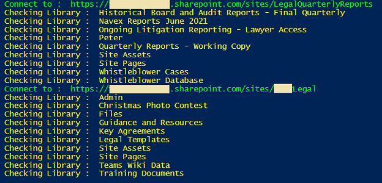

# Export checked-out files in all sites associated with a hub site to CSV

## Summary

This script will export all Checked-Out files in all SharePoint Online sites associated with a Hub site to a CSV file.

### Prerequisites

- The user account that runs the script must have SharePoint Online tenant administrator access.
- Before running the script, edit the script and update the variable values in the Config Variable section, such as SharePoint Tenant Admin URL, Hub Site URL, and the CSV output file path.

### Screenshots
Screen Output



CSV Output


# [PnP PowerShell](#tab/pnpps)
```powershell

#Config variables
$tenantAdminURL = "https://contoso-admin.sharepoint.com"
$hubSiteURL = "https://contoso.sharepoint.com/sites/LegalHub"
$reportOutput = "C:\Temp\CheckedOutFiles.csv"

#Connect to SharePoint Online admin site 
$cred = Get-Credential
Connect-PnPOnline -Url $tenantAdminURL -Credentials $cred

#Get SPO sites
$spoSites = Get-PnPTenantSite -Detailed 

#Get hub site
$hubSite = Get-PnPHubSite -Identity $hubSiteURL
 
#Get associated sites with hub
$associatedSites = $spoSites | Where-Object { $_.HubSiteId -eq $hubSite.Id }

#Iterate through associated sites to find Checked-out files
if ($associatedSites -and $associatedSites.Count -gt 0) {
    ForEach ($site in $associatedSites) {
        if ($hubSite.SiteUrl -ne $site.Url) {
            Try {
                #Connect to the site
                Write-Host "Connect to : " $site.Url -f Green
                $siteConn = Connect-PnPOnline -Url $site.Url -Credentials $cred -ReturnConnection
 
                #Get all document libraries from the site
                $documentLibraries = Get-PnPList -Connection $siteConn | Where-Object { $_.BaseType -eq "DocumentLibrary" -and $_.ItemCount -gt 0 -and $_.Hidden -eq $False }
 
                #Iterate through document libraries in site
                ForEach ($library in $documentLibraries) {
                    
                    Write-host "Checking Library : " $library.Title -f Yellow

                    #CAML Query to filter Checked-out files
                    $query = "<View Scope='RecursiveAll'><Query><Where><IsNotNull><FieldRef Name='CheckoutUser' /></IsNotNull></Where></Query></View>"

                    #Get all Checked-out files of the library
                    $checkedOutFiles = Get-PnPListItem -List $library -Query $query
     
                    #Get details of each checked-out file
                    $results = @()                    
                    ForEach ($file in $checkedOutFiles) {
                        $results += [PSCustomObject][ordered]@{
                            LibraryName     = $library.Title
                            CheckedOutTo    = $file.FieldValues.CheckoutUser.LookupValue
                            CheckedOutSince = ($file.FieldValues.Last_x0020_Modified -as [datetime]).DateTime                           
                            FileSizeMB      = [Math]::Round((($file.FieldValues.File_x0020_Size/1024)/1024),2)
                            FileName        = $file.FieldValues.FileLeafRef
                            FileURL         = $file.FieldValues.FileDirRef
                        }
                        
                        #Export Checked out files data to CSV
                        $results | Export-Csv -Path $reportOutput -Append -NoTypeInformation
                    }                                            
                }
                                           
                Disconnect-PnPOnline -Connection $siteConn
            }
            Catch {
                write-host "Error: $($_.Exception.Message)" -foregroundcolor Red
            }
        }        
    }   
}

```
[!INCLUDE [More about PnP PowerShell](../../docfx/includes/MORE-PNPPS.md)]


## Contributors

| Author(s) |
|-----------|
| [Arash Aghajani](https://github.com/arashaghajani) |

[!INCLUDE [DISCLAIMER](../../docfx/includes/DISCLAIMER.md)]

