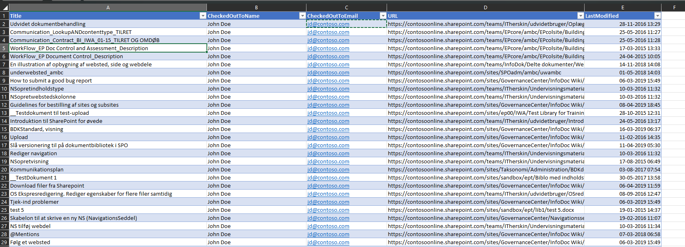

# Getting checked-out files in the tenant using Search

## Summary

It requires a lot of work to iterate all Site Collections looking for checked out files. If you can accept that the quality is slightly lower ( some sites or libraries might be excluded from Search) this script can provide the list of checkout file is minutes, not hours




# [PnP PowerShell](#tab/pnpps)

```powershell

#Config variables
$tenantAdminURL = "https://contoso-admin.sharepoint.com/"
$reportOutput = "C:\Temp\CheckedOutFiles.csv"


$tenantconn = Connect-PnPOnline -Url $tenantAdminURL -ClientId "YOURCLIENTID" -ClientSecret "YOURCLIENTSECRET"  -ReturnConnection


function Get-CheckedOutItems ($emaildomain)
{
    $query = "CheckoutUserOWSUSER:"+$emaildomain
    $searchres= Invoke-PnPSearchQuery -Query $query -All -Connection $tenantconn -SelectProperties Path,CheckoutUserOWSUSER,LastModifiedTime
    $searchres.ResultRows.Count
    $checkedoutitems= @()
    $index = 0
    foreach($row in $searchres.ResultRows)
    {
        $CheckedOutToName = $row["CheckoutUserOWSUSER"].substring($row["CheckoutUserOWSUSER"].IndexOf("|")+1)
        $CheckedOutToName = $CheckedOutToName.Substring(0,$CheckedOutToName.IndexOf("|"))
        $CheckedOutToName= $CheckedOutToName.Trim()

        $CheckedOutToEmail = $row["CheckoutUserOWSUSER"].substring(0,$row["CheckoutUserOWSUSER"].IndexOf("|")-1)

        Write-Host "$index of $($searchres.ResultRows.Count)" -ForegroundColor Green
        $Data = New-Object PSObject
        $Data | Add-Member NoteProperty Title($row.Title) 
        
        $Data | Add-Member NoteProperty CheckedOutToName($CheckedOutToName)
        $Data | Add-Member NoteProperty CheckedOutToEmail($CheckedOutToEmail)
        $Data | Add-Member NoteProperty URL($row["Path"]) 
        $Data | Add-Member NoteProperty LastModified($row["LastModifiedTime"]) 
        
        $checkedoutitems += $Data
        $index++
    }
    
    $checkedoutitems | Export-Csv -Path $reportOutput -Encoding utf8BOM -Force -Delimiter "¤"
    
        
}

#Can either be generic like "contoso.com" or specific like "john.doe@contoso.com"
Get-CheckedOutItems -emaildomain "contoso.com"


```
[!INCLUDE [More about PnP PowerShell](../../docfx/includes/MORE-PNPPS.md)]
***


## Contributors

| Author(s) |
|-----------|
| Kasper Larsen |

[!INCLUDE [DISCLAIMER](../../docfx/includes/DISCLAIMER.md)]

