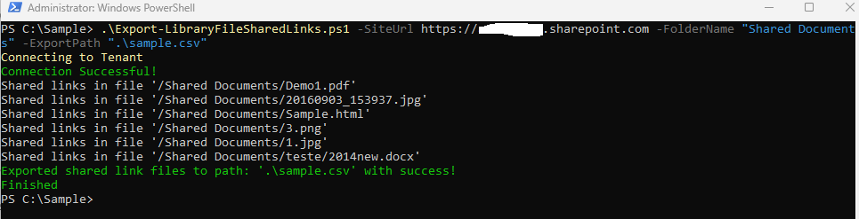

# Export access shared links from SharePoint Library 

## Summary

Script will export SharePoint Library with access shared links files to CSV file.


## Implementation

- Save script to support file **"Export-LibraryFileSharedLinks.ps1"**
- Open Windows PowerShell
- Change console path where file is saved
- Include following parameters **"SiteUrl"** (SharePoint url site ), **"FolderName"** (PnP:Library Name / CLI: Path to Library) and **"ExportPath"** for the export csv path parameter 
- Press enter to execute line command
- CSV file will be saved at path defined in parameter **"ExportPath"**



# [PnP PowerShell](#tab/pnpps)
```powershell

# Example: .\Export-LibraryFileSharedLinks.ps1 -SiteUrl https://contoso.sharepoint.com -FolderName "Shared Documents" -ExportPath ".\file.csv"

[CmdletBinding()]
param(
  [Parameter(Mandatory=$true,HelpMessage="Site Url")]
  [String]$SiteUrl="https://contoso.sharepoint.com",
  [Parameter(Mandatory=$true,HelpMessage="Library name")]
  [String]$FolderName="Shared Documents",
  [Parameter(Mandatory=$true,HelpMessage="Path were json content is exported")]
  [String]$ExportPath=".\file.csv"
)

Begin {
    #Log in to Microsoft 365
    Write-Host "Connecting to Tenant" -f Yellow
    Connect-PnPOnline -Url $SiteUrl -Interactive
    $Ctx = Get-PnPContext
    
    Write-Host "Connection Successful!" -f Green
}
Process{
    
    $sharedlinksResults = @()
    $count = 0

    $allFiles = Get-PnPListItem -List $FolderName -PageSize 10 | Where-Object{$_.FileSystemObjectType -ne "Folder"}
 
    $allFiles | foreach{
        $item= $_
        $SharingInfo = [Microsoft.SharePoint.Client.ObjectSharingInformation]::GetObjectSharingInformation($Ctx, $item, $false, $false, $false, $true, $true, $true, $true)
        $file = [Microsoft.SharePoint.Client.File]$item.File
        $ctx.Load($SharingInfo)
        $ctx.Load($file)
        $ctx.ExecuteQuery()
        
        $SharingInfo.SharingLinks | Where-Object{$_.ShareTokenString -ne $null} | foreach {
            Write-Host "Shared links in file '$($file.ServerRelativeUrl)'" 
            #Arrange object properties to better display content in csv
            $_ | Add-Member -NotePropertyName "ServerRelativeUrl" -NotePropertyValue $file.ServerRelativeUrl
            $sharedlinksResults += $_
        }
        
        $count += 1 
        #progress bar
        Write-Progress -Activity 'Links giving access to files' -Status "Searching for links giving access to files in Library '$($FolderName)'... ($($count)/$($allFiles.Count))" -PercentComplete (($count / $allFiles.Count) * 100)     
    }
    #Order columns for CSV exportation
    $sharedlinksResults | select ServerRelativeUrl,Url,ShareTokenString,AllowsAnonymousAccess,ApplicationId,BlocksDownload,Created,CreatedBy,Description,Embeddable,Expiration,HasExternalGuestInvitees,Invitations,IsActive,IsAddressBarLink,IsCreateOnlyLink,IsDefault,IsEditLink,IsFormsLink,IsManageListLink,IsReviewLink,IsUnhealthy,LastModified,LastModifiedBy,LimitUseToApplication,LinkKind,PasswordLastModified,PasswordLastModifiedBy,RedeemedUsers,RequiresPassword,RestrictedShareMembership,Scope,ShareId,SharingLinkStatus,TrackLinkUsers | ConvertTo-Csv -NoTypeInformation | Out-File $ExportPath
    Write-Host "Exported links giving access to files to path: '$($ExportPath)' with success!" -f Green
}
End {
    Disconnect-PnPOnline
    Write-Host "Finished" -ForegroundColor Green
}

```
[!INCLUDE [More about PnP PowerShell](../../docfx/includes/MORE-PNPPS.md)]

# [CLI for Microsoft 365](#tab/cli-m365-ps)
```powershell
# Example: .\Export-LibraryFileSharedLinks.ps1 -SiteUrl https://contoso.sharepoint.com -FolderName "Shared Documents" -ExportPath ".\file.csv"

[CmdletBinding()]
param(
  [Parameter(Mandatory=$true,HelpMessage="Site Url")]
  [String]$SiteUrl="https://contoso.sharepoint.com",
  [Parameter(Mandatory=$true,HelpMessage="Folder name")]
  [String]$FolderName="Shared Documents",
  [Parameter(Mandatory=$true,HelpMessage="Path were json content is exported")]
  [String]$ExportPath=".\file.csv"
)

Begin {
    #Log in to Microsoft 365
    Write-Host "Connecting to Tenant" -f Yellow

    $m365Status = m365 status
    if ($m365Status -match "Logged Out") {
        m365 login
    }

    Write-Host "Connection Successful!" -f Green
}
Process {

    $sharedlinksResults = @()
    $allFiles = m365 spo file list  --webUrl $SiteUrl --folder $FolderName --recursive -o json  | ConvertFrom-Json
    $count = 0
    foreach ($file in $allFiles) {
        #Exclude files from out of the box Forms folder
        if($file.ServerRelativeUrl -notlike '*/Forms/*')
        {
            #Retrive files with links    
            $_sharedFileInfo = (m365 spo file sharinginfo get --webUrl $SiteUrl --fileUrl $file.ServerRelativeUrl | ConvertFrom-Json) | Where-Object {($_.permissionsInformation.links).length -gt 0}
            #Retrive files with links with shared token url
            $_sharedFileInfo = $_sharedFileInfo.permissionsInformation.links |  Where-Object {$_.linkDetails.ShareTokenString -ne $null}
            if ($_sharedFileInfo.linkDetails -ne $null)
            {
                Write-Host "Shared links in file '$($file.ServerRelativeUrl)'" 
                #Arrange object properties to better display content in csv
                $_sharedFileInfo |foreach{
                    $_.linkDetails | Add-Member -NotePropertyName "ServerRelativeUrl" -NotePropertyValue $file.ServerRelativeUrl
                    $_.linkDetails.CreatedBy = $_.linkDetails.CreatedBy.userPrincipalName
                    $_.linkDetails.LastModifiedBy = $_.linkDetails.LastModifiedBy.userPrincipalName
                    $sharedlinksResults += $_.linkDetails
                }
            }
            $count += 1 
            #progress bar
            Write-Progress -Activity 'Links giving access to files' -Status "Searching for links giving access to files in Library '$($FolderName)'... ($($count)/$($allFiles.Count))" -PercentComplete (($count / $allFiles.Count) * 100)
        }
    }
    #Order columns for CSV exportation
    $sharedlinksResults | select ServerRelativeUrl,Url,ShareTokenString,AllowsAnonymousAccess,ApplicationId,BlocksDownload,Created,CreatedBy,Description,Embeddable,Expiration,HasExternalGuestInvitees,Invitations,IsActive,IsAddressBarLink,IsCreateOnlyLink,IsDefault,IsEditLink,IsFormsLink,IsManageListLink,IsReviewLink,IsUnhealthy,LastModified,LastModifiedBy,LimitUseToApplication,LinkKind,PasswordLastModified,PasswordLastModifiedBy,RedeemedUsers,RequiresPassword,RestrictedShareMembership,Scope,ShareId,SharingLinkStatus,TrackLinkUsers | ConvertTo-Csv -NoTypeInformation | Out-File $ExportPath
    Write-Host "Exported links giving access to files to path: '$($ExportPath)' with success!" -f Green
}
End {
    m365 logout
    Write-Host "Finished" -ForegroundColor Green
}

```
[!INCLUDE [More about CLI for Microsoft 365](../../docfx/includes/MORE-CLIM365.md)]
***

## Contributors

| Author(s) |
|-----------|
| Andre Lage |
| [Andre Lage](https://github.com/aaclage) |

[!INCLUDE [DISCLAIMER](../../docfx/includes/DISCLAIMER.md)]

