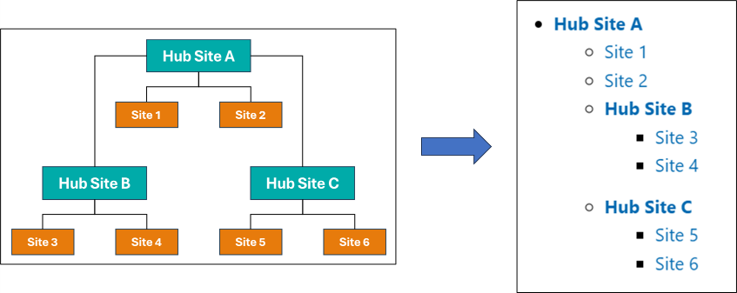

# Export of the Hierarchy of Hub Sites

## Summary

[SharePoint allows to associate a hub site with another hub site](https://learn.microsoft.com/sharepoint/hub-to-hub-association). This script exports the SharePoint site hierarchy into a Markdown file to visualize the hub sites and its associated sites. It helps to understand the structure of SharePoint.



The following is a sample of the output markdown.

```markdown
# SharePoint Sites in tenant [contoso]

## Hub Sites and Sites Associated with Hub Sites

Here are the hub sites and the sites associated with the hub sites. Hub sites are shown in bold.

- **[Hub Site A](https://contoso.sharepoint.com/sites/HubSiteA)**
  - [Site 1](https://contoso.sharepoint.com/sites/Site1)
  - [Site 2](https://contoso.sharepoint.com/sites/Site2)
  - **[Hub Site B](https://contoso.sharepoint.com/sites/HubSiteB)**
    - [Site 3](https://contoso.sharepoint.com/sites/Site3)
    - [Site 4](https://contoso.sharepoint.com/sites/Site4)
  - **[Hub Site C](https://contoso.sharepoint.com/sites/HubSiteC)**
    - [Site 5](https://contoso.sharepoint.com/sites/Site5)
    - [Site 6](https://contoso.sharepoint.com/sites/Site6)

- **[Hub Site D](https://contoso.sharepoint.com/sites/HubSiteA)**
  - [Site 7](https://contoso.sharepoint.com/sites/Site7)
  - [Site 8](https://contoso.sharepoint.com/sites/Site8)

## Sites that are not Hub Sites and are not Associated with any Hub Site

Here are the sites that are not hub sites and are not associated with any hub site.

- [Site 9](https://contoso.sharepoint.com/sites/Site9)
- [Site 10](https://contoso.sharepoint.com/sites/Site10)
```

The markdown file is created in the "SharePointHubSiteHierarchyReport" folder in MyDocuments.


> [!Note]
> - To run this script, it is required to be able to access the SharePoint Tenant Administration site.
> - Subsites are not exported.

# [PnP PowerShell](#tab/pnpps)

```powershell
# Target tenant name
$tenantName = '<Tenant Name>' # e.g. contoso

# Constants
$noHubSiteId = '00000000-0000-0000-0000-000000000000'
$adminUrl = "https://$tenantName-admin.sharepoint.com/"
$exportFolderName = 'SharePointHubSiteHierarchyReport'
$exportFolderPath = Join-Path ([Environment]::GetFolderPath('MyDocuments')) $exportFolderName
$timeStamp = (Get-Date).ToString('yyyyMMdd-HHmmss')
$markdownFilePath = Join-Path $exportFolderPath "$timeStamp-$tenantName.md"

# Function: Generate Markdown
function GenerateMarkdownForHubSite {
    param (
        $hubSite,
        $level,
        $hubSites,
        $tenantSites
    )

    $indent = "  " * ($level - 1)
    $hubSiteInfo = $tenantSites | Where-Object { $_.Url -eq $hubSite.SiteUrl }
    $hubTitle = $hubSiteInfo.Title ? $hubSiteInfo.Title : $hubSiteInfo.Url
    $markdown = "$indent- **[$hubTitle]($($hubSiteInfo.Url))**`r`n"

    $childSites = $tenantSites | Where-Object { $_.HubSiteId -eq $hubSite.SiteId -and $_.Url -ne $hubSite.SiteUrl }
    foreach ($childSite in $childSites) {
        $title = $childSite.Title ? $childSite.Title : $childSite.Url
        $markdown += "$indent  - [$title]($($childSite.Url))`r`n"
    }

    $childHubSites = $hubSites | Where-Object { $_.ParentHubSiteId -eq $hubSite.SiteId }
    foreach ($childHubSite in $childHubSites) {
        $markdown += (GenerateMarkdownForHubSite $childHubSite ($level + 1) $hubSites $tenantSites)
    }

    return $markdown
}

try {
    # Create the Data Export Folder
    if (-not (Test-Path $exportFolderPath -PathType Container)) {
        Write-Host "Creating Data Export Folder...Started" -ForegroundColor Yellow
        New-Item -Path $exportFolderPath -ItemType Directory -Force -ErrorAction Stop
        Write-Host "Creating Data Export Folder...Completed" -ForegroundColor Green
    }

    # Connect to SharePoint site
    Write-Host "Connecting to SharePoint site...Started" -ForegroundColor Yellow
    Connect-PnPOnline -Url $adminUrl -Interactive -ErrorAction Stop
    Write-Host "Connecting to SharePoint site...Completed" -ForegroundColor Green

    # Get tenant sites
    Write-Host "Retrieving tenant sites...Started" -ForegroundColor Yellow
    $tenantSites = Get-PnPTenantSite -ErrorAction Stop
    Write-Host "Retrieving tenant sites...Completed" -ForegroundColor Green

    # Get hub sites
    Write-Host "Retrieving hub sites...Started" -ForegroundColor Yellow
    $hubSites = Get-PnPHubSite -ErrorAction Stop
    Write-Host "Retrieving hub sites...Completed" -ForegroundColor Green

    # Generate Markdown
    Write-Host "Generating markdown...Started" -ForegroundColor Yellow
    $markdownText = @()
    $markdownText += "# SharePoint Sites in tenant [$($tenantName)]`r`n"

    # Hub Sites and Sites Associated with Hub Sites
    $markdownText += "## Hub Sites and Sites Associated with Hub Sites`r`n"
    $markdownText += "Here are the hub sites and the sites associated with the hub sites. Hub sites are shown in bold.`r`n"
    $parentHubSites = $hubSites | Where-Object { $_.ParentHubSiteId -eq $noHubSiteId }
    foreach ($parentHubSite in $parentHubSites) {
        $markdownText += (GenerateMarkdownForHubSite $parentHubSite 1 $hubSites $tenantSites)
    }

    # Hub Sites and Sites Associated with Hub Sites
    $markdownText += "## Sites that are not Hub Sites and are not Associated with any Hub Site`r`n"
    $markdownText += "Here are the sites that are not hub sites and are not associated with any hub site.`r`n"
    $standaloneSites = $tenantSites | Where-Object { $_.HubSiteId -eq $noHubSiteId }
    foreach ($standaloneSite in $standaloneSites) {
        $title = if ($standaloneSite.Title) { $standaloneSite.Title } else { $standaloneSite.Url }
        $markdownText += "- [$title]($($standaloneSite.Url))"
    }
    Write-Host "Generating markdown...Completed" -ForegroundColor Green

    # Save the Markdown file
    Write-Host "Saving markdown file...Started" -ForegroundColor Yellow
    $markdownText -join "`r`n" | Out-File -FilePath $markdownFilePath -Encoding UTF8 -ErrorAction Stop
    Write-Host "Saving markdown file...Completed" -ForegroundColor Green

    # Display successful file save message
    Write-Host "-".PadRight(50, "-")
    Write-Host "Markdown file is located at: $markdownFilePath"
    Write-Host "-".PadRight(50, "-")
}
catch {
    Write-Error "Error message: $($_.Exception.Message)"
}
finally {
    Disconnect-PnPOnline
}
```
[!INCLUDE [More about PnP PowerShell](../../docfx/includes/MORE-PNPPS.md)]
***

## Contributors

| Author(s)        |
|------------------|
| [Tetsuya Kawahara](https://github.com/tecchan1107) |

[!INCLUDE [DISCLAIMER](../../docfx/includes/DISCLAIMER.md)]
