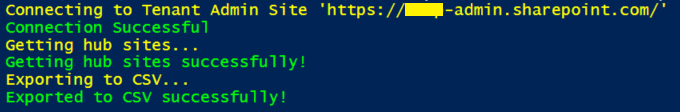

# Get Hub Sites Details And Export It To CSV

## Summary

This sample shows how to get hub sites information and export required details to CSV.

## Implementation

- Open Windows PowerShell ISE
- Create a new file
- Write a script as below,
- First, we will connect to Tenant admin site.
    - Then we will get hub sites details,
    - And then we will export it to CSV.
 


# [PnP PowerShell](#tab/pnpps)
```powershell

$adminSiteURL = "https://{domain}-admin.sharepoint.com/"
$username = "USERID"
$password = "********"
$secureStringPwd = $password | ConvertTo-SecureString -AsPlainText -Force 
$creds = New-Object System.Management.Automation.PSCredential -ArgumentList $username, $secureStringPwd
$dateTime = "_{0:MM_dd_yy}_{0:HH_mm_ss}" -f (Get-Date)
$basePath = "E:\Contribution\PnP-Scripts\Hubsites\Logs\"
$csvPath = $basePath + "\HubSites" + $dateTime + ".csv"
$global:hubSitesReports = @()

Function Login() {
    [cmdletbinding()]
    param([parameter(Mandatory = $true, ValueFromPipeline = $true)] $creds)     
    Write-Host "Connecting to Tenant Admin Site '$($adminSiteURL)'" -f Yellow   
    Connect-PnPOnline -Url $adminSiteURL -Credentials $creds
    Write-Host "Connection Successful!" -f Green 
}

Function GetHubSites {
    try {
        Write-Host "Getting hub sites..."  -ForegroundColor Yellow 
        $pnpHubSites = Get-PnPHubSite | select *          
        Write-Host "Getting hub sites successfully!"  -ForegroundColor Green
        foreach ($pnpHubSite in $pnpHubSites) {
            $global:hubSitesReports += New-Object PSObject -Property ([ordered]@{  
                    'ID'                = $pnpHubSite.ID
                    'Parent HubSite Id' = $pnpHubSite.ParentHubSiteId              
                    'Site Id'           = $pnpHubSite.SiteId 
                    'Site Url'          = $pnpHubSite.SiteUrl
                    'Title'             = $pnpHubSite.Title                                                                                             
                })
        }
    }
    catch {
        Write-Host "Error in getting hub sites information:" $_.Exception.Message -ForegroundColor Red                 
    }
    Write-Host "Exporting to CSV..."  -ForegroundColor Yellow 
    $global:hubSitesReports| Export-Csv $csvPath -NoTypeInformation -Append
    Write-Host "Exported to CSV successfully!"  -ForegroundColor Green	
}

Function StartProcessing {
    Login($creds);
    GetHubSites
}

StartProcessing

```
[!INCLUDE [More about PnP PowerShell](../../docfx/includes/MORE-PNPPS.md)]

# [CLI for Microsoft 365](#tab/cli-m365-ps)
```powershell
$dateTime = "_{0:MM_dd_yy}_{0:HH_mm_ss}" -f (Get-Date)
$basePath = "E:\Contribution\PnP-Scripts\Hubsites\Logs\"
$csvPath = $basePath + "\HubSites" + $dateTime + ".csv"
$global:hubSitesReports = @()

Function Login {
    Write-Host "Connecting to Tenant Site" -f Yellow   
    $m365Status = m365 status
    if ($m365Status -match "Logged Out") {
      m365 login
    }
    Write-Host "Connection Successful!" -f Green 
}

Function GetHubSites {
    try {
        Write-Host "Getting hub sites..."  -ForegroundColor Yellow 
        $pnpHubSites = m365 spo hubsite list | ConvertFrom-Json        
        Write-Host "Getting hub sites successfully!"  -ForegroundColor Green
        foreach ($pnpHubSite in $pnpHubSites) {
            $global:hubSitesReports += New-Object PSObject -Property ([ordered]@{  
                    'ID'                = $pnpHubSite.ID
                    'Parent HubSite Id' = $pnpHubSite.ParentHubSiteId              
                    'Site Id'           = $pnpHubSite.SiteId 
                    'Site Url'          = $pnpHubSite.SiteUrl
                    'Title'             = $pnpHubSite.Title                                                                                             
                })
        }
    }
    catch {
        Write-Host "Error in getting hub sites information:" $_.Exception.Message -ForegroundColor Red                 
    }
    Write-Host "Exporting to CSV..."  -ForegroundColor Yellow 
    $global:hubSitesReports| Export-Csv $csvPath -NoTypeInformation -Append
    Write-Host "Exported to CSV successfully!"  -ForegroundColor Green	
}

Function StartProcessing {
    Login
    GetHubSites
}

StartProcessing
```
[!INCLUDE [More about CLI for Microsoft 365](../../docfx/includes/MORE-CLIM365.md)]

# [SPO Management Shell](#tab/spoms-ps)

```powershell

$adminSiteURL = "https://{domain}-admin.sharepoint.com/"
$username = "USERID"
$password = "********"
$secureStringPwd = $password | ConvertTo-SecureString -AsPlainText -Force 
$creds = New-Object System.Management.Automation.PSCredential -ArgumentList $username, $secureStringPwd
$dateTime = "_{0:MM_dd_yy}_{0:HH_mm_ss}" -f (Get-Date)
$basePath = "E:\Contribution\PnP-Scripts\Hubsites\Logs\"
$csvPath = $basePath + "\HubSites" + $dateTime + ".csv"
$global:hubSitesReports = @()

Function Login() {
    [cmdletbinding()]
    param([parameter(Mandatory = $true, ValueFromPipeline = $true)] $creds)     
    Write-Host "Connecting to Tenant Admin Site '$($adminSiteURL)'" -f Yellow   
    Connect-SPOService -Url $adminSiteURL -Credential $creds
    Write-Host "Connection Successful" -f Green 
}

Function GetHubSite{    
    try {
        Write-Host "Getting hub sites..."  -ForegroundColor Yellow 
        $pnpHubSites = Get-SPOHubSite | select *          
        Write-Host "Getting hub sites successfully!"  -ForegroundColor Green
        foreach ($pnpHubSite in $pnpHubSites) {
            $global:hubSitesReports += New-Object PSObject -Property ([ordered]@{  
                    'ID'                = $pnpHubSite.ID
                    'Parent HubSite Id' = $pnpHubSite.ParentHubSiteId              
                    'Site Id'           = $pnpHubSite.SiteId 
                    'Site Url'          = $pnpHubSite.SiteUrl
                    'Title'             = $pnpHubSite.Title                                                                                             
                })
        }
    }
    catch {
        Write-Host "Error in getting hub sites information:" $_.Exception.Message -ForegroundColor Red                 
    }
    Write-Host "Exporting to CSV..."  -ForegroundColor Yellow 
    $global:hubSitesReports| Export-Csv $csvPath -NoTypeInformation -Append
    Write-Host "Exported to CSV successfully!"  -ForegroundColor Green	

}

Function StartProcessing {
    Login($creds);
    GetHubSite
}

StartProcessing

```
[!INCLUDE [More about SPO Management Shell](../../docfx/includes/MORE-SPOMS.md)]
***

## Contributors

| Author(s) |
|-----------|
| Chandani Prajapati (https://github.com/chandaniprajapati) |
| [Jasey Waegebaert](https://github.com/Jwaegebaert) |

[!INCLUDE [DISCLAIMER](../../docfx/includes/DISCLAIMER.md)]

