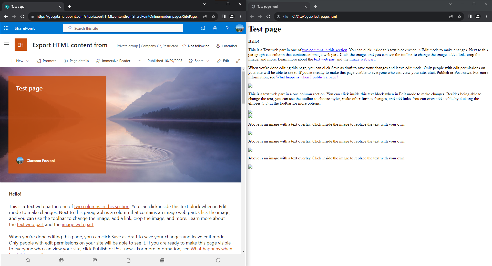

# Export HTML content from SharePoint Online modern pages

## Summary

This sample script exports all SharePoint Online modern pages as .html files, focusing on text content. This is useful when analysing the actual text with tools that don't support SharePoint Online but support HTML.

Files, images and videos included in the pages are not exported.



# [PnP PowerShell](#tab/pnpps)

```powershell
$url = "<spo site url>"
$destFolder = "C:\SitePages"

$ErrorActionPreference = 'Stop'

# Create the destination folder if it doesn't exist
mkdir $destFolder -ErrorAction:SilentlyContinue | Out-Null

# Connect to SPO using PnP PowerShell
Connect-PnPOnline $url -Interactive
# Get all the pages. Credits to https://pnp.github.io/script-samples/spo-export-stream-classic-webparts/README.html to filter only pages
$list = Get-PnPList "SitePages"
$pageItems = Get-PnPListItem -List $list -Fields CanvasContent1,Title,FileLeafRef | Where-Object { $_["FileLeafRef"] -like "*.aspx" }
foreach ($pageItem in $pageItems)
{
    try
    {
        # Save the html content of each page to a .html file
        $content = $pageItem["CanvasContent1"]
        $filename = $pageItem["FileLeafRef"]
        # Additional metadata could be added here in its own paragraph
        $prefix = "<div><h1>$($pageItem["Title"])</h1></div>"
        $prefix + $content | Out-File -LiteralPath "$($destFolder)\$($filename.Replace(".aspx",".html"))"
    }
    catch
    {
        Write-Host $_
    }
}
```
[!INCLUDE [More about PnP PowerShell](../../docfx/includes/MORE-PNPPS.md)]
***

## Source Credit

This sample reuses parts of [https://pnp.github.io/script-samples/spo-export-stream-classic-webparts/README.html](https://pnp.github.io/script-samples/spo-export-stream-classic-webparts/README.html)

## Contributors

| Author(s) |
|-----------|
| Giacomo Pozzoni |


[!INCLUDE [DISCLAIMER](../../docfx/includes/DISCLAIMER.md)]
