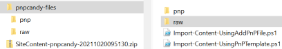

      
# Export all content from an existing SharePoint site

## Summary

This script allow us to export all content from an existing SharePoint site.  
Main idea here is to actually export content from one site and import to other site.  
The script will crawl Document libraries, export content to a local folder and prepare a pnptemplate ready to import  


  
### Outputs
* **pnpcandy-files** folder  
root folder, contains logfile and zip file (entire created package)
* **pnp** folder  
contains the pnptemplate with all content
* **raw** folder  
contains all content assets
* **Import-Content-UsingAddPnPFile.ps1** file  
script to import raw folder content to the new site, using Add-PnPFile cmdlet]  
* **Import-Content-UsingPnPTemplate.ps1** file  
script to import pnp folder content to the new site, using the PnP Provisioning engine]  


The script is a subset of the SPO powershell packages with content (PnPCandy) concept already been used across many projects.  
  
Excelsior, hum? :P  

# [PnP PowerShell](#tab/pnpps)

```powershell

[CmdletBinding()]
param (
    [Parameter(Mandatory = $false, HelpMessage = "Enter a package name")]
    [String]$PackageName = "SiteContent",
    [Parameter(Mandatory = $true, HelpMessage = "Site url (content will be exported from this site)")]
    [string] $Url,
    [Parameter(Mandatory = $false, HelpMessage = "If True, content will be zipped")]
    [bool]$CreatePackage = $true,    
    [Parameter(Mandatory = $true, HelpMessage = "Folder where the content will be downloaded to")]
    [string]$ExportFolder ,
    [Parameter(Mandatory = $false, HelpMessage = "String[] for selecting specific document libraries")]
    [String[]] $Includes = @(),
    [Parameter(Mandatory = $false, HelpMessage = "Log file name. By default, this options is AUTO _ logfile will be created with a default name ")]
    [string] $Logfile = "AUTO"
)
begin {
    
    ## General functions

    # Write message to string or log file if its defined
    function Write-Log($msg) {
        
        $message = "$($env:MainFunctionName)$($env:FunctionName) $msg"
        $message = $message.Trim()
        Write-Host ($message)
        if ($Logfile.Length -gt 0) {
            Add-Content -Path $Logfile -Value $message -Force
        }
    }
    ## display initial message on the script
    function Initial-Message() {
        
        $env:functionName = ""
        $env:MainFunctionName = ""

        $msg = "`n`r

█▀█ █▄░█ █▀█ █▀▀ ▄▀█ █▄░█ █▀▄ █▄█
█▀▀ █░▀█ █▀▀ █▄▄ █▀█ █░▀█ █▄▀ ░█░  `nPackage Builder  `n`n...aka ... [spo-export-site-content]
`n"
        $msg += ('#' * 70) + "`n"
        
        Write-Log  $msg
    }
   
    # Get folders and files in predetermined folderUrl . Entire stack of assets is added byref to the $outAssets
    Function Get-FoldersFiles($folderUrl, [ref] $outAssets) {
        $items = Get-PnPFolderItem -FolderSiteRelativeUrl $folderUrl -ItemType All    
        # Loop through the folders  
        foreach ($asset in $items) { 
            # dont collect forms document library   
            if ($asset.Name -ne "Forms") {               
                $newItemURL = $folderUrl + "/" + $asset.Name   
                $item = New-Object PSObject
                $item | Add-Member -MemberType NoteProperty -Name 'ServerRelativeUrl' -Value $asset.ServerRelativeUrl
                $item | Add-Member -MemberType NoteProperty -Name 'LocalPath' -Value ($newItemURL -replace "/", "\")
           
                $item | Add-Member -MemberType NoteProperty -Name 'IsFolder' -Value  ($null -ne $asset.ItemCount)
                $item | Add-Member -MemberType NoteProperty -Name 'Leaf' -Value  ($newItemURL | Split-Path -Leaf  )
            
                $item | Add-Member -MemberType NoteProperty -Name 'RemotePath' -Value ($newItemURL | Split-Path) #(($newItemURL | Split-Path) -replace "\\", "/")
                [Hashtable] $t = $outAssets.Value
                $t.Add($asset.ServerRelativeUrl, $item)
                if ($null -ne $asset.ItemCount) {
                    Write-Log  "   Collecting  $newItemURL"
                    Get-FoldersFiles -folderUrl $newItemURL -outAssets ([ref]$t)
                }  
            }
        }
    } 

    # Export  SPO files to a local folder
    Function Export-Assets {
       
        $env:functionName = "[EXP-ASSETS]"

        Write-Log " Start"
        Write-Log "  Content will be exported to $rawPath"
        ## Get all document libraries
        $doclibs = Get-PnPList | where-object { $_.BaseTemplate -eq 101 -and $_.Hidden -eq $false }  

        if ($Includes.length -gt 0) {
            $doclibs = $doclibs | where-object { $_.Title -in $Includes }
            Write-Log "  Gathering [$Includes] Document Libraries"
        }
       
        $files = "Write-Host 'Attention: Document libraries should exists already on the url.' `n"
        $files += "Write-Host 'This script dont create the document libraries or replace invalid chars in the filenames'`n"
        $doclibs.foreach({
                $list = $_
                Write-Log "   $($list.Title) Document Library"
                Write-Log "   Collecting all files and folders"

                #Create hashtable to be used within by ref in functions
                [HashTable]$htItems = @{}
                Get-FoldersFiles $list.Title -outAssets ([ref]$htItems)
                #convert hashtable value to array
                $items = $htItems.GetEnumerator().ForEach({ $_.Value }) | Sort-Object IsFolder -Descending
                Write-Log "   All files and folders collected"
                Write-Log "   Export [$($list.Title)] Content started ..."
                
                $items.foreach({
                        $item = $_
                       
                        if ($item.IsFolder) {
                            $itemPath = "$rawPath\$($item.LocalPath)"
                            New-Item -Path $itemPath -ItemType Directory -Force | Out-Null
                            Write-Log "     [$itemPath ] created !"
                        }
                        else {
                            $itemPath = "$rawPath\$($item.LocalPath | Split-Path)"
                            Get-PnPFile -Url $item.ServerRelativeUrl -Path $itemPath -Filename $item.Leaf -AsFile -Force | Out-Null
                            $goodFile = ""
                            FixInvalidChars -fileName  $item.Leaf -fileFullName "$itemPath\$($item.Leaf)" -out  ([ref] $goodFile)


                            Write-Log "     [$itemPath\$($goodFile)] created !"
                            ## files is used to create a script to import files with PnPCmdlet Add-PnPFile
                            $files += "Add-PnPFile -Path " + """" + ".\raw\" +$item.RemotePath + "\" + $goodFile + """" + " -Folder '$($item.RemotePath)' `r`n"
                        }
    
                    })
                Write-Log "   Export [$($list.Title)] Content ended !"
            })
        Write-Log " End"
        Write-Log "  Creating Ps1 file for adding files through pnp cmdlets " 
        $scriptFile = "$path\Import-Content-UsingAddPnPFile.ps1" 
        $scriptFileContent = "`$ErrorActionPreference = 'Continue'`r`n"
        $scriptFileContent += 'Set-Location  $PSScriptRoot' + "`r`n"
        $scriptFileContent += '$siteUrl="[ADD YOURSITE URL HERE]"  ' + "`r`n"
        $scriptFileContent += 'Connect-PnPOnline -Url $siteUrl -Interactive ' + "`r`n"
        $scriptFileContent += $files
        $scriptFileContent += 'Disconnect-PnPOnline' + "`r`n"
        Set-Content -Path  $scriptFile -Value  $scriptFileContent -Force   
    } 


    function FixInvalidChars($fileName,$fileFullName, $out) {

        # set of invalid characters
        $REGEX_INVALID_FILEFOLDER_NAME_CHARS = '[~#%&*{}\:<>?/|""\t\r\n]';
        $REGEX_REPLACEMENT_CHAR = "_"
        $itemNewPath = $fileName
        #Test if filename has invalid chars
        $fileNameNotOk = $fileName -match $REGEX_INVALID_FILEFOLDER_NAME_CHARS
        if ($fileNameNotOk) {
            Write-Log "   File: [$fileName] : has invalid characters $REGEX_INVALID_FILEFOLDER_NAME_CHARS"   
            $match = [regex]::matches($fileName, $REGEX_INVALID_FILEFOLDER_NAME_CHARS)
            $itemPathOriginal = $fileFullName
            #invalid characters as replaced by $REGEX_REPLACEMENT_CHAR
            $match.ForEach({
                    $itemNewPath = $itemNewPath -replace $_.Captures.Value, $REGEX_REPLACEMENT_CHAR
                })

            $fileLoop = $true
            $tmpReplaceChar = ""
            # rename invalid file with new name :loop until valid
            while ($fileLoop) {
                try {
                    Rename-Item -Path $itemPathOriginal -NewName $itemNewPath
                    $fileLoop = $false
                }
                catch {
                    #if a file already exists with that name , it will renamed until error is not thrown
                    $tmpReplaceChar += $REGEX_REPLACEMENT_CHAR 
                    $itemNewPath = ($itemNewPath.replace($REGEX_REPLACEMENT_CHAR, $tmpReplaceChar) | Split-path -Leaf) 
                    $fileLoop = $true
                }
            }
        }
        $out.Value = $itemNewPath

    }
    #create New-PnPTemplate with collected files 
    Function New-PnPTemplate {
        $env:functionName = "[NEW-PNPTEMPLATE]"

        # Get PnPSiteTemplate
        $pnpTemplate = Get-PnPSiteTemplate -OutputInstance -Handlers Lists -IncludeAllPages
        $PnPTemplateFile = "$pnpPath\$PackageName.xml" 
        Save-PnPSiteTemplate -Out $PnPTemplateFile -Template $pnpTemplate -Force
        $originalPath = Get-Location
        Set-Location $pnpPath
        Write-Log " Start"
        Write-Log "  PnPTemplate will be creating adding files from $rawPath"
        $items = Get-ChildItem -Path $rawPath -Recurse -File  -Exclude "Import-Content-UsingAddPnPFile.ps1" | `
            Select-Object Name, FullName, DirectoryName, `
        @{ Name = 'RemotePath'; Expression = { ($_.DirectoryName).Replace($rawPath + "\", "").Replace("\", "/") } }
           
        Write-Log "  Add files Start"          
        $items.foreach({
                $item = $_
                Add-PnPFileToSiteTemplate -Path  $PnPTemplateFile -Source $item.FullName -Folder $item.RemotePath
                Write-Log "   File:[$($item.FullName)] added!"  
            })
        Write-Log "  Add files End"    
        
        Write-Log "  PnPTemplate file created : $pnpPath\$PackageName.xml"

        Write-Log "  Creating Ps1 file for apply pnptemplate execution " 
        $scriptFile = "$path\Import-Content-UsingPnPTemplate.ps1" 
        $scriptFileContent = "`$ErrorActionPreference = 'Continue'`r`n"
        $scriptFileContent += 'Set-Location  $PSScriptRoot' + "`r`n"
        $scriptFileContent += '$siteUrl="[ADD YOURSITE URL HERE]"  ' + "`r`n"
        $scriptFileContent += 'Connect-PnPOnline -Url $siteUrl -Interactive ' + "`r`n"
        $scriptFileContent += 'Invoke-PnPSiteTemplate -Path .\pnp\' + $PackageName + '.xml' + "`r`n"
        $scriptFileContent += 'Disconnect-PnPOnline' + "`r`n"

        Set-Content -Path  $scriptFile -Value  $scriptFileContent -Force   

        Write-Log " End"
        Set-Location $originalPath
        
    }

    ## Zip all the content 
    Function New-ZipPackage {
        $env:functionName = "[PCK-ASSETS]"
        Write-Log " Start"
        $packageName = "$ExportFolder\$PackageName" + "-pnpcandy-" + ($StarCurrentTimeStamp).ToString("yyyyMMddHHmmsss") + ".zip"
        Write-Log "  Packaging [$path] to [$packageName]"
        [io.compression.zipfile]::CreateFromDirectory($path, $packageName)
        Write-Log " End"
    } 

    ## Start Script
    $ErrorActionPreference = "Stop"
    Import-Module PnP.PowerShell

    $StarCurrentTimeStamp = Get-Date
   
    $ExportFolder = (Resolve-Path -Path $ExportFolder).Path 
    $defaultLogFile = "$ExportFolder\$PackageName-pnpcandy-" + ($StarCurrentTimeStamp).ToString("yyyyMMddHHmmsss") + ".log"
    $path = "$ExportFolder\pnpcandy-files"
    $rawPath = $path + "\raw"
    $pnpPath = $path + "\pnp"
    New-Item -Path $rawPath -ItemType Directory -Force | Out-Null
    New-Item -Path $pnpPath -ItemType Directory -Force | Out-Null

    if ($Logfile -eq "AUTO") {
        $Logfile = $defaultLogFile
    }
    
    Initial-Message
    #Log is using $env variable as msg prefix . Eggxample
    
    $env:MainFunctionName = "[PNPCANDY-PKGBUILDER]"
    $env:FunctionName = ""
   
    New-Item -Path $path -ItemType Directory -Force | Out-Null
    Write-Log "Start" 
   
    Write-Log " Connecting to $Url"
    Connect-PnPOnline -Url $Url -Interactive 
 
}
process {
   
    Export-Assets
    New-PnPTemplate
    if ($CreatePackage) { New-ZipPackage }
}

end {
    $env:FunctionName = ""
    Write-Log " Disconnecting"
    Disconnect-PnPOnline
  
    $EndCurrentTimeStamp = Get-Date
    Write-Log (" Execution time :" + ($EndCurrentTimeStamp - $StarCurrentTimeStamp) + "")
    if ($Logfile.Length -gt 0) {
        Write-Log " Logfile : $Logfile"
    }
    Write-Log "End"
    
}
```
[!INCLUDE [More about PnP PowerShell](../../docfx/includes/MORE-PNPPS.md)]
***

## Contributors

| Author(s) |
|-----------|
| Rodrigo Pinto |

[!INCLUDE [DISCLAIMER](../../docfx/includes/DISCLAIMER.md)]


