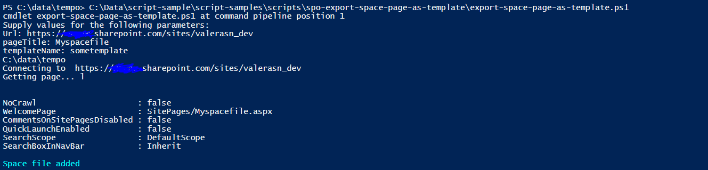

# Extract Space content type Modern page as template and save to SharePoint

## Summary

This script will extract Space content type page as template file and saves it as new space page to SharePoint. 
Note, this script does not include referenced files e.g. images, videos etc.



# [PnP PowerShell](#tab/pnpps)

```powershell

[CmdletBinding()]
param (
    [Parameter(Mandatory = $true)]
    [string]$Url,
    $saveDir = (Resolve-path ".\"),
    [Parameter(Mandatory = $true)]
    [string]$pageTitle,
    [Parameter(Mandatory = $true)]
    [string]$templateName
)
begin{
 Write-Host  $saveDir
    Write-Host "Connecting to " $Url
    Connect-PnPOnline -Url $Url -Interactive
}
process {

    Write-Host "Getting page..."l

    $web = Get-PnPWeb
    $sourceSite = $web.ServerRelativeUrl
    $library = "Site Pages"

    #get all pages in the site pages library
    $pages = Get-PnPListItem -List $library
 
    #save current homepage
    $currentHomePage = Get-PnPHomePage
 
    $pagesList = New-Object System.Collections.Generic.List[System.Object]

    $pages | Foreach-Object{
        
        if($_.FileSystemObjectType -eq "File"){
		    $pagePath = $_.FieldValues["FileRef"]
            
            if($_.FieldValues["Title"]) {$pageTitleLibrary = $_.FieldValues["Title"].ToString()}

		    #set space page as home page and save the template		
		    if($pageTitleLibrary.ToLower() -eq $pageTitle.ToLower()){
			    Set-PnPHomePage -RootFolderRelativeUrl ($pagePath -replace ($sourceSite+"/"), "")	
			    Get-PnPSiteTemplate -out $($saveDir.Path + "\" + $templateName + ".xml") -Handlers PageContents					 
		    }		
	    }
    }

    #change back default homepage
    Set-PnPHomePage -RootFolderRelativeUrl $currentHomePage

    #wait for homepage to be set
    Start-Sleep -Seconds 5 
 
    #open and update xml
    $xmlFile = [xml][io.File]::ReadAllText($($saveDir.Path + "\" + $templateName + ".xml"))
    $xmlFile.Provisioning.Templates.ProvisioningTemplate.RemoveChild($mainFile.Provisioning.Templates.ProvisioningTemplate.WebSettings)	
    $xmlfile.Provisioning.Templates.ProvisioningTemplate.ClientSidePages.ClientSidePage.Title = $("##PAGENAME##").ToString()
    $xmlfile.Provisioning.Templates.ProvisioningTemplate.ClientSidePages.ClientSidePage.PageName = $("##PAGENAME##.aspx").ToString()
 
    #save final template
    $mainFile.Save($($saveDir.Path + "\" + $templateName + ".xml"))


    ((Get-Content -path $($saveDir.Path + "\" + $templateName + ".xml") -Raw) -replace '##PAGENAME##', $pageTitle) | Set-Content -Path 'temp.xml'
 
    #create new page using template
    Invoke-PnPSiteTemplate -path temp.xml
    Remove-Item -Path 'temp.xml'
    
    Write-Host "Space file added"  -ForegroundColor Cyan
}

```
[!INCLUDE [More about PnP PowerShell](../../docfx/includes/MORE-PNPPS.md)]

***

## Contributors

| Author(s) |
|-----------|
| Valeras Narbutas |


[!INCLUDE [DISCLAIMER](../../docfx/includes/DISCLAIMER.md)]

