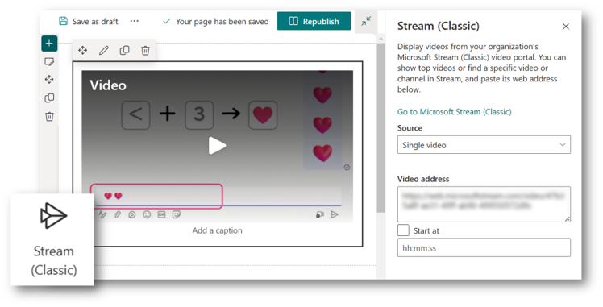
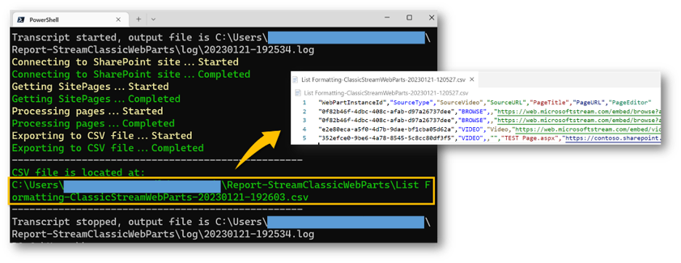

# Export of Stream (Classic) Web Parts and pages that use them

## Summary

Microsoft Stream (Classic) is scheduled to be retired. More information on this can be found at the following link.

[Migration Overview - Stream (Classic) to Stream (on SharePoint)](https://learn.microsoft.com/stream/streamnew/stream-classic-to-new-migration-overview)

In addition to migrating the video, this retirement may also involve replacing Stream (Classic) Web Parts embedded within SharePoint pages.



This sample script helps you understand how many Stream (Classic) Web Parts are being used by your site by outputting a CSV file of the Stream (Classic) Web Parts and the pages that use them. The CSV file is created in the Report-StreamClassicWebParts folder in My Documents.



# [PnP PowerShell](#tab/pnpps)

```powershell
[CmdletBinding()]
param(
    [parameter(Mandatory = $true, HelpMessage = "URL of the SharePoint site, e.g.https://contoso.sharepoint.com/PnPScriptSamples")]
    [string]$siteUrl
)

$csvFolderPath = "$([Environment]::GetFolderPath("MyDocuments"))\Report-StreamClassicWebParts"
$logFolderPath = "$([Environment]::GetFolderPath("MyDocuments"))\Report-StreamClassicWebParts\log"

# Create the log and csv folder if they don't exist
if(!(Test-Path $csvFolderPath)){New-Item -ItemType Directory -Path $csvFolderPath}
if(!(Test-Path $logFolderPath)){New-Item -ItemType Directory -Path $logFolderPath}

# Start logging
Start-Transcript -Path "$logFolderPath\$($(Get-Date).ToString("yyyyMMdd-HHmmss")).log"

# Connect to SharePoint site
try {
    Write-Host "Connecting to SharePoint site...Started" -ForegroundColor Yellow
    Connect-PnPOnline -Url $siteUrl -Interactive -ErrorAction Stop
    Write-Host "Connecting to SharePoint site...Completed" -ForegroundColor Green
}
catch {
    Write-Error "Error connecting to $($siteUrl). Error message: $_.Exception.Message"
    Stop-Transcript
    return
}

try {
    # Get SitePages
    Write-Host "Getting SitePages...Started" -ForegroundColor Yellow
    $items = Get-PnPListItem -List "SitePages" -ErrorAction Stop | Where-Object { $_["FileLeafRef"] -like "*.aspx" }
    $itemCount = $items.count
    Write-Host "Getting SitePages...Completed" -ForegroundColor Green

    # Get web parts in each page
    $streamWebParts = @()
    $counter = 0
    $uri = New-Object System.Uri($siteUrl)
    $rootUrl = "$($uri.Scheme)://$($uri.Host)"
    Write-Host "Processing pages...Started" -ForegroundColor Yellow
    foreach ($item in $items) {
        try {
            $counter++
            Write-Progress -Activity "Processing pages" -Status "$counter/$itemCount" -PercentComplete (($counter / $itemCount) * 100)

            $page = Get-PnPPage -Identity $item["FileLeafRef"] -ErrorAction Stop
            foreach ($control in ($page.Controls | Where-Object { $_.WebPartId -eq "275c0095-a77e-4f6d-a2a0-6a7626911518" })) {
                $controlProperties = ConvertFrom-Json $control.PropertiesJson -ErrorAction Stop
                $streamWebPart = [PSCustomObject]@{
                    WebPartInstanceId = $control.InstanceId
                    SourceType        = $controlProperties.sourceType
                    SourceVideo       = $controlProperties.videoTitle
                    SourceURL         = [regex]::Matches($controlProperties.embedCode, 'src="(.+?)"')[0].Value -replace 'src="', '' -replace '"', ''
                    PageTitle         = $item["FileLeafRef"]
                    PageURL           = "$($rootUrl)$($item["FileRef"])"
                    PageEditor        = $item["Editor"].lookupValue
                }
                $streamWebParts += $streamWebPart
            }
        }
        catch {
            Write-Error "Error processing page $($item["FileLeafRef"]). Error message: $_.Exception.Message"
        }
    }
    Write-Host "Processing pages...Completed" -ForegroundColor Green

    # Export web parts to CSV
    try {
        $site = Get-PnPWeb
        $timeStamp = (Get-Date).ToString("yyyyMMdd-HHmmss")
        $csvFilePath = "$csvFolderPath\$($site.Title)-ClassicStreamWebParts-$timeStamp.csv"

        Write-Host "Exporting to CSV file...Started" -ForegroundColor Yellow
        $streamWebParts | Export-Csv $csvFilePath -ErrorAction Stop
        Write-Host "Exporting to CSV file...Completed" -ForegroundColor Green

        Write-Host "CSV file was created in the following location."
        Write-Host $csvFilePath
    }
    catch {
        Write-Error "Error exporting stream web parts to $($csvFilePath). Error message: $_.Exception.Message"
    }
}
catch {
    Write-Error "Error getting SitePages. Error message: $_.Exception.Message"
    return
}
finally {
    Disconnect-PnPOnline
    Stop-Transcript
}
```
[!INCLUDE [More about PnP PowerShell](../../docfx/includes/MORE-PNPPS.md)]
***

## Contributors

| Author(s)        |
|------------------|
| Tetsuya Kawahara |

[!INCLUDE [DISCLAIMER](../../docfx/includes/DISCLAIMER.md)]
