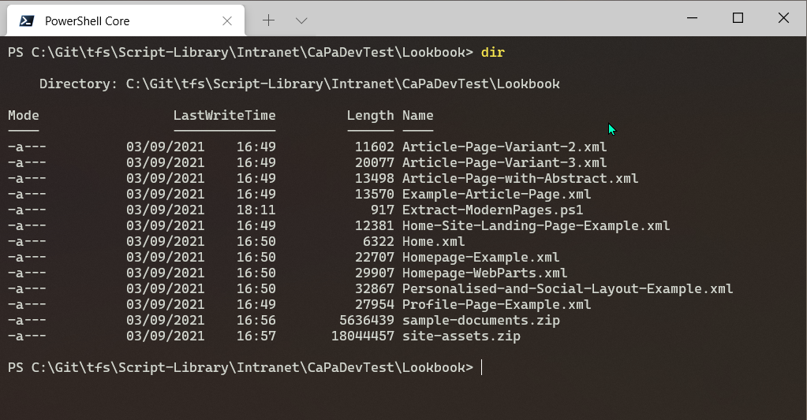

# Extract Modern Pages to Individual Provisioning Files

## Summary

This script will extract each of the pages into a individual provisioning file allow you to either move selectively to another site or tenant. 
Note, this script does not include referenced files e.g. images, videos etc.



# [PnP PowerShell](#tab/pnpps)

```powershell

[CmdletBinding()]
param (
    [Parameter(Mandatory = $true)]
    [string]$Url
)
begin{

    Write-Host "Connecting to " $Url

    Connect-PnPOnline -Url $Url -Interactive
}
process {

    Write-Host "Extracting pages..." $Url

    $pages = Get-PnPListItem -List "SitePages"

    $pages | Foreach-Object{

        $fileName = $_.FieldValues["FileLeafRef"]

        $pageName = $fileName.Replace(".aspx", "")

        Export-PnPPage -Identity $fileName -Out "$($pageName).xml"

    }

    Write-Host "Extracted all pages" -ForegroundColor Cyan
}

```
[!INCLUDE [More about PnP PowerShell](../../docfx/includes/MORE-PNPPS.md)]

***

## Contributors

| Author(s) |
|-----------|
| Paul Bullock} |


[!INCLUDE [DISCLAIMER](../../docfx/includes/DISCLAIMER.md)]

