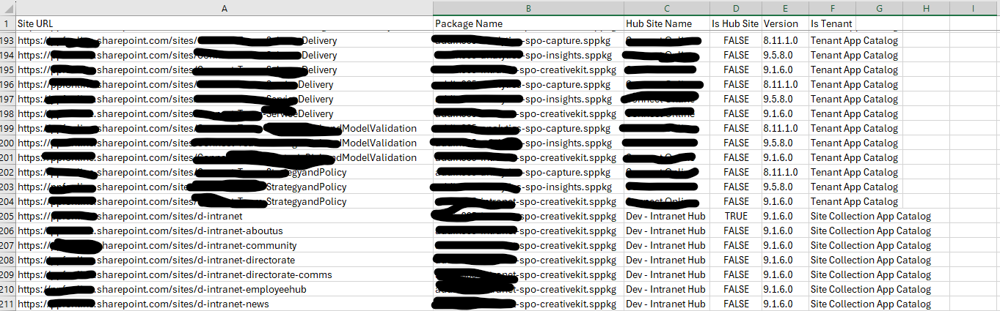

# Find SharePoint Framework (SPFx) Packages in Tenant and Site Collection App Catalogs

## Summary

Find SPFx package installations within SharePoint Online environment in Tenant and Site Collection App Catalog which will help maintain oversight of SPFx package installation, ensuring they are up-to-date and compliant.

The script was particularly useful in pinpointing sites within the tenant where third-party applications, specifically an analytics SPFx component, were deployed. This was crucial for ensuring that data collection was confined to designated sites, such as the intranet in this case. Despite the analytics dashboard aggregating data from all tenant sites, it was challenging to discern the sources of data collection. Therefore, this script was developed to clearly identify the sites from which data were being collected.



### Prerequisites

- The user account that runs the script must have access to the SharePoint Online site.

# [PnP PowerShell](#tab/pnpps)

```powershell
# Parameters
$AdminCenterURL = "https://contosoonline-admin.sharepoint.com"
$tenantAppCatalogUrl = "https://contosoonline.sharepoint.com/sites/appcatalog"
$sppkgFolder = "./packages"
$dateTime = (Get-Date).toString("dd-MM-yyyy")
$fileName = "\InventorySPFx-" + $dateTime + ".csv"

$invocation = (Get-Variable MyInvocation).Value
$directorypath = Split-Path $invocation.MyCommand.Path
$OutPutView = $directorypath + $fileName

 
cd $PSScriptRoot
$packageFiles = Get-ChildItem $sppkgFolder
 
Connect-PnPOnline $tenantAppCatalogUrl -Interactive
$appCatConnection  = Get-PnPConnection
 
Connect-PnPOnline $AdminCenterURL -Interactive
$adminConnection  = Get-PnPConnection
 
$SiteAppUpdateCollection = @()
 
#Get associated sites with hub
$associatedSites = Get-PnPTenantSite -Detailed -Connection $adminConnection  | Where-Object -Property Template -NotIn ("PWA#0","SRCHCEN#0", "REDIRECTSITE#0", "SPSMSITEHOST#0", "APPCATALOG#0", "POINTPUBLISHINGHUB#0", "POINTPUBLISHINGTOPIC#0","EDISC#0", "STS#-1") 
$istenantApp = ""

$associatedSites | select url | ForEach-Object {
  $Site = Get-PnPTenantSite $_.url -Connection $adminConnection
  Connect-PnPOnline -Url $Site.url -Interactive
  $siteConnection  = Get-PnPConnection   

  try{
  foreach($package in $packageFiles)
  {  
     $packageName = $package.PSChildName
     $appTitle = $null;
      #Find Name of app from installed package
      $RestMethodUrl = '/_api/web/lists/getbytitle(''Apps%20for%20SharePoint'')/items?$select=Title,LinkFilename'
      if((Get-PnPSiteCollectionAppCatalog -CurrentSite)){
        $apps = (Invoke-PnPSPRestMethod -Url $RestMethodUrl -Method Get -Connection $siteConnection).Value
        $appTitle = ($apps | where-object {$_.LinkFilename -eq $packageName} | select Title).Title
        $istenantApp = "Site Collection App Catalog"
      }
      if(!$appTitle)
      {
        $apps = (Invoke-PnPSPRestMethod -Url $RestMethodUrl -Method Get -Connection $appCatConnection).Value
        $appTitle = ($apps | where-object {$_.LinkFilename -eq $packageName} | select Title).Title
        $istenantApp = "Tenant App Catalog"
      }
  
    $web = Get-PnPWeb -Includes AppTiles -Connection $siteConnection
    $app = $web.AppTiles  |  where-object {$_.Title -eq $appTitle }
    $currentPackage = Get-PnPApp -Identity  $appTitle -Connection $siteConnection
    if($currentPackage.InstalledVersion){
      Write-Host "Current package version on site $($site.Url): $($currentPackage.InstalledVersion)"
      $ExportVw = New-Object PSObject
      $ExportVw | Add-Member -MemberType NoteProperty -name "Site URL" -value $Site.url
      $ExportVw | Add-Member -MemberType NoteProperty -name "Package Name" -value $packageName
        $ExportVw | Add-Member -MemberType NoteProperty -name "Hub Site Name" -value  (get-pnphubsite -identity $Site.HubSiteId.Guid).title
        $ExportVw | Add-Member -MemberType NoteProperty -name "Is Hub Site" -value $Site.IsHubSite
        $ExportVw | Add-Member -MemberType NoteProperty -name "Version" -value $currentPackage.InstalledVersion
        $ExportVw | Add-Member -MemberType NoteProperty -name "Is Tenant" -value $istenantApp
      $SiteAppUpdateCollection += $ExportVw
    }
  }
}
catch{
  write-host -f Red $_.Exception.Message
 }
}

#Export the result Array to CSV file
$SiteAppUpdateCollection | Export-CSV $OutPutView -Force -NoTypeInformation
```

[!INCLUDE [More about PnP PowerShell](../../docfx/includes/MORE-PNPPS.md)]

***

## Source Credit

Sample first appeared on [Find SharePoint Framework (SPFx) Packages with PowerShell in Tenant and Site Collection App Catalogs](https://reshmeeauckloo.com/posts/powershell_inventory-of-spfx-installs-in-sites/)

## Contributors

| Author(s) |
|-----------|
| [Reshmee Auckloo](https://github.com/reshmee011) |


[!INCLUDE [DISCLAIMER](../../docfx/includes/DISCLAIMER.md)]

