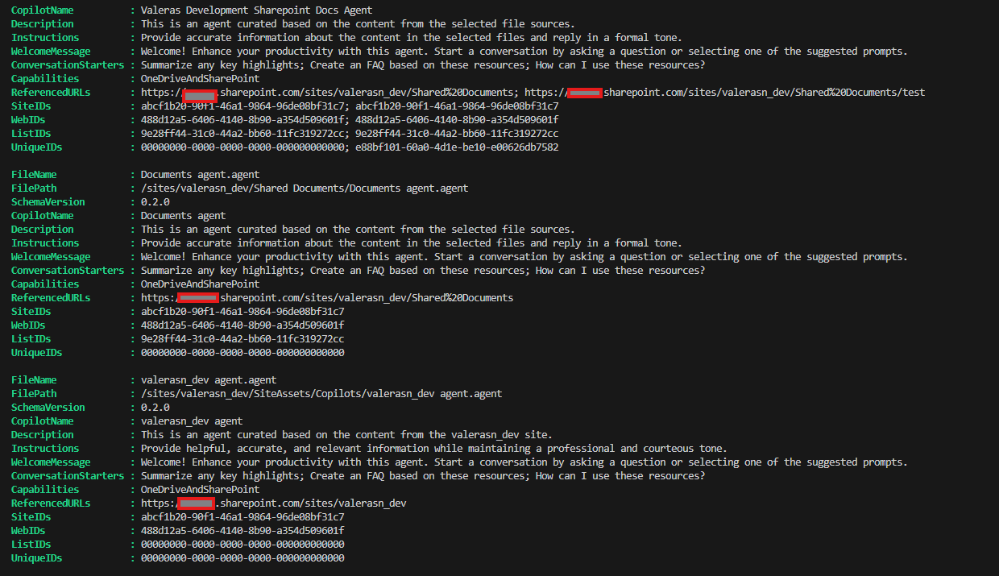

# Get list of SharePoint Agents with PowerShell

## Summary

This script will get all the SharePoint agents from the SharePoint document libraries and export the data to a CSV file. Data includes agent name, description, instructions, welcome message, conversation starters, capabilities, referenced URLs, site IDs, web IDs, list IDs, and unique IDs.



**Minimum Steps To Success**

* Update SharePoint url.
* Update file location.
* Run the script with your credentials.

### Prerequisites

Account or Entra app that runs the script needs access to all of the locations where the files, folders, libraries or sites to be used in the agent are located.

# [PnP PowerShell](#tab/pnpps)

```powershell

$url = "https://[TenantName].sharepoint.com/sites/[SiteName]"
$fileLocation = "C:\Projects\temp\SharePointAgentFiles.csv"

# Connect-PnPOnline -Url $url -Interactive
Connect-PnPOnline -Url $url -UseWebLogin 

# Get all document libraries excluding system libraries
$documentLibraries = Get-PnPList | Where-Object {
    $_.BaseTemplate -eq 101 -and
    $_.Hidden -eq $false -and
    $_.Title -notmatch "Form Templates|Style Library|Site Pages"
}

$allAgentFiles = @()

foreach ($library in $documentLibraries) {

    # Extract all agent files from the library, basically all files with .agent extension. FieldValues contains all the metadata of the file.
    $files = Get-PnPListItem -List $library.Title | Where-Object { $_["FileLeafRef"] -like "*.agent" } | select-object  FieldValues

     foreach ($file in $files) {

        $fileUrl = $file.FieldValues["FileRef"]
        $fileContent = Get-PnPFile -Url $fileUrl -AsString
        $jsonData = $fileContent | ConvertFrom-Json

        $agentData = [PSCustomObject]@{
                    FileName              = $file.FieldValues["FileLeafRef"]
                    FilePath              = $fileUrl
                    SchemaVersion         = $jsonData.schemaVersion
                    CopilotName           = $jsonData.customCopilotConfig.gptDefinition.name
                    Description           = $jsonData.customCopilotConfig.gptDefinition.description
                    Instructions          = $jsonData.customCopilotConfig.gptDefinition.instructions
                    WelcomeMessage        = $jsonData.customCopilotConfig.conversationStarters.welcomeMessage.text
                    ConversationStarters  = ($jsonData.customCopilotConfig.conversationStarters.conversationStarterList.text -join "; ")
                    Capabilities          = ($jsonData.customCopilotConfig.gptDefinition.capabilities.name -join "; ")
                    ReferencedURLs        = ($jsonData.customCopilotConfig.gptDefinition.capabilities.items_by_url.url -join "; ")
                    SiteIDs               = ($jsonData.customCopilotConfig.gptDefinition.capabilities.items_by_url.site_id -join "; ")
                    WebIDs                = ($jsonData.customCopilotConfig.gptDefinition.capabilities.items_by_url.web_id -join "; ")
                    ListIDs               = ($jsonData.customCopilotConfig.gptDefinition.capabilities.items_by_url.list_id -join "; ")
                    UniqueIDs             = ($jsonData.customCopilotConfig.gptDefinition.capabilities.items_by_url.unique_id -join "; ")
                }

        $allAgentFiles += $agentData

     }
}


$allAgentFiles | Export-Csv -Path $fileLocation -NoTypeInformation
Write-Host $fileLocation

```
[!INCLUDE [More about PnP PowerShell](../../docfx/includes/MORE-PNPPS.md)]
***


## Contributors

| Author(s) |
|-----------|
| Valeras Narbutas |

[!INCLUDE [DISCLAIMER](../../docfx/includes/DISCLAIMER.md)]

