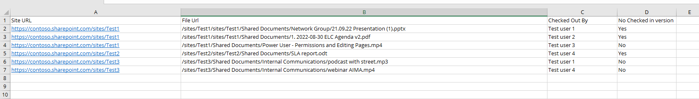

# Get Checked Out Files including those with no checked in version

## Summary

There are scenarios when files uploaded won't have **checked-in version** which will make the files visible only to their uploader. Two possible scenarios.

1. When **Require Check Out** option under versioning settings of any library is set to "Yes" and the uploader forget to check in the file. 

2. When there are required fields and end user uses OneDrive to save a newly created office file.



Files which have no checked in versions have the following issues

- Invisibility: They evade search results, remaining hidden from intended audiences.
- Backup Issues: These files are not backed up, risking data loss.
- Mass update of those files failed

# [PnP PowerShell](#tab/pnpps)

```powershell
#Set Parameters
$AdminCenterURL="https://contoso-admin.sharepoint.com/"
Connect-PnPOnline -Url $AdminCenterURL -Interactive
$dateTime = (Get-Date).toString("dd-MM-yyyy")
$invocation = (Get-Variable MyInvocation).Value
$directorypath = Split-Path $invocation.MyCommand.Path
$fileName = "checkedoutfiles-" + $dateTime + ".csv"
$OutPutView = $directorypath + "\Logs\"+ $fileName
# Array to Hold Result - PSObjects
$filesCollection = @()
 
#Array to Skip System Lists and Libraries
$SystemLists = @("Converted Forms", "Master Page Gallery", "Customized Reports", "Form Templates", "List Template Gallery", "Theme Gallery","Apps for SharePoint",
                            "Reporting Templates", "Solution Gallery", "Style Library", "Web Part Gallery","Site Assets", "wfpub", "Site Pages", "Images", "MicroFeed","Pages")
 
$m365Sites = Get-PnPTenantSite -Detailed | Where-Object {($_.Url -like '*/intranet-*' -or  $_.Url -like '*/team-*' -or $_.Template -eq 'TEAMCHANNEL#1') -and $_.Template -ne 'RedirectSite#0' }
$m365Sites | ForEach-Object {
$siteUrl = $_.Url;    
Connect-PnPOnline -Url $siteUrl -Interactive
 
$Ctx = Get-PnPContext
#Get the List
write-host  $siteUrl  
 Get-PnPList  | Where {$_.Hidden -eq $false -and $SystemLists -notcontains $_.Title -and $_.BaseTemplate -eq 101 } | ForEach-Object {
#Get All Checked-Out Files
$CheckedOutFiles = $_.GetCheckedOutFiles()
$Ctx.Load($CheckedOutFiles)
$Ctx.ExecuteQuery()
#Check-in All Files Checked out to the User
$CheckedOutFiles | ForEach-Object {

        $user = (Get-PnPUser -Identity $_.CheckedoutById -ErrorAction Ignore) ?? $_.CheckedoutById
        $ExportVw = New-Object PSObject
        $ExportVw | Add-Member -MemberType NoteProperty -name "Site URL" -value $siteUrl
        $ExportVw | Add-Member -MemberType NoteProperty -name "File Url" -value $_.ServerRelativePath.DecodedUrl
        $ExportVw | Add-Member -MemberType NoteProperty -name "Checked Out By" -value $user.Title
        $ExportVw | Add-Member -MemberType NoteProperty -name "No Checked in version" -value "Yes"
        $filesCollection += $ExportVw
    }
 
$alldocs = (Get-PnPListItem -List $_  -PageSize 1000 | where-object{ $null -ne $_.FieldValues.CheckoutUser} )
 
$alldocs | ForEach-Object {
        $ExportVw = New-Object PSObject
        $ExportVw | Add-Member -MemberType NoteProperty -name "Site URL" -value $siteUrl
        $ExportVw | Add-Member -MemberType NoteProperty -name "File Url" -value $_.FieldValues.FileRef
        $ExportVw | Add-Member -MemberType NoteProperty -name "Checked Out By" -value $_.FieldValues.CheckoutUser.LookupValue
        $ExportVw | Add-Member -MemberType NoteProperty -name "No Checked in version" -value "No"
        $filesCollection += $ExportVw
  }
 }
}
# Export the result array to CSV file
$filesCollection | sort-object "File Url" |Export-CSV $OutPutView -Force -NoTypeInformation
```

[!INCLUDE [More about PnP PowerShell](../../docfx/includes/MORE-PNPPS.md)]

***

## Source Credit

Sample first appeared on [Discovering All Checked Out Files including those with no checked in versions with PnP PowerShell](https://reshmeeauckloo.com/posts/powershell_getallfileswithnocheckedinversion/)

## Contributors

| Author(s) |
|-----------|
| [Reshmee Auckloo](https://github.com/reshmee011)|

[!INCLUDE [DISCLAIMER](../../docfx/includes/DISCLAIMER.md)]

