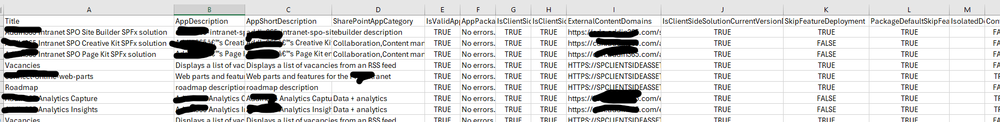

# Retrieve SPFx Details from Tenant and Site Collection App Catalogs

## Summary

This script will help to gather detailed information about SPFx solutions installed in SharePoint environment, such as API permissions, for auditing, inventory, or compliance purposes from both the tenant-level and site collection app catalogs.



### Prerequisites

- The user account that runs the script must have access to the SharePoint Online site.

# [PnP PowerShell](#tab/pnpps)

```powershell
$AdminCenterURL= Read-Host -Prompt "Enter admin tenant collection URL";

$tenantAppCatalogUrl = Get-PnPTenantAppCatalogUrl
$dateTime = (Get-Date).toString("dd-MM-yyyy")
$invocation = (Get-Variable MyInvocation).Value
$directorypath = Split-Path $invocation.MyCommand.Path
$fileName = "\InventorySPFx-" + $dateTime + ".csv"
$OutPutView = $directorypath + $fileName
 
cd $PSScriptRoot
 
Connect-PnPOnline $tenantAppCatalogUrl -Interactive
$appCatConnection  = Get-PnPConnection
 
Connect-PnPOnline $AdminCenterURL -Interactive
$adminConnection  = Get-PnPConnection
 
$appsDetails = @()
 
#Get associated sites with hub
$sites = Get-PnPTenantSite -Detailed -Connection $adminConnection  | Where-Object -Property Template -NotIn ("PWA#0","SRCHCEN#0", "REDIRECTSITE#0", "SPSMSITEHOST#0", "APPCATALOG#0", "POINTPUBLISHINGHUB#0", "POINTPUBLISHINGTOPIC#0","EDISC#0", "STS#-1") 
$RestMethodUrl = '/_api/web/lists/getbytitle(''Apps%20for%20SharePoint'')/items?$select=Title,LinkFilename,SkipFeatureDeployment,ContainsTeamsManifest,ContainsVivaManifest,SupportsTeamsTabs,WebApiPermissionScopesNote,ContainsTenantWideExtension,IsolatedDomain,PackageDefaultSkipFeatureDeployment,IsClientSideSolutionCurrentVersionDeployed,ExternalContentDomains,IsClientSideSolutionDeployed,IsClientSideSolution,AppPackageErrorMessage,IsValidAppPackage,SharePointAppCategory,AppDescription,AppShortDescription'

$apps = (Invoke-PnPSPRestMethod -Url $RestMethodUrl -Method Get -Connection $appCatConnection).Value
#export details of apps
$apps| foreach-object{
    $app = $_
    $app  | Add-Member -MemberType NoteProperty -name "Site Url" -value $tenantAppCatalogUrl
    $appsDetails += $app
}

$sites | select url | ForEach-Object {
  write-host "Processing Site:" $_.url -f Yellow
    $Site = Get-PnPTenantSite $_.url -Connection $adminConnection
  Connect-PnPOnline -Url $Site.url -Interactive
  $siteConnection  = Get-PnPConnection   

  try{
      if((Get-PnPSiteCollectionAppCatalog -CurrentSite)){
        $apps = (Invoke-PnPSPRestMethod -Url $RestMethodUrl -Method Get -Connection $siteConnection).Value
        $apps| foreach-object{
            $app = $_
            $app  | Add-Member -MemberType NoteProperty -name "Site Url" -value $Site.url
            $appsDetails += $app
        }
      }
     }
 catch{
  write-host -f Red $_.Exception.Message
 }
}
#Export the result Array to CSV file
$appsDetails | Export-CSV $OutPutView -Force -NoTypeInformation
```

[!INCLUDE [More about PnP PowerShell](../../docfx/includes/MORE-PNPPS.md)]

***

## Source Credit

Sample first appeared on [Retrieve SPFx Details from Tenant and Site Collection App Catalogs Using PowerShell](https://reshmeeauckloo.com/posts/powershell-get-spfx-details-tenant-sitecollection-appcatalog/)

## Contributors

| Author(s) |
|-----------|
| [Reshmee Auckloo](https://github.com/reshmee011) |


[!INCLUDE [DISCLAIMER](../../docfx/includes/DISCLAIMER.md)]

