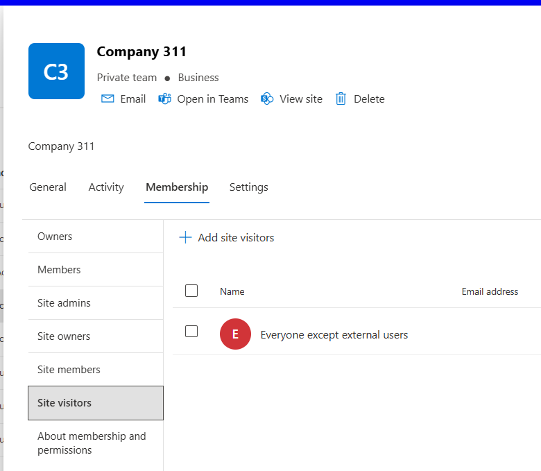

# Audit 'Everyone' and  'Everyone except external users' claim within a SharePoint site

## Summary

As part of Microsoft 365 Copilot readiness, you may want to find where "Everyone and "Everyone except external users" claims are granted permissions which is a cause of oversharing.

This is an example where 'Everyone except external users' has been added to the SharePoint site visitors group.



### Prerequisites

- The user account that runs the script must have SharePoint Online site administrator access.

# [PnP PowerShell](#tab/pnpps)

```powershell
param (
    [Parameter(Mandatory = $true)]
    [string] $domain
)
Clear-Host

$properties=@{SiteUrl='';SiteTitle='';ListTitle='';SensitivityLabel='';Type='';RelativeUrl='';ParentGroup='';MemberType='';MemberName='';MemberLoginName='';Roles='';}; 

$adminSiteURL = "https://$domain-Admin.SharePoint.com"
$TenantURL = "https://$domain.sharepoint.com" 
$dateTime = (Get-Date).toString("dd-MM-yyyy-hh-ss")
$invocation = (Get-Variable MyInvocation).Value
$directorypath = (Split-Path $invocation.MyCommand.Path) + "\Logs\"
$excludeLimitedAccess = $true;
$includeListsItems = $true;

#$SiteCollectionUrl = Read-Host -Prompt "Enter site collection URL ";
$everyoneGroups = @("everyone except external users", "everyone","all users")

$global:siteTitle= "";
#Exclude certain libraries
$ExcludedLibraries = @("Form Templates", "Preservation Hold Library", "Site Assets", "Images", "Pages", "Settings", "Videos","Timesheet"
  "Site Collection Documents", "Site Collection Images", "Style Library", "AppPages", "Apps for SharePoint", "Apps for Office")

$global:permissions =@();
$global:sharingLinks = @();

function Get-ListItems_WithUniquePermissions{
  param(
      [Parameter(Mandatory)]
      [Microsoft.SharePoint.Client.List]$List
  )
  $selectFields = "ID,HasUniqueRoleAssignments,FileRef,FileLeafRef,FileSystemObjectType"
 
  $Url = $siteUrl + '/_api/web/lists/getbytitle(''' + $($list.Title) + ''')/items?$select=' + $($selectFields)
  $nextLink = $Url
  $listItems = @()
  $Stoploop =$true
  while($nextLink){  
      do{
      try {
          $response = invoke-pnpsprestmethod -Url $nextLink -Method Get
          $Stoploop =$true
  
      }
      catch {
          write-host "An error occured: $_  : Retrying" -ForegroundColor Red
          $Stoploop =$true
          Start-Sleep -Seconds 30
      }
  }
  While ($Stoploop -eq $false)
  
      $listItems += $response.value | where-object{$_.HasUniqueRoleAssignments -eq $true}
      if($response.'odata.nextlink'){
          $nextLink = $response.'odata.nextlink'
      }    else{
          $nextLink = $null
      }
  }

  return $listItems
}

Function PermissionObject($_object,$_type,$_relativeUrl,$_siteUrl,$_siteTitle,$_listTitle,$_memberType,$_parentGroup,$_memberName,$_memberLoginName,$_roleDefinitionBindings,$_sensitivityLabel)
{
  $permission = New-Object -TypeName PSObject -Property $properties; 
  $permission.SiteUrl =$_siteUrl; 
  $permission.SiteTitle = $_siteTitle; 
  $permission.ListTitle = $_listTitle; 
  $permission.SensitivityLabel = $_sensitivityLabel; 
  $permission.Type =  $_Type -eq 1 ? "Folder" : $_Type -eq 0 ? "File" : $_Type;
  $permission.RelativeUrl = $_relativeUrl; 
  $permission.MemberType = $_memberType; 
  $permission.ParentGroup = $_parentGroup; 
  $permission.MemberName = $_memberName; 
  $permission.MemberLoginName = $_memberLoginName; 
  $permission.Roles = $_roleDefinitionBindings -join ","; 
  $global:permissions += $permission;
}

Function Extract-Guid ($inputString) {
  $splitString = $inputString -split '\|'
  return $splitString[2].TrimEnd('_o')
}

Function QueryUniquePermissionsByObject($_ctx,$_object,$_Type,$_RelativeUrl,$_siteUrl,$_siteTitle,$_listTitle)
{
  $roleAssignments = Get-PnPProperty -ClientObject $_object -Property RoleAssignments
   switch ($_Type) {
    0 { $sensitivityLabel = $_object.FieldValues["_DisplayName"] }
    1 { $sensitivityLabel = $_object.FieldValues["_DisplayName"] }
    "Site" { $sensitivityLabel = (Get-PnPSiteSensitivityLabel).displayname }
    default { " " }
}
  foreach($roleAssign in $roleAssignments){
    Get-PnPProperty -ClientObject $roleAssign -Property RoleDefinitionBindings,Member;
    $PermissionLevels = $roleAssign.RoleDefinitionBindings | Select -ExpandProperty Name;
    #Get all permission levels assigned (Excluding:Limited Access)  
    if($excludeLimitedAccess -eq $true){
       $PermissionLevels = ($PermissionLevels | Where { $_ -ne "Limited Access"}) -join ","  
    }

    $MemberType = $roleAssign.Member.GetType().Name; 
    #Get the Principal Type: User, SP Group, AD Group  
    $PermissionType = $roleAssign.Member.PrincipalType  

    If($PermissionLevels.Length -gt 0) {
      $MemberType = $roleAssign.Member.GetType().Name; 
       #Ignoring sharing links as sharing links are not supported for everyone group
       
      If($roleAssign.Member.Title -notlike "SharingLinks*" -and ($MemberType -eq "Group" -or $MemberType -eq "User"))
      { 
        $MemberName = $roleAssign.Member.Title; 
        $groupExists = $false;
        $everyonegroups | ForEach-Object {if($roleAssign.Member.Title -contains $_){$groupExists =$true}}
        $MemberLoginName = $roleAssign.Member.LoginName;    
        if($groupExists -eq $true){
         
        if($MemberType -eq "User")
        {
          $ParentGroup = "NA";
        }
        else
        {
          $ParentGroup = $MemberName;
        }
        (PermissionObject $_object $_Type $_RelativeUrl $_siteUrl $_siteTitle $_listTitle $MemberType $ParentGroup $MemberName $MemberLoginName $PermissionLevels $sensitivityLabel); 
        }  
    }

      if($_Type  -eq "Site" -and $MemberType -eq "Group")
      {
        $sensitivityLabel = (Get-PnPSiteSensitivityLabel).DisplayName
        If($PermissionType -eq "SharePointGroup")  {  
          #Get Group Members  
          $groupUsers = Get-PnPGroupMember -Identity $roleAssign.Member.LoginName                  
          $groupUsers|foreach-object{ 
            $groupExists = $false;
            $title = $_.Title
            $everyonegroups | ForEach-Object {if($title -contains $_){$groupExists =$true}}
            if($groupExists -eq $true){
            (PermissionObject $_object "Site" $_RelativeUrl $_siteUrl $_siteTitle "" "GroupMember" $roleAssign.Member.LoginName $_.Title $_.LoginName $PermissionLevels $sensitivityLabel);   
            }
        }
        }
      } 
    }      
  }
}
Function QueryUniquePermissions($_web)
{
  ##query list, files and items unique permissions
  Write-Host "Querying web $($_web.Title)";
  $siteUrl = $_web.Url; 
 
  Write-Host $siteUrl -Foregroundcolor "Red"; 
  $global:siteTitle = $_web.Title; 
  $ll = Get-PnPList -Includes BaseType, Hidden, Title,HasUniqueRoleAssignments,RootFolder  -Connection $siteconn | Where-Object {$_.Hidden -eq $False -and $_.Title -notin $ExcludedLibraries } #$_.BaseType -eq "DocumentLibrary" 
  Write-Host "Number of lists $($ll.Count)";

  QueryUniquePermissionsByObject $_web $_web "Site" "" $siteUrl $siteTitle  "";
 
  foreach($list in $ll)
  {      
    $listUrl = $list.RootFolder.ServerRelativeUrl; 
    #Exclude internal system lists and check if it has unique permissions 
    if($list.Hidden -ne $True)
    { 
      Write-Host $list.Title  -Foregroundcolor "Yellow"; 
      $listTitle = $list.Title; 
      #Check List Permissions 
      if($list.HasUniqueRoleAssignments -eq $True)
      { 
        $Type = $list.BaseType.ToString(); 
        QueryUniquePermissionsByObject $_web $list $Type $listUrl $siteUrl $siteTitle $listTitle;
      }
      
      if($includeListsItems){         
        $collListItem =  Get-ListItems_WithUniquePermissions -List $list
        $count = $collListItem.Count
        Write-Host  "Number of items with unique permissions: $count within list $listTitle" 
        foreach($item in $collListItem) 
        {
            $Type = $item.FileSystemObjectType; 
            $fileUrl = $item.FileRef;  
            $i = Get-PnPListItem -List $list -Id $item.ID
            QueryUniquePermissionsByObject $_web $i $Type $fileUrl $siteUrl $siteTitle $listTitle;
        } 
      }
    }
  }
}

if(Test-Path $directorypath){
  Connect-PnPOnline -Url $adminSiteURL -Interactive 
  $adminConnection = Get-PnPConnection
  Get-PnPTenantSite -Filter "Url -like '$TenantURL'" -Connection $adminConnection | Where-Object { $_.Template -ne 'RedirectSite#0' }  | foreach-object {   
    Write-Host "Processing Site:" $_.Url -ForegroundColor Magenta
  Connect-PnPOnline -Url $_.Url -Interactive
   #array storing permissions
   $web = Get-PnPWeb
   #root web , i.e. site collection level
   QueryUniquePermissions($web);
}
  Write-Host "Permission count: $($global:permissions.Count)";
  $exportFilePath = Join-Path -Path $directorypath -ChildPath $([string]::Concat($domain,"-everyone_",$dateTime,".csv"));
  
  Write-Host "Export File Path is:" $exportFilePath
  Write-Host "Number of lines exported is :" $global:permissions.Count
 
  $global:permissions | Select-Object SiteUrl,SiteTitle,Type,SensitivityLabel,RelativeUrl,ListTitle,MemberType,MemberName,MemberLoginName,ParentGroup,Roles|Export-CSV -Path $exportFilePath -NoTypeInformation;
  
}
else{
  Write-Host "Invalid directory path:" $directorypath -ForegroundColor "Red";
}
```

[!INCLUDE [More about PnP PowerShell](../../docfx/includes/MORE-PNPPS.md)]

***

## Source Credit

Sample first appeared on [Manage 'Everyone' and 'Everyone except external users' claim within a SharePoint site using PowerShell](https://reshmeeauckloo.com/posts/powershell-get-everyone-report-sharepoint/)

## Contributors

| Author(s) |
|-----------|
| [Reshmee Auckloo](https://github.com/reshmee011) |


[!INCLUDE [DISCLAIMER](../../docfx/includes/DISCLAIMER.md)]

