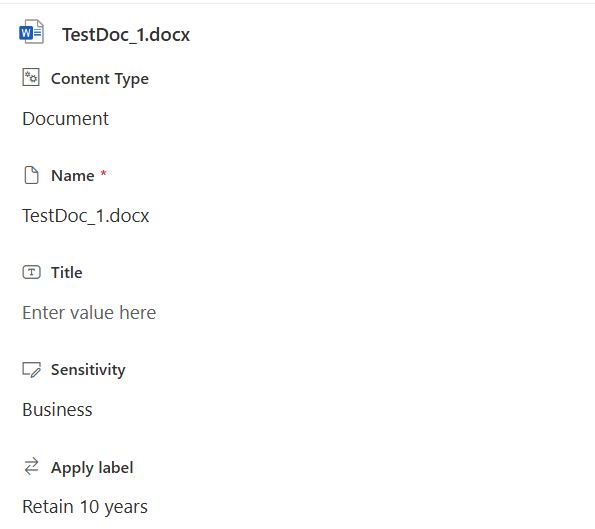

# Get Files with Retention or Sensitivity Labels in SharePoint Online

## Summary
Understanding the sensitivity and retention labels applied to files in your SharePoint Online sites is essential for maintaining data security and compliance. These labels enable you to manage and protect your data by defining retention periods and handling sensitive information appropriately. This is particularly important for initiatives like the Microsoft 365 Copilot rollout, ensuring that the correct files are stored within the appropriate SharePoint sites. For example, if a SharePoint site is a public Team site, files labeled as confidential should be moved to a private Team site or existing Team site updated from public to private.

Example of file tagged with retention label and sensitivity label:



## Prerequisites

- The user account that runs the script must have SharePoint Online site administrator access.

# [PnP PowerShell](#tab/pnpps)
```powershell
param (
    [Parameter(Mandatory = $true)]
    [string] $domain
)

$adminSiteURL = "https://$domain-Admin.SharePoint.com"
$TenantURL = "https://$domain.sharepoint.com"
$dateTime = (Get-Date).ToString("dd-MM-yyyy-hh-ss")
$invocation = (Get-Variable MyInvocation).Value
$directoryPath = Split-Path $invocation.MyCommand.Path
$fileName = "labelsReport" + $dateTime + ".csv"
$outputPath = $directoryPath + "\" + $fileName

Connect-PnPOnline -Url $adminSiteURL -Interactive -WarningAction SilentlyContinue
$adminConnection = Get-PnPConnection

# Exclude certain libraries
$ExcludedLibraries = @(
    "Form Templates", "Preservation Hold Library", "Site Assets", "Site Pages", "Images", "Pages", "Settings", "Videos",
    "Site Collection Documents", "Site Collection Images", "Style Library", "AppPages", "Apps for SharePoint", "Apps for Office"
)

function ReportFileLabels($siteUrl) {
    $report = @()
    Connect-PnPOnline -url $siteUrl -Interactive -WarningAction SilentlyContinue
    $siteconn = Get-PnPConnection
    try {
        $DocLibraries = Get-PnPList -Includes BaseType, Hidden, Title -Connection $siteconn | Where-Object {
            $_.BaseType -eq "DocumentLibrary" -and $_.Hidden -eq $False -and $_.Title -notin $ExcludedLibraries
        }

        $report += $DocLibraries | ForEach-Object {
            Write-Host "Processing Document Library:" $_.Title -ForegroundColor Yellow
            $library = $_

             Get-PnPListItem -List $library.Title -Fields "ID","_ComplianceTag","_DisplayName" -PageSize 1000 -Connection $siteconn | ForEach-Object  {
                if ($_.FieldValues["_DisplayName"] -or $_.FieldValues["_ComplianceTag"]) {
                    [PSCustomObject]@{
                        SiteUrl           = $siteUrl
                        Title             = $_.FieldValues["FileLeafRef"]
                        ServerRelativePath = $_.FieldValues["FileRef"]
                        RetentionLabel    = $_.FieldValues["_ComplianceTag"]
                        SensitivityLabel  = $_.FieldValues["_DisplayName"]
                        LastModified      = $_["Last_x0020_Modified"]
                    }
                }
            }
        }
    } catch {
        Write-Output "An exception was thrown: $($_.Exception.Message)" -ForegroundColor Red
    }
    return $report
}

Get-PnPTenantSite -Filter "Url -like '$TenantURL'" -Connection $adminConnection | Where-Object { $_.Template -ne 'RedirectSite#0' }  | foreach-object {   
    Write-Host "Processing Site:" $_.Url -ForegroundColor Magenta
    $report += ReportFileLabels -siteUrl $_.Url
}

if($report -and $report.Count -gt 0){
    $report | Export-Csv -Path $outputPath -NoTypeInformation
} else {
    Write-Output "No data found" -ForegroundColor Yellow
} 

```

[!INCLUDE [More about PnP PowerShell](../../docfx/includes/MORE-PNPPS.md)]
***

## Source Credit

Sample first appeared on [PowerShell: Fetch Files with Retention or Sensitivity Labels in SharePoint Online](https://reshmeeauckloo.com/posts/powershell-get-sensitivity-retention-label/)

## Contributors

| Author(s) |
|-----------|
| [Reshmee Auckloo](https://github.com/reshmee011)|

[!INCLUDE [DISCLAIMER](../../docfx/includes/DISCLAIMER.md)]

