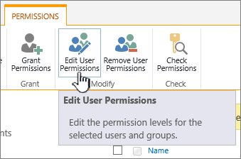

# Find all items with unique permissions and export to csv

## Summary

It is a very common request to inventory the items with custom permissions.




# [PnP PowerShell](#tab/pnpps)

```powershell

$adminSiteURL = "https://contoso-admin.sharepoint.com/"
$listOfItemWithCustomPermissionsCSVPath = "C:\temp\itemswithcustompermissions.csv"
$listOfListsWithCustomPermissionsCSVPath = "C:\temp\listswithcustompermissions.csv"

function Handle-Web ($webUrl)
{
    try 
    {
        # Most likely you should use the app-only approach, but for now I'm using the interactive approach
        #$localconn = Connect-PnPOnline -Url $webUrl -ClientId $ClientId -thumbprint $thumbprint -Tenant $TenantName -ReturnConnection -erroraction stop
        $localconn = Connect-PnPOnline -Url $webUrl -Interactive -ReturnConnection
        #first root
        $lists = Get-PnPList -Connection $localconn
        foreach($list in $lists)
        {
            $IsSystemList = Get-PnPProperty -ClientObject $list -Property IsSystemList -Connection $localconn
            if($IsSystemList)
            {
                write-host " Skipping $($list.Title) on $webUrl" -ForegroundColor Yellow
                continue  #skipping the system lists
            }
            write-host " handling $($list.Title) on $($webUrl)" -ForegroundColor Blue
            $listHasUniqueRoleAssignments = Get-PnPProperty -ClientObject $list -Property "HasUniqueRoleAssignments" -Connection $localconn
            if($listHasUniqueRoleAssignments )
            {
                $listInfo = New-Object PSObject
                $listInfo | Add-Member NoteProperty Title($list.Title) 
                $listInfo | Add-Member NoteProperty Url($list.ParentWebUrl) 
                $global:listOfListsWithCustomPermissions+=$listInfo
            }
            else
            {
                $listitems = Get-PnPListItem -List $list -PageSize 500 -Connection $localconn
                foreach($listItem in $listitems)
                {
                    $listItemHasUniqueRoleAssignments = Get-PnPProperty -ClientObject $listItem -Property HasUniqueRoleAssignments -Connection $localconn
                    if($listItemHasUniqueRoleAssignments)
                    {
                        $listItemInfo = New-Object PSObject
                        $listItemInfo | Add-Member NoteProperty Title($listItem["FileLeafRef"]) 
                        $listItemInfo | Add-Member NoteProperty List($list.Title)
                        $listItemInfo | Add-Member NoteProperty Url($list.ParentWebUrl)
                        $global:listOfItemWithCustomPermissions += $listItemInfo
                    }
                }
            }
        }  
        #then sub sites (which shouldn't be there ;-))
        $subs = Get-PnPSubWeb -Recurse -Connection $localconn
        foreach($sub in $subs)
        {
            Handle-Web -webUrl $sub.Url
        }      
    }
    catch 
    {
        write-host $_.Exception.Message
        #log the error
    }    
}


$global:listOfItemWithCustomPermissions = @()    
$global:listOfListsWithCustomPermissions = @()
$conn = Connect-PnPOnline -Url $adminSiteURL -Interactive -ReturnConnection
$allSites = Get-PnPTenantSite -Connection $conn
try 
{
    $counter = 0
    $allSitesCount = $allSites.Count
    foreach($site in $allSites)
    {
        write-host " at $counter of $allSitesCount" -ForegroundColor Green 
        $counter++
        
              
        #first root
        Handle-Web $site.Url
        
    }
        
}
catch 
{
    Write-Error $_.Exception.Message    
}

$listOfItemWithCustomPermissions | Export-Csv -Path $listOfItemWithCustomPermissionsCSVPath -Force -Encoding utf8BOM -Delimiter "|"
$listOfListsWithCustomPermissions | Export-Csv -Path $listOfListsWithCustomPermissionsCSVPath -Force -Encoding utf8BOM -Delimiter "|"

```
[!INCLUDE [More about PnP PowerShell](../../docfx/includes/MORE-PNPPS.md)]
***


## Contributors

| Author(s) |
|-----------|
| Kasper Larsen |

[!INCLUDE [DISCLAIMER](../../docfx/includes/DISCLAIMER.md)]

