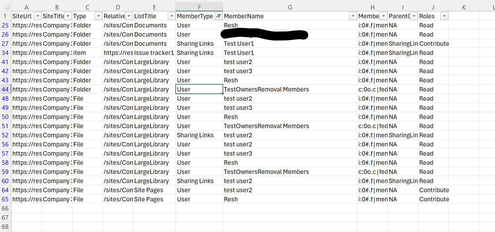

# Get permissions including unique permissions up to item level including sharing links

## Summary

Managing permissions in SharePoint is a critical aspect of maintaining data security and compliance within organisations. However, as SharePoint environments grow in complexity, manually auditing and managing permissions becomes increasingly challenging.

Copilot for Microsoft m365 can access data from all the tenant, whether it’s Outlook emails, Teams chats and meetings, SharePoint and OneDrive. SharePoint is where all most documents, videos, and more are stored. Hence permission audit across sensitive sites to ensure "Least privilege" is a must to avoid data leak while using Copilot for Microsoft m365 which makes it easier to discover content through prompts.



### Prerequisites

- The user account that runs the script must have SharePoint Online site administrator access.

# [PnP PowerShell](#tab/pnpps)

```powershell

Clear-Host

$properties=@{SiteUrl='';SiteTitle='';ListTitle='';SensitivityLabel='';Type='';RelativeUrl='';ParentGroup='';MemberType='';MemberName='';MemberLoginName='';Roles='';}; 
 
$dateTime = (Get-Date).toString("dd-MM-yyyy-hh-ss")
$invocation = (Get-Variable MyInvocation).Value
$directorypath = (Split-Path $invocation.MyCommand.Path) + "\"
$excludeLimitedAccess = $true;
$includeListsItems = $true;

$SiteCollectionUrl = Read-Host -Prompt "Enter site collection URL ";
$global:siteTitle= "";
#Exclude certain libraries
$ExcludedLibraries = @("Form Templates", "Preservation Hold Library", "Site Assets", "Images", "Pages", "Settings", "Videos","Timesheet"
  "Site Collection Documents", "Site Collection Images", "Style Library", "AppPages", "Apps for SharePoint", "Apps for Office")

$global:permissions =@();
$global:sharingLinks = @();

function Get-ListItems_WithUniquePermissions{
  param(
      [Parameter(Mandatory)]
      [Microsoft.SharePoint.Client.List]$List
  )
  $selectFields = "ID,HasUniqueRoleAssignments,FileRef,FileLeafRef,FileSystemObjectType"
 
  $Url = $siteUrl + '/_api/web/lists/getbytitle(''' + $($list.Title) + ''')/items?$select=' + $($selectFields)
  $nextLink = $Url
  $listItems = @()
  $Stoploop =$true
  while($nextLink){  
      do{
      try {
          $response = invoke-pnpsprestmethod -Url $nextLink -Method Get
          $Stoploop =$true
  
      }
      catch {
          write-host "An error occured: $_  : Retrying" -ForegroundColor Red
          $Stoploop =$true
          Start-Sleep -Seconds 30
      }
  }
  While ($Stoploop -eq $false)
  
      $listItems += $response.value | where-object{$_.HasUniqueRoleAssignments -eq $true}
      if($response.'odata.nextlink'){
          $nextLink = $response.'odata.nextlink'
      }    else{
          $nextLink = $null
      }
  }

  return $listItems
}

Function PermissionObject($_object,$_type,$_relativeUrl,$_siteUrl,$_siteTitle,$_listTitle,$_memberType,$_parentGroup,$_memberName,$_memberLoginName,$_roleDefinitionBindings,$_sensitivityLabel)
{
  $permission = New-Object -TypeName PSObject -Property $properties; 
  $permission.SiteUrl =$_siteUrl; 
  $permission.SiteTitle = $_siteTitle; 
  $permission.ListTitle = $_listTitle; 
  $permission.SensitivityLabel = $_sensitivityLabel; 
  $permission.Type =  $_Type -eq 1 ? "Folder" : $_Type -eq 0 ? "File" : $_Type;
  $permission.RelativeUrl = $_relativeUrl; 
  $permission.MemberType = $_memberType; 
  $permission.ParentGroup = $_parentGroup; 
  $permission.MemberName = $_memberName; 
  $permission.MemberLoginName = $_memberLoginName; 
  $permission.Roles = $_roleDefinitionBindings -join ","; 
  $global:permissions += $permission;
}

Function Extract-Guid ($inputString) {
  $splitString = $inputString -split '\|'
  return $splitString[2].TrimEnd('_o')
}

Function QueryUniquePermissionsByObject($_ctx,$_object,$_Type,$_RelativeUrl,$_siteUrl,$_siteTitle,$_listTitle)
{
  $roleAssignments = Get-PnPProperty -ClientObject $_object -Property RoleAssignments
   switch ($_Type) {
    0 { $sensitivityLabel = $_object.FieldValues["_DisplayName"] }
    1 { $sensitivityLabel = $_object.FieldValues["_DisplayName"] }
    "Site" { $sensitivityLabel = (Get-PnPSiteSensitivityLabel).displayname }
    default { " " }
}
  foreach($roleAssign in $roleAssignments){
    Get-PnPProperty -ClientObject $roleAssign -Property RoleDefinitionBindings,Member;
    $PermissionLevels = $roleAssign.RoleDefinitionBindings | Select -ExpandProperty Name;
    #Get all permission levels assigned (Excluding:Limited Access)  
    if($excludeLimitedAccess -eq $true){
       $PermissionLevels = ($PermissionLevels | Where { $_ -ne "Limited Access"}) -join ","  
    }
    $Users = Get-PnPProperty -ClientObject ($roleAssign.Member) -Property Users -ErrorAction SilentlyContinue
    #Get Access type
    $AccessType = $roleAssign.RoleDefinitionBindings.Name
    $MemberType = $roleAssign.Member.GetType().Name; 
    #Get the Principal Type: User, SP Group, AD Group  
    $PermissionType = $roleAssign.Member.PrincipalType  
  if( $_Type -eq 0){
      $sharingLinks = Get-PnPFileSharingLink -Identity $_object.FieldValues["FileRef"]
  }
  if( $_Type -eq 1){
      $sharingLinks = Get-PnPFolderSharingLink -Folder $_object.FieldValues["FileRef"]
  }

    If($PermissionLevels.Length -gt 0) {
      $MemberType = $roleAssign.Member.GetType().Name; 
       #Sharing link is in the format SharingLinks.03012675-2057-4d1d-91e0-8e3b176edd94.OrganizationView.20d346d3-d359-453b-900c-633c1551ccaa
        If ($roleAssign.Member.Title -like "SharingLinks*")
        {
          if($sharingLinks){
          $sharingLinks | where-object {$roleAssign.Member.Title -match $_.Id } | ForEach-Object{
            If ($Users.Count -gt 0) 
            {
                ForEach ($User in $Users)
                {
                PermissionObject $_object $_Type $_RelativeUrl $_siteUrl $_siteTitle $_listTitle "Sharing Links" $roleAssign.Member.LoginName  $user.Title $User.LoginName $_.Link.Type $sensitivityLabel; 
                }
            } 
            else {
              PermissionObject $_object $_Type $_RelativeUrl $_siteUrl $_siteTitle $_listTitle "Sharing Links" $roleAssign.Member.LoginName  $_.Link.Scope "" $_.Link.Type  $sensitivityLabel;
            }
          }  
        }
        <#  
        If ($Users.Count -gt 0) 
            {
                ForEach ($User in $Users)
                {
                PermissionObject $_object $_Type $_RelativeUrl $_siteUrl $_siteTitle $_listTitle "Sharing Links" $roleAssign.Member.LoginName  $user.Title $User.LoginName $AccessType $sensitivityLabel; 
                }
            } 
            else{
              if($sharingLinks){
                $sharingLinks | where-object {$roleAssign.Member.Title -match $_.Id } | ForEach-Object{
                  PermissionObject $_object $_Type $_RelativeUrl $_siteUrl $_siteTitle $_listTitle "Sharing Links" $roleAssign.Member.Title  $_.Link.Scope "" $_.Link.Type $sensitivityLabel;
                }
              }
              else{
                #find whether the sharing link is organisation or anyone
                PermissionObject $_object $_Type $_RelativeUrl $_siteUrl $_siteTitle $_listTitle "Sharing Links" $roleAssign.Member.Title  "All"  $roleAssign.Member.Title $roleAssign.RoleDefinitionBindings.Description $sensitivityLabel;
              }
            }#>
        }
      ElseIf($MemberType -eq "Group" -or $MemberType -eq "User")
      { 
        $MemberName = $roleAssign.Member.Title; 
        $MemberLoginName = $roleAssign.Member.LoginName;    
        if($MemberType -eq "User")
        {
          $ParentGroup = "NA";
        }
        else
        {
          $ParentGroup = $MemberName;
        }
        (PermissionObject $_object $_Type $_RelativeUrl $_siteUrl $_siteTitle $_listTitle $MemberType $ParentGroup $MemberName $MemberLoginName $PermissionLevels $sensitivityLabel); 
      }

      if($_Type  -eq "Site" -and $MemberType -eq "Group")
      {
        $sensitivityLabel = (Get-PnPSiteSensitivityLabel).DisplayName
        If($PermissionType -eq "SharePointGroup")  {  
          #Get Group Members  
          $groupUsers = Get-PnPGroupMember -Identity $roleAssign.Member.LoginName                  
          $groupUsers|foreach-object{ 
            if ($_.LoginName.StartsWith("c:0o.c|federateddirectoryclaimprovider|") -and $_.LoginName.EndsWith("_0")) {
              $guid = Extract-Guid $_.LoginName
              
              Get-PnPMicrosoft365GroupOwners -Identity $guid | ForEach-Object {
                $user = $_
                (PermissionObject $_object "Site" $_RelativeUrl $_siteUrl $_siteTitle "" "GroupMember" $roleAssign.Member.LoginName $user.DisplayName $user.UserPrincipalName $PermissionLevels $sensitivityLabel); 
              }
            }
            elseif ($_.LoginName.StartsWith("c:0o.c|federateddirectoryclaimprovider|")) {
              $guid = Extract-Guid $_.LoginName
              
              Get-PnPMicrosoft365GroupMembers -Identity $guid | ForEach-Object {
                $user = $_
                (PermissionObject $_object "Site" $_RelativeUrl $_siteUrl $_siteTitle "" "GroupMember" $roleAssign.Member.LoginName $user.DisplayName $user.UserPrincipalName $PermissionLevels $sensitivityLabel); 
              }
            }

            (PermissionObject $_object "Site" $_RelativeUrl $_siteUrl $_siteTitle "" "GroupMember" $roleAssign.Member.LoginName $_.Title $_.LoginName $PermissionLevels $sensitivityLabel);   
          }
        }
      } 
    }      
  }
}
Function QueryUniquePermissions($_web)
{
  ##query list, files and items unique permissions
  Write-Host "Querying web $($_web.Title)";
  $siteUrl = $_web.Url; 
 
  Write-Host $siteUrl -Foregroundcolor "Red"; 
  $global:siteTitle = $_web.Title; 
  $ll = Get-PnPList -Includes BaseType, Hidden, Title,HasUniqueRoleAssignments,RootFolder  -Connection $siteconn | Where-Object {$_.Hidden -eq $False -and $_.Title -notin $ExcludedLibraries } #$_.BaseType -eq "DocumentLibrary" 
  Write-Host "Number of lists $($ll.Count)";

  QueryUniquePermissionsByObject $_web $_web "Site" "" $siteUrl $siteTitle  "";
 
  foreach($list in $ll)
  {      
    $listUrl = $list.RootFolder.ServerRelativeUrl; 
    #Exclude internal system lists and check if it has unique permissions 
    if($list.Hidden -ne $True)
    { 
      Write-Host $list.Title  -Foregroundcolor "Yellow"; 
      $listTitle = $list.Title; 
      #Check List Permissions 
      if($list.HasUniqueRoleAssignments -eq $True)
      { 
        $Type = $list.BaseType.ToString(); 
        QueryUniquePermissionsByObject $_web $list $Type $listUrl $siteUrl $siteTitle $listTitle;
      }
      
      if($includeListsItems){         
        $collListItem =  Get-ListItems_WithUniquePermissions -List $list
        $count = $collListItem.Count
        Write-Host  "Number of items with unique permissions: $count within list $listTitle" 
        foreach($item in $collListItem) 
        {
            $Type = $item.FileSystemObjectType; 
            $fileUrl = $item.FileRef;  
            $i = Get-PnPListItem -List $list -Id $item.ID
            QueryUniquePermissionsByObject $_web $i $Type $fileUrl $siteUrl $siteTitle $listTitle;
        } 
      }
    }
  }
}

if(Test-Path $directorypath){
 
  Connect-PnPOnline -Url $SiteCollectionUrl -Interactive
  #array storing permissions
  $web = Get-PnPWeb
  #root web , i.e. site collection level
  QueryUniquePermissions($web);

  Write-Host "Permission count: $($global:permissions.Count)";
  $exportFilePath = Join-Path -Path $directorypath -ChildPath $([string]::Concat($siteTitle,"-Permissions_",$dateTime,".csv"));
  
  Write-Host "Export File Path is:" $exportFilePath
  Write-Host "Number of lines exported is :" $global:permissions.Count
 
  $global:permissions | Select-Object SiteUrl,SiteTitle,Type,SensitivityLabel,RelativeUrl,ListTitle,MemberType,MemberName,MemberLoginName,ParentGroup,Roles|Export-CSV -Path $exportFilePath -NoTypeInformation;
  
}
else{
  Write-Host "Invalid directory path:" $directorypath -ForegroundColor "Red";
}
```

[!INCLUDE [More about PnP PowerShell](../../docfx/includes/MORE-PNPPS.md)]

***

## Source Credit

Sample first appeared on [PowerShell Script to Query Unique Permissions in SharePoint](https://reshmeeauckloo.com/posts/powershell-query-unique-permissions-sharepoint/)

## Contributors

| Author(s) |
|-----------|
| [Reshmee Auckloo](https://github.com/reshmee011) |


[!INCLUDE [DISCLAIMER](../../docfx/includes/DISCLAIMER.md)]
