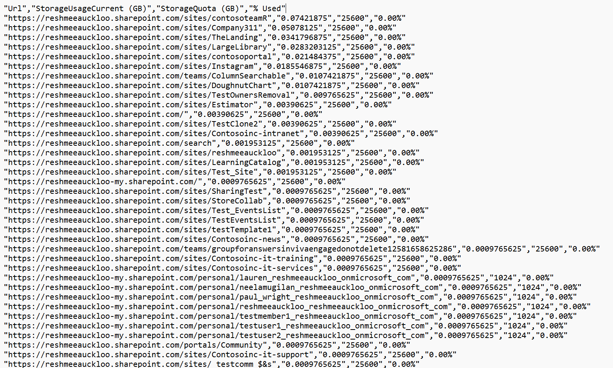

# Get SharePoint Storage Usage Against Allocated Quota

## Summary

There is limited space allocated to the tenant. To ensure business continuity and smooth ongoing operation, it is imperative to keep an eye on its usage and take relevant actions suited to the circumstances. By default a SharePoint site is allocated 25 TB by default and OneDrive for Business site is allocated 1 TB by default. These settings can be amended manually to a different quota to control SharePoint site. The script will help to proactively monitor percent used against quota for each SharePoint site.



### Prerequisites

- The user account that runs the script must have SharePoint Online tenant administrator access.

# [PnP PowerShell](#tab/pnpps)

```powershell
connect-pnpOnline -url https://contoso-admin.sharepoint.com/ -Interactive
$reportPath = "c:\temp\storage.csv"
Get-PnPTenantSite -IncludeOneDriveSites |  Sort-Object StorageUsageCurrent -Descending  | Select-Object Url, @{Name='StorageUsageCurrent (GB)'; Expression={$_.StorageUsageCurrent / 1024}}, @{Name='StorageQuota (GB)'; Expression={$_.StorageQuota / 1024}}, @{Name='% Used'; Expression={'{0:P2}' -f ($_.StorageUsageCurrent / $_.StorageQuota)}} | Select-Object -First 10| export-csv  $reportPath -notypeinformation

# Omit `Select-Object -First 10` if all sites need to be monitored. 

# omit the parameter -IncludeOneDriveSites to exclude OneDrive sites 
```

[!INCLUDE [More about PnP PowerShell](../../docfx/includes/MORE-PNPPS.md)]

***

## Source Credit

Sample first appeared on [SharePoint Storage Monitoring Against Allocated Quota using PowerShell](https://reshmeeauckloo.com/posts/PowerShell-SharePoint-Storage-Reporting/)

## Contributors

| Author(s) |
|-----------|
| [Reshmee Auckloo](https://github.com/reshmee011) |


[!INCLUDE [DISCLAIMER](../../docfx/includes/DISCLAIMER.md)]
