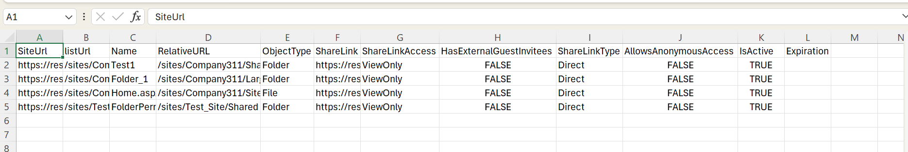

# Get sharing links within the tenant

## Summary

Effective oversight of sharing links is paramount to ensuring data security, compliance, and optimal collaboration experiences.

For Copilot for M365 implementations, ensuring there is no oversharing is a critical aspect of safeguarding sensitive information and maintaining regulatory compliance. By integrating the sharing link audit process into deployment strategies, administrators can preemptively address security vulnerabilities and uphold the integrity of M365 environments. 



### Prerequisites

- The user account that runs the script must have SharePoint Online tenant administrator access.

# [PnP PowerShell](#tab/pnpps)

```powershell
#Parameters
$tenantUrl = Read-Host -Prompt "Enter tenant collection URL";
$dateTime = (Get-Date).toString("dd-MM-yyyy-hh-ss")
$invocation = (Get-Variable MyInvocation).Value
$directorypath = Split-Path $invocation.MyCommand.Path
$fileName = "SharedLinks-" + $dateTime + ".csv"
$ReportOutput = $directorypath + "\Logs\"+ $fileName

#Connect to PnP Online
Connect-PnPOnline -Url $tenantUrl -Interactive

$global:Results = @();

function getSharingLink($_ctx,$_object,$_type,$_siteUrl,$_listUrl)
{
    $SharingInfo = [Microsoft.SharePoint.Client.ObjectSharingInformation]::GetObjectSharingInformation($_ctx, $_object, $false, $false, $false, $true, $true, $true, $true)
        $ctx.Load($SharingInfo)
        $ctx.ExecuteQuery()
        ForEach($ShareLink in $SharingInfo.SharingLinks)
        {
            If($ShareLink.Url)
            {           
                If($ShareLink.IsEditLink)
                {
                    $AccessType="Edit"
                }
                ElseIf($shareLink.IsReviewLink)
                {
                    $AccessType="Review"
                }
                Else
                {
                    $AccessType="ViewOnly"
                }
                #Collect the data

                if($_type -eq "File")
                {
                  $ObjectType = $item.FileSystemObjectType; 
                  $Name  = $Item.FieldValues["FileLeafRef"]           
                  $RelativeURL = $Item.FieldValues["FileRef"]
                }
                else
                {
                    $ObjectType = $_type;
                    $Name = "";
                    $RelativeURL = $listUrl ?? $SiteUrl;
                }
                $result = New-Object PSObject -property $([ordered]@{
                    SiteUrl = $SiteURL
                    listUrl = $listUrl
                    Name  = $Name           
                    RelativeURL = $RelativeURL
                    ObjectType = $ObjectType
                    ShareLink  = $ShareLink.Url
                    ShareLinkAccess  =  $AccessType
                    HasExternalGuestInvitees = $ShareLink.HasExternalGuestInvitees
                    ShareLinkType  = $ShareLink.LinkKind
                    AllowsAnonymousAccess  = $ShareLink.AllowsAnonymousAccess
                    IsActive  = $ShareLink.IsActive
                    Expiration = $ShareLink.Expiration
                })
                $global:Results +=$result;
            }
        }
}

#Exclude certain libraries
$ExcludedLists = @("Form Templates", "Preservation Hold Library", "Site Assets", "Images", "Pages", "Settings", "Videos","Timesheet"
    "Site Collection Documents", "Site Collection Images", "Style Library", "AppPages", "Apps for SharePoint", "Apps for Office")

$m365Sites = Get-PnPTenantSite| Where-Object { ( $_.Url -like '*/sites/*') -and $_.Template -ne 'RedirectSite#0' } 
$m365Sites | ForEach-Object {
$siteUrl = $_.Url;     
Connect-PnPOnline -Url $siteUrl -Interactive
$ctx = Get-PnPContext
$web= Get-PnPWeb

Write-Host "Processing site $siteUrl"  -Foregroundcolor "Red"; 

#getSharingLink $ctx $web "site" $siteUrl "";
$ll = Get-PnPList -Includes BaseType, Hidden, Title,HasUniqueRoleAssignments,RootFolder | Where-Object {$_.Hidden -eq $False -and $_.Title -notin $ExcludedLists } #$_.BaseType -eq "DocumentLibrary" 
  Write-Host "Number of lists $($ll.Count)";

  foreach($list in $ll)
  {
    $listUrl = $list.RootFolder.ServerRelativeUrl;       

    #Get all list items in batches
    $ListItems = Get-PnPListItem -List $list -PageSize 2000 
 #   getSharingLink $ctx $list "list/library" $siteUrl $listUrl;
        #Iterate through each list item
        ForEach($item in $ListItems)
        {
            $ItemCount = $ListItems.Count
            #Check if the Item has unique permissions
            $HasUniquePermissions = Get-PnPProperty -ClientObject $Item -Property "HasUniqueRoleAssignments"
            If($HasUniquePermissions)
            {       
                #Get Shared Links
                if($list.BaseType -eq "DocumentLibrary")
                {
                    $type= "File";
                }
                else
                {
                    $type= "Item";
                }
                getSharingLink $ctx $item $type $siteUrl $listUrl;
            }
        }
    }
 }
  $global:Results | Export-CSV $ReportOutput -NoTypeInformation
  Write-host -f Green "Sharing Links Report Generated Successfully!"
```

[!INCLUDE [More about PnP PowerShell](../../docfx/includes/MORE-PNPPS.md)]

***

## Source Credit

Sample first appeared on [Oversight of Sharing Links in SharePoint sites using PowerShell](https://reshmeeauckloo.com/posts/powershell-get-sharing-links-sharepoint/)

## Contributors

| Author(s) |
|-----------|
| [Reshmee Auckloo](https://github.com/reshmee011) |


[!INCLUDE [DISCLAIMER](../../docfx/includes/DISCLAIMER.md)]
