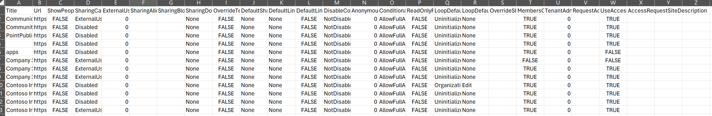

# Get SharePoint site sharing Settings

## Summary

Reviewing sharing settings is essential to prevent oversharing, which can lead to data breaches and unauthorised access to sensitive information. By regularly auditing and adjusting these settings, organization's sharing policies can be enforced and ensure that only authorized users have access to specific content. This is particularly important during the rollout of Copilot for M365, as it helps maintain a secure and compliant environment.



### Prerequisites

- The user account that runs the script must have SharePoint Online site administrator and SharePoint Administrator access .

# [PnP PowerShell](#tab/pnpps)

```powershell
param (
    [Parameter(Mandatory = $true)]
    [string] $domain
)

$adminSiteURL = "https://$domain-Admin.SharePoint.com"
$TenantURL = "https://$domain.sharepoint.com"
$dateTime = "_{0:MM_dd_yy}_{0:HH_mm_ss}" -f (Get-Date)
$invocation = (Get-Variable MyInvocation).Value
$directorypath = Split-Path $invocation.MyCommand.Path
$fileName = "site_sharing_settings" + $dateTime + ".csv"
$outputPath = $directorypath + "\"+ $fileName

if (-not (Test-Path $outputPath)) {
    New-Item -ItemType File -Path $outputPath
}
Connect-PnPOnline -Url $adminSiteURL -Interactive -WarningAction SilentlyContinue
$adminConnection = Get-PnPConnection
        Write-Host "Getting site sharing settings..." -ForegroundColor Yellow
        $sharingReport = Get-PnPTenantSite -Filter "Url -like '$TenantURL'" | Where-Object { $_.Template -ne 'RedirectSite#0' }  | foreach-object {
          try {    
            $sharingsetting = Get-PnPTenantSite -url $_.Url -DisableSharingForNonOwnersStatus -Connection $adminConnection| select `
            Title, `
            Url, `
            ShowPeoplePickerSuggestionsForGuestUsers, `
            SharingCapability, `
            ExternalUserExpirationInDays, `
            SharingAllowedDomainList, `
            SharingBlockedDomainList, `
            SharingDomainRestrictionMode, `
            OverrideTenantExternalUserExpirationPolicy, `
            OverrideTenantAnonymousLinkExpirationPolicy, `
            DefaultSharingLinkType, `
            DefaultLinkPermission, `
            DefaultShareLinkScope, `
            DefaultShareLinkRole, `
            DefaultLinkToExistingAccess, `
            DisableCompanyWideSharingLinks, `
            DisableSharingForNonOwnersStatus, `
            AnonymousLinkExpirationInDays, `
            ConditionalAccessPolicy, `
            ReadOnlyForUnmanagedDevices, `
            LoopDefaultSharingLinkScope, `
            LoopDefaultSharingLinkRole, `
            OverrideSharingCapability, `
            RequestFilesLinkEnabled, `
            RequestFilesLinkExpirationInDays, `
            RestrictedAccessControl, `
            RestrictedAccessControlGroups, `
            RestrictContentOrgWideSearch
            # DefaultShareLinkScope and DefaultShareLinkRole will replace DefaultSharingLinkType and DefaultLinkPermission

            $restUrl = $_.Url +'/_api/web?$select=MembersCanShare,TenantAdminMembersCanShare,RequestAccessEmail,UseAccessRequestDefault,AccessRequestSiteDescription'
            connect-PnPOnline -Url $_.Url -interactive -WarningAction SilentlyContinue
            $siteconnection = Get-PnPConnection
            $response = invoke-pnpsprestmethod -Url $restUrl -Method Get -Connection $siteconnection

            [PSCustomObject]@{
                ##add the properties from the $sharingsetting object
                Title = $sharingsetting.Title
                Url = $sharingsetting.Url
                ShowPeoplePickerSuggestionsForGuestUsers = $sharingsetting.ShowPeoplePickerSuggestionsForGuestUsers
                SharingCapability = $sharingsetting.SharingCapability
                ExternalUserExpirationInDays = $sharingsetting.ExternalUserExpirationInDays
                SharingAllowedDomainList = $sharingsetting.SharingAllowedDomainList
                SharingBlockedDomainList = $sharingsetting.SharingBlockedDomainList
                SharingDomainRestrictionMode = $sharingsetting.SharingDomainRestrictionMode
                OverrideTenantExternalUserExpirationPolicy = $sharingsetting.OverrideTenantExternalUserExpirationPolicy
                DefaultSharingLinkType = $sharingsetting.DefaultSharingLinkType
                DefaultLinkPermission = $sharingsetting.DefaultLinkPermission
                DefaultShareLinkScope  = $sharingsetting.DefaultShareLinkScope
                DefaultShareLinkRole = $sharingsetting.DefaultShareLinkRole
                DefaultLinkToExistingAccess = $sharingsetting.DefaultLinkToExistingAccess
                DisableCompanyWideSharingLinks = $sharingsetting.DisableCompanyWideSharingLinks
                AnonymousLinkExpirationInDays = $sharingsetting.AnonymousLinkExpirationInDays
                ConditionalAccessPolicy = $sharingsetting.ConditionalAccessPolicy
                ReadOnlyForUnmanagedDevices = $sharingsetting.ReadOnlyForUnmanagedDevices
                LoopDefaultSharingLinkScope = $sharingsetting.LoopDefaultSharingLinkScope
                LoopDefaultSharingLinkRole = $sharingsetting.LoopDefaultSharingLinkRole
                OverrideSharingCapability = $sharingsetting.OverrideSharingCapability
                OverrideTenantAnonymousLinkExpirationPolicy = $sharingsetting.OverrideTenantAnonymousLinkExpirationPolicy
                RequestFilesLinkEnabled = $sharingsetting.RequestFilesLinkEnabled
                RequestFilesLinkExpirationInDays = $sharingsetting.RequestFilesLinkExpirationInDays
                RestrictContentOrgWideSearch = $sharingsetting.RestrictContentOrgWideSearch
                DisableSharingForNonOwners = $sharingsetting.DisableSharingForNonOwnersStatus
                ##add the properties from the $response object
                MembersCanShare = $response.MembersCanShare
                TenantAdminMembersCanShare = $response.TenantAdminMembersCanShare
                RequestAccessEmail = $response.RequestAccessEmail
                UseAccessRequestDefault = $response.UseAccessRequestDefault
                AccessRequestSiteDescription = $response.AccessRequestSiteDescription
            }
        }
        catch {
            Write-Host "An error occurred: $_" -ForegroundColor Red
        }     
    }
    $sharingReport |select *  |Export-Csv $outputPath -NoTypeInformation -Append
    Write-Host "Exported successfully!..." -ForegroundColor Green
```

[!INCLUDE [More about PnP PowerShell](../../docfx/includes/MORE-PNPPS.md)]

***

## Source Credit

Sample first appeared on [Get SharePoint site sharing Settings with PowerShell](https://reshmeeauckloo.com/posts/powershell-sharing-settings-sharepoint-site/)

## Contributors

| Author(s) |
|-----------|
| [Reshmee Auckloo](https://github.com/reshmee011) |


[!INCLUDE [DISCLAIMER](../../docfx/includes/DISCLAIMER.md)]

