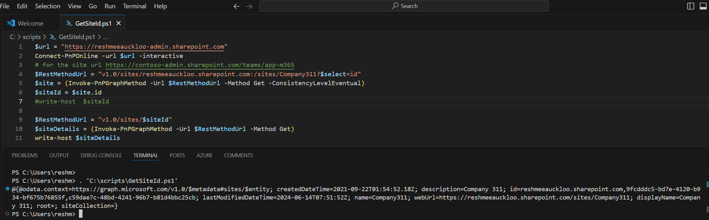

# Retrieves site id from Microsoft Graph

## Summary

Retrieves a SiteId from Microsoft Graph using PnP PowerShell. This can be particularly useful when making further API calls that require the SiteId.



### Prerequisites

- The user account that runs the script must have access to the SharePoint Online site.

# [PnP PowerShell](#tab/pnpps)

```powershell
$siteurl = "https://contoso.sharepoint.com/sites/Company311"
Connect-PnPOnline -url $siteurl -interactive

# Extract the domain and site name
$uri = New-Object System.Uri($siteurl)
$domain = $uri.Host
$siteName = $uri.AbsolutePath

# Construct the new URL
$RestMethodUrl = "v1.0/sites/$($domain):$($siteName)?$select=id"

$site = (Invoke-PnPGraphMethod -Url $RestMethodUrl -Method Get -ConsistencyLevelEventual)
$siteId = (($site.id) -split ",")[1]

write-host $siteId
```

[!INCLUDE [More about PnP PowerShell](../../docfx/includes/MORE-PNPPS.md)]

***

## Source Credit

Sample first appeared on [Retrieving SiteId from Microsoft Graph for Subsequent API Calls](https://reshmeeauckloo.com/posts/powershell_getsiteid_graph/)

## Contributors

| Author(s) |
|-----------|
| [Reshmee Auckloo](https://github.com/reshmee011) |
| Ioannis Gianko|


[!INCLUDE [DISCLAIMER](../../docfx/includes/DISCLAIMER.md)]

