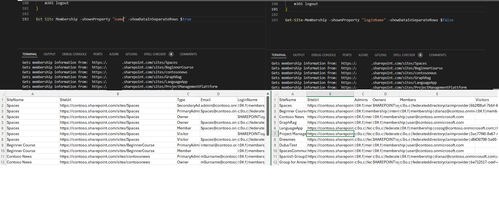

# Get sites membership as an admin

## Summary

Obtaining basic membership information for all SharePoint sites in a tenant can be challenging. Even SharePoint administrators typically cannot access this information unless they are assigned as Site Collection Administrators for each site. This script enables the retrieval of membership details without requiring Site Collection Administrator permissions. 

It utilizes special CLI for Microsoft 365 commands to extract this information, without the need for additional background actions.

The `showDataInSeparateRows` parameter determines whether the data is displayed in separate rows or consolidated into a single row per site in output csv.

The `shownProperty` parameter specifies which user property (name, email, or loginName) is present when data is consolidated into one row per site.



### Prerequisites

- The user account that runs the script must have SharePoint Online Administrator access.

# [CLI for Microsoft 365](#tab/cli-m365-ps)

```powershell
function Get-Site-Membership {
    param (
        [ValidateSet("name", "email", "loginName")]
        [string]$shownProperty = "loginName",
        [boolean]$showDataInSeparateRows
    )

    $dateTime = "{0:MM_dd_yy}_{0:HH_mm_ss}" -f (Get-Date)
    $csvPath = "site-membership" + $dateTime + ".csv"

    #Get Credentials to connect
    $m365Status = m365 status
    if ($m365Status -match "Logged Out") {
        m365 login
    }

    #Get SharePoint sites
    $m365Sites = m365 spo site list -o json | ConvertFrom-Json | Where-Object { $_.Url -like '*/sites/*' -and $_.Template -ne 'RedirectSite#0' }
    #filter to include sites with "/sites/" managed path and to exclude the redirect sites 

    $siteRows = @()

    $m365Sites | ForEach-Object {
        Write-host "Gets membership information from: " $_.Url

        $admins = m365 spo site admin list --siteUrl $_.Url --asAdmin -o json | ConvertFrom-Json
        $groups = m365 spo tenant site membership list --siteUrl $_.Url -o json | ConvertFrom-Json
        
        $mappingTable = @{
            "email"     = "Email"
            "loginName" = "LoginName"
            "name"      = "Title"
        }

        if ($showDataInSeparateRows) {
            $siteUrl = $_.Url
            $siteName = $_.Title
            $admins | ForEach-Object {
                $siteRows = New-Object PSObject -Property ([ordered]@{
                        SiteName  = $siteName
                        SiteUrl   = $siteUrl
                        Type      = $_.IsPrimaryAdmin  ? "PrimaryAdmin"  :"SecondaryAdmin"
                        Email     = $_.Email
                        LoginName = $_.LoginName
                        Title     = $_.Title
                    }) 
                $siteRows | Export-Csv $csvPath -NoTypeInformation -Append
            }

            $groups.AssociatedOwnerGroup | ForEach-Object {
                $siteRows = New-Object PSObject -Property ([ordered]@{
                        SiteName  = $siteName
                        SiteUrl   = $siteUrl
                        Type      = "Owner"
                        Email     = $_.email
                        LoginName = $_.loginName
                        Title     = $_.name
                    }) 
                $siteRows | Export-Csv $csvPath -NoTypeInformation -Append
            }

            $groups.AssociatedMemberGroup | ForEach-Object {
                $siteRows = New-Object PSObject -Property ([ordered]@{
                        SiteName  = $siteName
                        SiteUrl   = $siteUrl
                        Type      = "Member"
                        Email     = $_.email
                        LoginName = $_.loginName
                        Title     = $_.name
                    }) 
                $siteRows | Export-Csv $csvPath -NoTypeInformation -Append
            }

            $groups.AssociatedOwnerGroup | ForEach-Object {
                $siteRows = New-Object PSObject -Property ([ordered]@{
                        SiteName  = $siteName
                        SiteUrl   = $siteUrl
                        Type      = "Visitor"
                        Email     = $_.email
                        LoginName = $_.loginName
                        Title     = $_.name
                    }) 
                $siteRows | Export-Csv $csvPath -NoTypeInformation -Append
            }
        }
        else {
            $siteRows = New-Object PSObject -Property ([ordered]@{
                    SiteName = $_.Title 
                    SiteUrl  = $_.Url
                    Admins   = ($admins | ForEach-Object { $_.($mappingTable[$shownProperty]) }) -join ";"
                    Owners   = ($groups.AssociatedOwnerGroup | ForEach-Object { $_.$shownProperty }) -join ";"
                    Members  = ($groups.AssociatedMemberGroup | ForEach-Object { $_.$shownProperty }) -join ";"
                    Visitors = ($groups.AssociatedVisitorGroup | ForEach-Object { $_.$shownProperty }) -join ";"
                }) 
            $siteRows | Export-Csv $csvPath -NoTypeInformation -Append
        }
    }

    # Disconnect SharePoint online connection
    m365 logout
}

Get-Site-Membership -shownProperty "name" -showDataInSeparateRows $true
```

[!INCLUDE [More about CLI for Microsoft 365](../../docfx/includes/MORE-CLIM365.md)]

***

## Contributors

| Author(s)                                 |
| ----------------------------------------- |
| [Michał Kornet](https://github.com/mkm17) |


[!INCLUDE [DISCLAIMER](../../docfx/includes/DISCLAIMER.md)]

