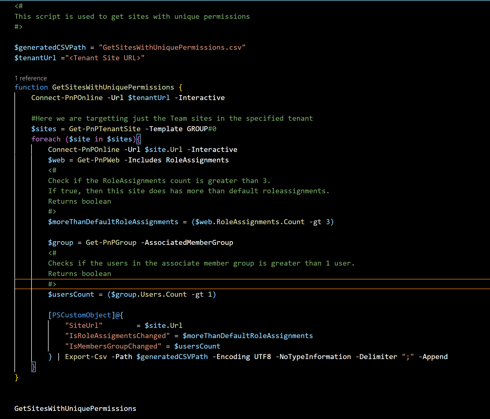
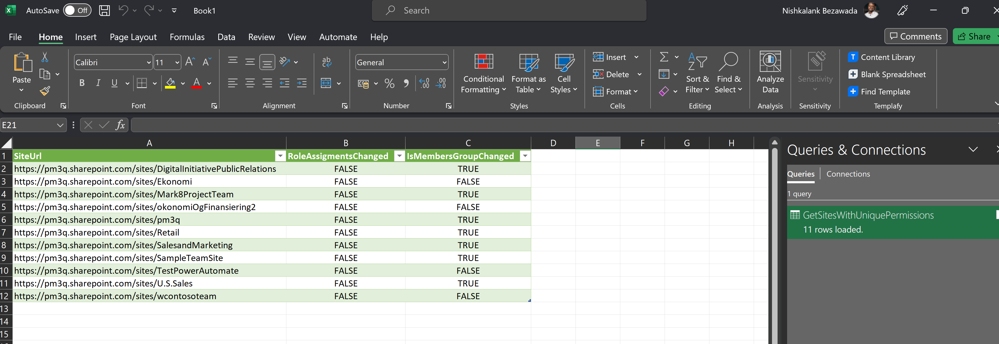

# Get the report of the sites throughout the tenant which has unique permissions based on the RoleAssignments and the Associated member groups


## Implementation

- Open Windows PowerShell ISE
- Create a new file
- Copy a script  below
- Run the script from Windows PowerShell ISE



# [PnP PowerShell](#tab/pnpps)

```powershell

<#
This script is used to get sites with unique permissions
#>

$generatedCSVPath = "GetSitesWithUniquePermissions.csv"
$tenantUrl ="<Tenant Site URL>"

function GetSitesWithUniquePermissions {
    Connect-PnPOnline -Url $tenantUrl -Interactive
    
    #Here we are targetting just the Team sites in the specified tenant
    $sites = Get-PnPTenantSite -Template GROUP#0 
    foreach ($site in $sites){
        Connect-PnPOnline -Url $site.Url -Interactive
        $web = Get-PnPWeb -Includes RoleAssignments
        <#
        Check if the RoleAssignments count is greater than 3. 
        If true, then this site does has more than default roleassignments. 
        Returns boolean
        #>
        $moreThanDefaultRoleAssignments = ($web.RoleAssignments.Count -gt 3)

        $group = Get-PnPGroup -AssociatedMemberGroup
        <#
        Checks if the users in the associate member group is greater than 1 user. 
        Returns boolean
        #>
        $usersCount = ($group.Users.Count -gt 1)

        [PSCustomObject]@{
            "SiteUrl"        = $site.Url
            "IsRoleAssigmentsChanged" = $moreThanDefaultRoleAssignments
            "IsMembersGroupChanged" = $usersCount
        } | Export-Csv -Path $generatedCSVPath -Encoding UTF8 -NoTypeInformation -Delimiter ";" -Append
    }
}


GetSitesWithUniquePermissions


```
[!INCLUDE [More about PnP PowerShell](../../docfx/includes/MORE-PNPPS.md)]




## Contributors

| Author(s) |
|-----------|
| [Nishkalank Bezawada](https://github.com/NishkalankBezawada) |


[!INCLUDE [DISCLAIMER](../../docfx/includes/DISCLAIMER.md)]
