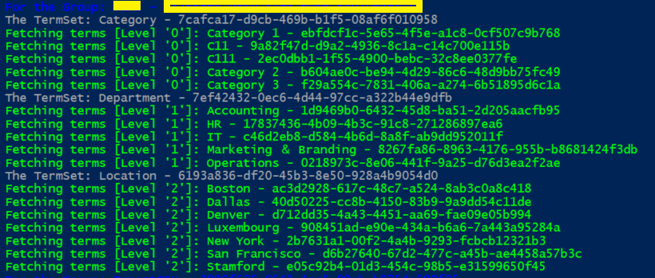

# How to retrieve the entire term store hierarchy across all levels

## Summary

At times, there might be a business need to retrieve the entire term store hierarchy across all levels using PowerShell.



Let's see step-by-step implementation

## Implementation

Open Windows Powershell ISE
Create a new file and write a script

Now we will see all the steps which we required to achieve the solution:

1. Initialize the admin site URL, username, and password as global variables.
2. Create a function named Login to establish a connection to the Office 365 SharePoint Admin site.
3. Create a function to gather all term stores and groups, and then utilize a recursive approach to retrieve all terms and term sets across different levels.

Here's how our final script will look:

# [CSOM PowerShell](#tab/csomps)

```powershell

Add-Type -Path "C:\Program Files\Common Files\microsoft shared\Web Server Extensions\16\ISAPI\Microsoft.SharePoint.Client.dll" 
Add-Type -Path "C:\Program Files\Common Files\microsoft shared\Web Server Extensions\16\ISAPI\Microsoft.SharePoint.Client.Taxonomy.dll"

$adminSiteURL = "https://domain-admin.sharepoint.com/"
$userName = "admin@domain.onmicrosoft.com"
$password = "********"
$secureStringPwd = $password | ConvertTo-SecureString -AsPlainText -Force 
$creds = New-Object System.Management.Automation.PSCredential -ArgumentList $userName, $secureStringPwd
$level = 0;

Function Login() {
    param([parameter(Mandatory = $true, ValueFromPipeline = $true)] $creds)  
    Write-Host "Connecting to Site '$($siteURL)'" -f Yellow   
    $clientContext = New-Object Microsoft.SharePoint.Client.ClientContext($adminSiteURL)
    $credentials = New-Object Microsoft.SharePoint.Client.SharePointOnlineCredentials($creds.username, $creds.password) 
    $clientContext.Credentials = $credentials
    Write-Host "Connecting successfully!..." -f Green 
    MMDOperations -ClientContext $clientContext
}

Function MMDOperations() {
    param($clientContext)
    $metadataStrore = [Microsoft.SharePoint.Client.Taxonomy.TaxonomySession]::GetTaxonomySession($clientContext)
    $clientContext.Load($metadataStrore)
    $clientContext.ExecuteQuery()
    $termStores = $metadataStrore.TermStores
    $clientContext.Load($termStores)
    $clientContext.ExecuteQuery()

    Write-Host "Loading termstore..." -f Yellow  
    $termStore = $termStores[0]
    $clientContext.Load($termStore)
    $clientContext.ExecuteQuery()
    Write-Host "Loading termstore completed..." -f Green  

    Write-Host "Loading groups..." -f Yellow  
    $groups = $termStore.Groups
    $clientContext.Load($groups)
    $clientContext.ExecuteQuery()
    Write-Host "Loading groups completed..." -f Green  

    foreach ($group in $groups) { 
        write-host "For the Group: $($group.Name) - $($group.id)" -f Blue 
        MMDTermSetOperations -ClientContext $clientContext -Group $group        
    }
}

Function MMDTermSetOperations() {
    param($clientContext,$Group)
    $termsets = $Group.TermSets
    $clientContext.Load($termsets)
    $clientContext.ExecuteQuery()
    foreach ($termset in $termsets ) {
        write-host "The TermSet: $($termset.Name) - $($termset.id)" -f Gray
        MMDTermOperations -ClientContext $clientContext -TermSet $termset    
        $level++;    
    }
}

Function MMDTermOperations() {
    param($clientContext,$TermSet)
    $terms = $TermSet.Terms
    $clientContext.Load($terms)
    $clientContext.ExecuteQuery()    
    foreach ($term in $terms ) {
        write-host "Fetching terms [Level '$($level)']: $($term.Name) - $($term.id)" -f Green
        MMDSubTermOperations -ClientContext $clientContext -Term $term        
    }        
}

Function MMDSubTermOperations() {
    param($clientContext,$Term)
    $subTerms = $Term.Terms
    $clientContext.Load($subTerms)
    $clientContext.ExecuteQuery()    
    foreach ($subTerm in $subTerms ) {
        write-host "Fetching terms [Level '$($level)']: $($subTerm.Name) - $($subTerm.id)" -f Green
        if ($subTerm.TermsCount -gt 0) {
            MMDSubTermOperations -ClientContext $clientContext -Term $subTerm            
        }
    }    
}

Function StartProcessing {
    Login($creds);              
}

StartProcessing

```
[!INCLUDE [More about Client Side Object Mode (CSOM)](../../docfx/includes/MORE-CSOM.md)]
***

## Contributors

| Author(s) |
|-----------|
| Chandani Prajapati |

[!INCLUDE [DISCLAIMER](../../docfx/includes/DISCLAIMER.md)]

