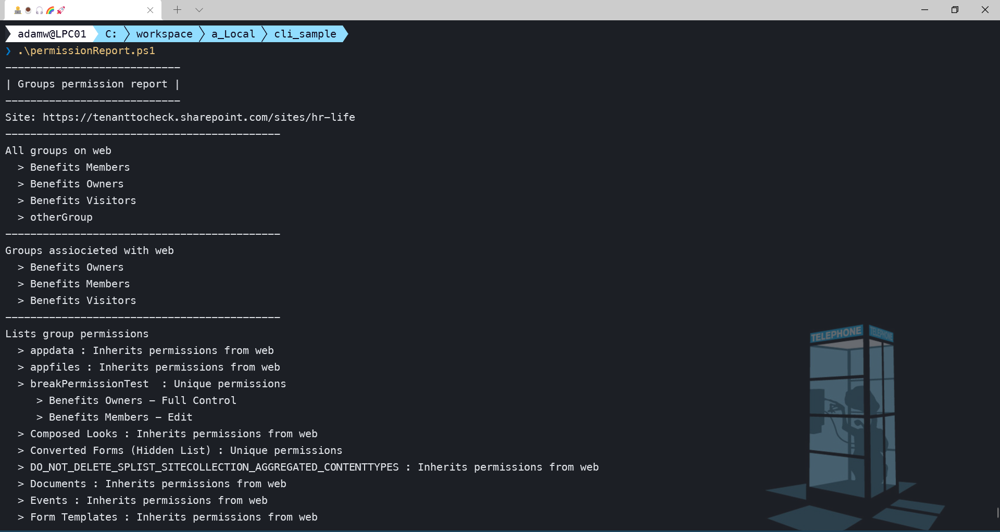
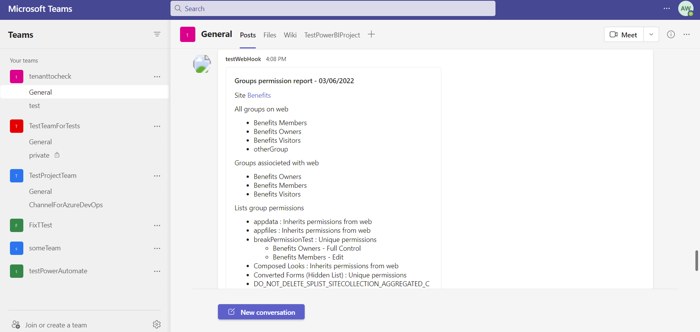

# Get permission group report of a site

## Summary

The scripts get group permission report of site and each list on the site and prints it to console and also sends it as an adaptive card to Teams channel specified by webhook.

result in console



result as adaptive card in teams



## Implementation

- Open Windows PowerShell ISE
- Create a new file
- Copy a script  below

# [CLI for Microsoft 365](#tab/cli-m365-ps)
```powershell
$site = 'https://contoso.sharepoint.com/sites/someSite'
$adaptiveCard = '{\"type\":\"AdaptiveCard\",\"body\":[{\"type\":\"TextBlock\",\"size\":\"Medium\",\"weight\":\"Bolder\",\"text\":\"${title}\"},{\"type\":\"TextBlock\",\"text\":\"${description}\",\"wrap\":true}],\"$schema\":\"http://adaptivecards.io/schemas/adaptive-card.json\",\"version\":\"1.3\"}'
$webhook = ' https://contoso.webhook.office.com/webhookb2/1204eba2-061c-4442-9696-2a725cb2d094@2942bb31-1d49-4da6-8d3d-d0f9e1141486/IncomingWebhook/6e54c3958bde444e96fec9ecad356993/be11f523-2a4d-4eae-9d42-277410893c41'

try { 
    $m365Status = m365 status
    if ($m365Status -match "Logged Out") {
        m365 login
    }
    
    Write-Host '----------------------------'
    Write-Host "| Groups permission report |"
    Write-Host '----------------------------'
    
    Write-Host "Site: $site"
    Write-Host '--------------------------------------------'

    $web = m365 spo web get --webUrl $site --withGroups
    $web = $web | ConvertFrom-Json
    
    $groups = m365 spo group list --webUrl $site
    $groups = $groups | ConvertFrom-Json

    $lists = m365 spo list list --webUrl $site
    $lists = $lists | ConvertFrom-Json
    
    $siteOwnerGroup = $web.AssociatedOwnerGroup
    $siteMemberGroup = $web.AssociatedMemberGroup
    $siteVisitorGroup = $web.AssociatedVisitorGroup

    $adaptiveCardDescription = "Site [$($web.Title)]($site)"

    Write-Host 'All groups on web'
    $adaptiveCardDescription += "\n\n All groups on web"
    foreach ($group in $groups) {
        Write-Host "  > $($group.Title)"
        $adaptiveCardDescription += "\n - $($group.Title)"
    }
    
    Write-Host '--------------------------------------------'
    
    Write-Host 'Groups assiocieted with web'
    $adaptiveCardDescription += "\n\n Groups assiocieted with web"
    Write-Host "  > $($siteOwnerGroup.Title)"
    $adaptiveCardDescription += "\n - $($siteOwnerGroup.Title)"
    Write-Host "  > $($siteMemberGroup.Title)"
    $adaptiveCardDescription += "\n - $($siteMemberGroup.Title)"
    Write-Host "  > $($siteVisitorGroup.Title)"
    $adaptiveCardDescription += "\n - $($siteVisitorGroup.Title)"
    Write-Host '--------------------------------------------'

    Write-Host 'Lists group permissions'
    $adaptiveCardDescription += "\n\n Lists group permissions"
    foreach ($list in $lists) {
        $listWithPermissions = m365 spo list get --title $list.Title --webUrl $site --withPermissions
        $listWithPermissions = $listWithPermissions | ConvertFrom-Json

        $hidden = ''
        if ($list.Hidden) {
            $hidden = '(Hidden List)'
        }

        if ($listWithPermissions.HasUniqueRoleAssignments) {
            Write-Host "  > $($list.Title) $hidden : Unique permissions"
            $adaptiveCardDescription += "\n - $($list.Title) $hidden : Unique permissions"
            foreach ($roleAssignment in $listWithPermissions.roleAssignments) {
                Write-Host "     > $($roleAssignment.Member.Title) - $($roleAssignment.RoleDefinitionBindings.Name)"
                $adaptiveCardDescription += "\n      - $($roleAssignment.Member.Title) - $($roleAssignment.RoleDefinitionBindings.Name)"
            }            
        }
        else {
            Write-Host "  > $($list.Title) : Inherits permissions from web"
            $adaptiveCardDescription += "\n - $($list.Title) : Inherits permissions from web"
        }
    }
    Write-Host '--------------------------------------------'

    $today = Get-Date -Format "MM/dd/yyyy"
    $cardData = '{\"title\": \"Groups permission report - ' + $today + '\" ,\"description\":\"' + $adaptiveCardDescription + '\"}'
    m365 adaptivecard send --url $webhook --card $adaptiveCard --cardData $cardData
}
catch {
    Write-Host "An error occurred:"
    Write-Host $_
}
```
[!INCLUDE [More about CLI for Microsoft 365](../../docfx/includes/MORE-CLIM365.md)]

***

## Contributors

| Author(s) |
|-----------|
| [Adam Wójcik](https://github.com/Adam-it)|

[!INCLUDE [DISCLAIMER](../../docfx/includes/DISCLAIMER.md)]
