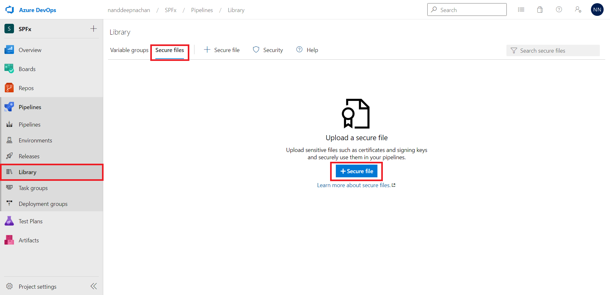
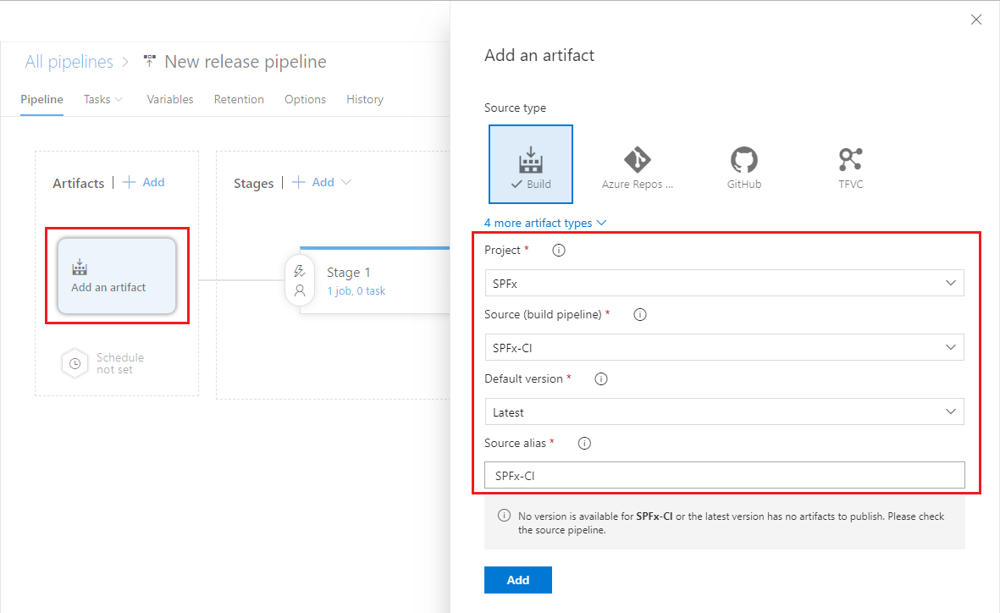

# Install Solution and Deploy to the SharePoint site

## Summary

Installs or updates a SharePoint Framework (SPFx) solution from an Azure DevOps pipeline. Deploys the solution if it hasn't been deployed yet or updates the existing package if it's been previously deployed. This script is ready to use for a CI/CD pipeline.


## Implementation

**Step 1: Create a new Personal Information Exchange (.pfx) file**

Generate a certificate to [log in using a certificate](https://pnp.github.io/cli-microsoft365/user-guide/connecting-office-365/#log-in-using-a-certificate).

**Step 2: Upload certificate to Azure DevOps pipeline**
1. Open your Azure DevOps project. 
2. Navigate to the **Pipelines** > **Library**.
3. Browse to the **Secure files** tab.
4. Click **+ Secure file**.
5. Browse and upload the certificate generated in step 1.



6. Add below YAML task to your Azure DevOps pipeline

```yaml
- script: download certificate
    - task: DownloadSecureFile@1
      name: certificate
      displayName: 'Download CA certificate'
      inputs:
        secureFile: 'protected.pfx'
```

The variable `$(certificate.secureFilePath)` will have a path to the cerficiate file to refer.

**Step 3: Define variables in Azure pipeline**

Define below varibales in your Azure pipeline:

| Name | Value (e.g.)|
|------|-------------|
|tenant|contoso|
|catalogsite|/sites/apps|
|targetsite|/sites/spfx-demo|
|thumbprint|47C4885736C624E90491F32B98855AA8A7562AF1|
|password|password1|
|spfx_package_name|spfx-ci|

**Step 4: Link the Build Artifact**
1. In the **release pipeline**, click **Add an artifact**.
2. Under **Source (build pipeline)**, select the previously created build definition.
3. Note down **Source alias** (for e.g., SPFx-CI) for future use.
4. Click **Add**.

    

# [CLI for Microsoft 365 with PowerShell](#tab/cli-m365-ps)
```powershell
# log in to Microsoft 365 using a Personal Information Exchange (.pfx) file
m365 login --authType certificate --certificateFile $(certificate.secureFilePath) --thumbprint $(thumbprint) --password $(password)

# Generates SharePoint Framework solution package with a no-framework web part rendering the specified HTML snippet
m365 spfx package generate --webPartTitle "Amsterdam weather" --webPartDescription "Shows weather in Amsterdam" --packageName $(spfx_package_name) --html @amsterdam-weather.html --allowTenantWideDeployment --enableForTeams all

# Overwrite the spfx.sppkg package in the tenant app catalog with the newer version
m365 spo app add --filePath $(System.DefaultWorkingDirectory)/SPFx-CI/drop/SharePoint/solution/$(spfx_package_name).sppkg --overwrite

# Deploy the app with the specified name in the tenant app catalog.
m365 spo app deploy --name $(spfx_package_name).sppkg --appCatalogUrl https://$(tenant).sharepoint.com/$(catalogsite)

# Get details about the app with name solution.sppkg available in the tenant app catalog using the specified app catalog URL
$spfxApp = m365 spo app get --name $(spfx_package_name).sppkg --appCatalogUrl https://$(tenant).sharepoint.com/$(catalogsite) | ConvertFrom-Json

# Install the app with specified ID to the SharePoint site.
m365 spo app install --id $spfxApp.ID --siteUrl https://$(tenant).sharepoint.com/$(targetsite)
```
[!INCLUDE [More about CLI for Microsoft 365](../../docfx/includes/MORE-CLIM365.md)]
***

## Contributors

| Author(s) |
|-----------|
|[Nanddeep Nachan](https://github.com/nanddeepn)|


[!INCLUDE [DISCLAIMER](../../docfx/includes/DISCLAIMER.md)]

