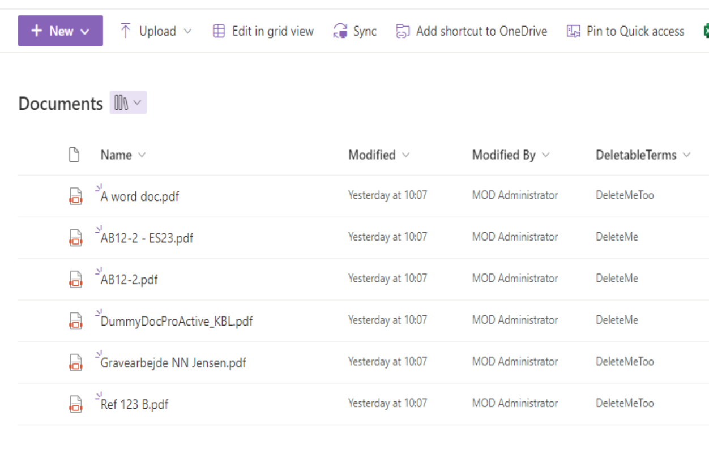

# Locate orphaned Termstore Terms

> [!Note]
> This is a submission helper template please find the [contributor guidance](/docfx/contribute.md) to help you write this scenario.

## Summary

Once in a while, you might see a Managed Metadate column in a SharePoint list or library that has a value that is not in the Termstore. This script will help you locate the orphaned terms.
Rather than relie on you Admin account to have access to all sites, I will recommend you to use either a managed identity or a service principal to run this script.

[!INCLUDE [Delete Warning](../../docfx/includes/DELETE-WARN.md)]




# [PnP PowerShell](#tab/pnpps)

```powershell

#sample showing one way to find managed metadata fields where the values doesn't exists anymore because the term has been deleted

#connect to the term store
$spAdminUrl = "https://contoso-admin.sharepoint.com"

$SPAdminConn = Connect-PnPOnline -Url $spAdminUrl -Interactive -ReturnConnection


function RecursiveGetTerms($term)
{
    if($term.Terms.Count -gt 0)
    {
        foreach($childTerm in $term.Terms)
        {
            $allTerms.Add($childTerm) | Out-Null
            RecursiveGetTerms $childTerm 
        }
    }
    
}
#extract all terms
$allTerms =  New-Object System.Collections.ArrayList 
$termGroups = Get-PnPTermGroup -Connection $SPAdminConn
foreach($termGroup in $termGroups)
{
    $termSets = Get-PnPTermSet -TermGroup $termGroup -Connection $SPAdminConn
    foreach($termSet in $termSets)
    {
        Write-Host "Processing $($termSet.Name)"
        $terms = Get-PnPTerm -TermSet $termSet -TermGroup $termGroup -Connection $SPAdminConn -IncludeChildTerms -IncludeDeprecated 
        foreach($term in $terms)
        {
            $allTerms.Add($term) | Out-Null
            RecursiveGetTerms $term 
            
        }
    }
}
#get all hits on owstaxidmetadataalltagsinfo
$query = "owstaxidmetadataalltagsinfo:*"
$hits = Invoke-PnPSearchQuery -Connection $SPAdminConn -Query $query -All -SelectProperties "owstaxidmetadataalltagsinfo"
foreach($hit in $hits.ResultRows)
{
    $owstaxidmetadataalltagsinfos = $hit["owstaxidmetadataalltagsinfo"]
    $owstaxidmetadataalltagsinfos = $owstaxidmetadataalltagsinfos.Split(";")
    foreach($metadata in $owstaxidmetadataalltagsinfos)
    {
        $parts = $metadata.Split("|")
        $metadataGuid = $parts[1]
        $metadataGuid = $metadataGuid.Replace("#0","")
        if($metadataGuid.IndexOf("ffffffff") -gt -1) # there are some metadata fields that are not managed metadata
        {
            continue
        }
        $term = $allTerms | Where-Object { $_.Id -eq $metadataGuid }
            
        if($term -eq $null)
        {
            Write-Host "Term not found for $metadata"
        }
        else {
            Write-Host "Term found for $metadata at $($term.Name)"
        }
    }
    
}


```
[!INCLUDE [More about PnP PowerShell](../../docfx/includes/MORE-PNPPS.md)]
***


## Contributors

| Author(s) |
|-----------|
| Kasper Larsen |


[!INCLUDE [DISCLAIMER](../../docfx/includes/DISCLAIMER.md)]
