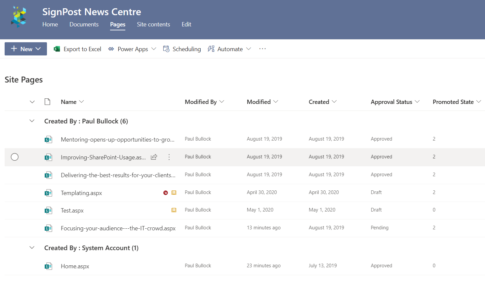

# SharePoint Modern Page Publishing Report


## Summary

This script will go through all the pages in a modern site and report publishing status of the pages.
This is useful for scenarios where you are either about to launch an Intranet or want regular reports on page drafts.

The output includes:

- Site Title
- Site Url
- Page FileName
- Scheduled Date - if Page Scheduling is enabled
- Is News - using the promoted state to determine if it a news page
- Approval Status - if you have enabled Content Approval on the page library
- Version - if versions are not whole numbers, they are drafts (for those without content approval enabled)

> [!Tip]
> You could further enhance to loop through a set of sites if you are using a hub site.



# [PnP PowerShell](#tab/pnpps)

```powershell

# Example: .\Get-PagesReportDraft.ps1 -PartTenant "Contoso" -SourceSitePartUrl "SignPost-News"
[CmdletBinding()]
param (
    [Parameter(Mandatory = $true, HelpMessage = "Source e.g. Intranet-Archive")]
    [string]$SourceSitePartUrl,
    [Parameter(Mandatory = $false, HelpMessage = "Organisation Url Fragment e.g. contoso ")]
    [string]$PartTenant,
    [string]$ReportName = "Page-Status-Report.csv"
)
begin{

    $baseUrl = "https://$($PartTenant).sharepoint.com"
    $sourceSiteUrl = "$($baseUrl)/sites/$($SourceSitePartUrl)"
    
    Write-Host "Connecting to " $sourceSiteUrl
    
    # For MFA Tenants - Interactive opens a browser window
    $sourceConnection = Connect-PnPOnline -Url $sourceSiteUrl  -ReturnConnection -Interactive
    $filter = '<View>' +
                '<Query>' +
                    '<Where>' +
                        '<And>' +
                            '<Eq>'+
                                '<FieldRef Name="FSObjType" />'+
                                '<Value Type="Integer">0</Value>'+
                            '</Eq>'+
                            '<Neq>'+
                                '<FieldRef Name="_SPSitePageFlags" />'+
                                '<Value Type="Text">{Template}}</Value>'+
                            '</Neq>'+
                        '</And>' +
                    '</Where>' +
                '</Query>' +
            '</View>'

    $loc = Get-Location
    $reportPath = "$($loc)\$($ReportName)"

    '"Site Title","Site Url","Page FileName","Scheduled Date","IsNews","Approval Status","Version"' | Out-File $reportPath
}
process{

    Write-Host "Reading pages in site..."

    $web = Get-PnPWeb -Includes Title,Url
    $webTitle = $web.Title
    $webUrl = $web.Url
    
    $pages = Get-PnPListItem -List "SitePages" -Connection $sourceConnection -Query $filter
            
    Foreach($page in $pages){

        $file = $page.FieldValues["FileLeafRef"]
        $scheduled = $page.FieldValues["_PublishStartDate"]
        $promotedState = $page.FieldValues["PromotedState"]
        $ModerationStatus = $page.FieldValues["_ModerationStatus"]
        $version = $page.FieldValues["_UIVersionString"]
        $ModerationStatusDesc = ""
        $promotedLevel = ""

        Write-Host " Processing Page $($file)" -ForegroundColor Cyan

        switch ($promotedState) {
            0 { $promotedLevel = "Page" }
            1 { $promotedLevel = "News" }
            2 { $promotedLevel = "News" }
            Default {}
        }

        switch ($ModerationStatus) {
            0 { $ModerationStatusDesc = "Approved" }
            1 { $ModerationStatusDesc = "Denied Approval" }
            2 { $ModerationStatusDesc = "Pending Approval" }
            3 { $ModerationStatusDesc = "Draft" }
            4 { $ModerationStatusDesc = "Scheduled Approval" }
        }
        
        $line = '"' + $webTitle + '","' + `
            $webUrl + '","' + `
            $file + '","' + `
            $scheduled  + '","' + `
            $promotedLevel + '","' + `
            $ModerationStatusDesc + '","' + `
            $version + '"'

        $line | Out-File $reportPath -Append

    }
}

```
[!INCLUDE [More about PnP PowerShell](../../docfx/includes/MORE-PNPPS.md)]
***

## Contributors

| Author(s) |
|-----------|
| Paul Bullock |


[!INCLUDE [DISCLAIMER](../../docfx/includes/DISCLAIMER.md)]
