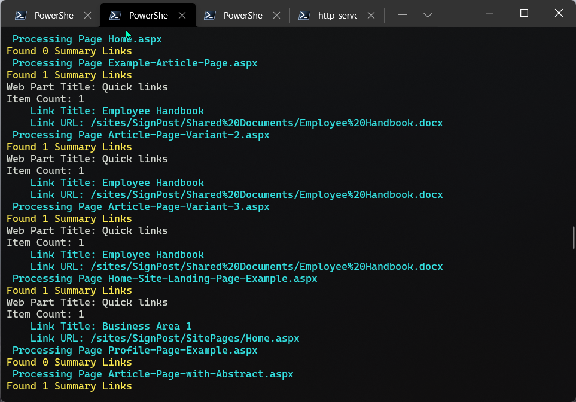

# SharePoint Modern Page URL Report


## Summary

This report will go through all the pages in a modern site and report on the URLs within each **Quick Links** Web Part. 
This is useful for migration and new content scenarios to ensure that any placeholder or temporary links within a page are listed in a report.



This script does have scope for the future to include other web part types e.g. Image Web Parts, Hero where user/provisioning has specified the link.

# [PnP PowerShell](#tab/pnpps)

```powershell

# Example: .\List-UrlsInPage.ps1 -SourceSitePartUrl "SiteA" -PartTenant "contoso"
[CmdletBinding()]
param (
    [Parameter(Mandatory = $true, HelpMessage = "Source e.g. Intranet-Archive")]
    [string]$SourceSitePartUrl,
    [Parameter(Mandatory = $false, HelpMessage = "Organisation Url Fragment e.g. contoso ")]
    [string]$PartTenant,
    [string]$ReportName = "URL-Report.csv"
)
begin{

    $baseUrl = "https://$($PartTenant).sharepoint.com"
    $sourceSiteUrl = "$($baseUrl)/sites/$($SourceSitePartUrl)"
    
    Write-Host "Connecting to " $sourceSiteUrl
    
    # For MFA Tenants - Interactive opens a browser window
    $sourceConnection = Connect-PnPOnline -Url $sourceSiteUrl  -ReturnConnection -Interactive
    $filter = '<View>' +
                '<Query>' +
                    '<Where>' +
                        '<And>' +
                            '<Eq>'+
                                '<FieldRef Name="FSObjType" />'+
                                '<Value Type="Integer">0</Value>'+
                            '</Eq>'+
                            '<Neq>'+
                                '<FieldRef Name="_SPSitePageFlags" />'+
                                '<Value Type="Text">{Template}}</Value>'+
                            '</Neq>'+
                        '</And>' +
                    '</Where>' +
                '</Query>' +
            '</View>'

    $loc = Get-Location
    $reportPath = "$($loc)\$($ReportName)"

    '"WebTitle","WebUrl","PageFileName","WebPartTitle","LinkTitle","LinkUrl"' | Out-File $reportPath
}
process{

    Write-Host "Reading pages in site..."

    $web = Get-PnPWeb -Includes Title,Url
    $webTitle = $web.Title
    $webUrl = $web.Url
    
    $pages = Get-PnPListItem -List "SitePages" -Connection $sourceConnection -Query $filter
            
    Foreach($page in $pages){

        $file = $page.FieldValues["FileLeafRef"]

        Write-Host " Processing Page $($file)" -ForegroundColor Cyan

        $components = Get-PnPPageComponent -Page $file
        
        # To find the Web Part ID:
        # Get-PnPPageComponent -Page "MyPage.aspx" -ListAvailable

        # You can filter based on type of web part
        # c70391ea-0b10-4ee9-b2b4-006d3fcad0cd QuickLinksWebPart
        $summaryLinks = $components | Where-Object { $_.WebPartId -eq 'c70391ea-0b10-4ee9-b2b4-006d3fcad0cd'}
        Write-Host "Found $($summaryLinks.Count) Summary Links" -ForegroundColor Yellow

        $summaryLinks | Foreach-Object{

            $wpTitle = $_.title
            Write-Host "Web Part Title: $($wpTitle)"

            $serverContent = $_.ServerProcessedContent | ConvertFrom-Json
            $itemCount = $serverContent.links.Count

            #{htmlStrings, searchablePlainTexts, imageSources, links...}
            Write-Host "Item Count: $($itemCount)"
            
            For($i = 0; $i -lt $itemCount; $i++){

                $titlePath = "items[$($i)].title"
                $urlPath = "items[$($i)].sourceItem.url"

                $lnkTitle = $serverContent.searchablePlainTexts.$titlePath
                $lnkUrl = $serverContent.links.$urlPath

                Write-Host "    Link Title: $($lnkTitle)" -ForegroundColor Cyan
                Write-Host "    Link URL: $($lnkUrl)" -ForegroundColor Cyan

                $line = '"' + $webTitle + '","' + `
                    $webUrl + '","' + `
                    $file + '","' + `
                    $wpTitle  + '","' + `
                    $lnkTitle + '","' + `
                    $lnkUrl + '"'

                $line | Out-File $reportPath -Append
            }

        }
    }
}

```
[!INCLUDE [More about PnP PowerShell](../../docfx/includes/MORE-PNPPS.md)]
***

## Contributors

| Author(s) |
|-----------|
| Paul Bullock |


[!INCLUDE [DISCLAIMER](../../docfx/includes/DISCLAIMER.md)]

