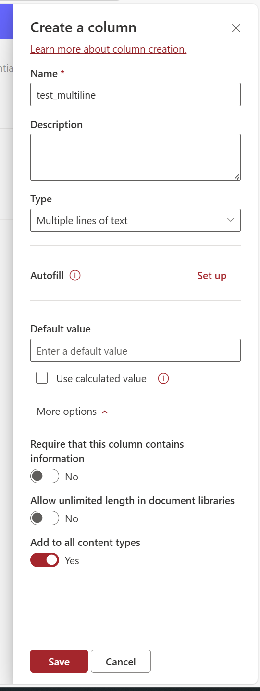

# Updating Multiline Text Field Properties in SharePoint

## Summary

Managing multiline text fields in SharePoint can be tricky, especially when certain field properties are not visible or editable at the library/list level, even though they are available at the site level.

For example, at the **site level**, you can configure properties such as:
- **Append Changes to Text**
- **Number of Lines**
- **Field Type**: Plain Text, Rich Text, or Enhanced Rich Text

However, these settings may not appear at the **library/list level**



### Prerequisites

- The user account that runs the script must have access to the SharePoint Online site.

# [PnP PowerShell](#tab/pnpps)

```powershell
param (
    [Parameter(Mandatory = $true)]
    [string]$Url,

    [Parameter(Mandatory = $true)]
    [string]$ListName,

    [Parameter(Mandatory = $true)]
    [string]$FieldName,

    [Parameter(Mandatory = $true)]
    [ValidateSet("EnhancedRichText", "PlainText", "RichText")]
    [string]$TextType = "EnhancedRichText",

    [Parameter(Mandatory = $true)]
    [ValidateSet("Yes", "No")]
    [string]$AppendOnly = "Yes"
)

# Connect to SharePoint site
Connect-PnPOnline -Url $Url

# Map the TextType to corresponding RichTextMode and RichText values
switch ($TextType) {
    "EnhancedRichText" {
        $RichTextMode = "FullHtml"
        $RichText = $true
    }
    "PlainText" {
        $RichTextMode = "Compatible"
        $RichText = $false
    }
    "RichText" {
        $RichTextMode = "Compatible"
        $RichText = $true
    }
}

# Convert AppendOnly parameter to boolean
$AppendOnlyValue = if ($AppendOnly -eq "Yes") { $true } else { $false }

# Update field properties
Set-PnPField -List $ListName -Identity $FieldName -Values @{
    AppendOnly = $AppendOnlyValue
    RichTextMode = $RichTextMode
    RichText = $RichText
    NumLines = "6"
    UnlimitedLengthInDocumentLibrary = $false
} -ErrorAction Stop

# Handle properties that cannot be updated directly
$Field = Get-PnPField -List $ListName -Identity $FieldName -ErrorAction Stop
$FieldSchemaXml = [xml]$Field.SchemaXml

if ($TextType -eq "EnhancedRichText" -or $TextType -eq "RichText") {
    $FieldSchemaXml.Field.SetAttribute("RichTextMode", $RichTextMode)
    $FieldSchemaXml.Field.SetAttribute("NumLines", "8")
}

Set-PnPField -List $ListName -Identity $FieldName -Values @{
    SchemaXml = $FieldSchemaXml.OuterXml
} -ErrorAction Stop
```

[!INCLUDE [More about PnP PowerShell](../../docfx/includes/MORE-PNPPS.md)]

***

## Source Credit

Sample first appeared on [Updating Multiline Text Field Properties in SharePoint Using PowerShell](https://reshmeeauckloo.com/posts/powershell-sharepoint-multilinefield-appendtext/)

## Contributors

| Author(s) |
|-----------|
| [Reshmee Auckloo](https://github.com/reshmee011) |


[!INCLUDE [DISCLAIMER](../../docfx/includes/DISCLAIMER.md)]

