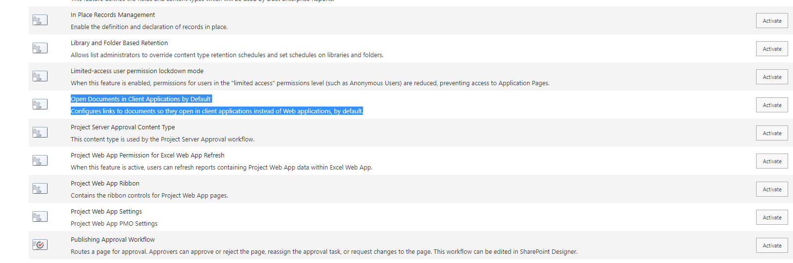

# Open Office documents in the Client

## Summary

One of the most common requests from customers is that any Office document should open in the Client so here goes:

## Implementation

- Open VS Code
- Create a new file
- Write a script as below,
- Change the variables to target to your environment
- Run the script.

## Screenshot of Output



# [PnP PowerShell](#tab/pnpps)
```powershell


# SharePoint online site url
$siteUrl = "https://<tenant>.sharepoint.com/contoso"

# Scope of feature: Web or Site
$featureScope = "Web"

# SharePoint Feature ID: in this case Open in Client
$featureId = "8a4b8de2-6fd8-41e9-923c-c7c3c00f8295"	

#another common one is Activate Document ID ( feature id b50e3104-6812-424f-a011-cc90e6327318)

# Connect to SharePoint Online site  

Connect-PnPOnline -Url $siteUrl -Interactive

# Get Feature from SharePoint site
$spacesFeature = Get-PnPFeature -Scope $featureScope -Identity $featureId

# Check if feature found or not
if($spacesFeature.DefinitionId -eq $null) {  
    Write-host "Activating Feature ($featureId)..." 
	
    # Activate the site feature eature
    Enable-PnPFeature -Scope Site -Identity $FeatureId -Force
 
    Write-host -f Green "Feature ($featureId) has been activated Successfully!"
}
else {
    Write-host "Feature ($featureId) is already active on this site!"
}   
   

```
[!INCLUDE [More about PnP PowerShell](../../docfx/includes/MORE-PNPPS.md)]
***

## Contributors

| Author(s) |
|-----------|
| Kasper Larsen, Fellowmind|

[!INCLUDE [DISCLAIMER](../../docfx/includes/DISCLAIMER.md)]

