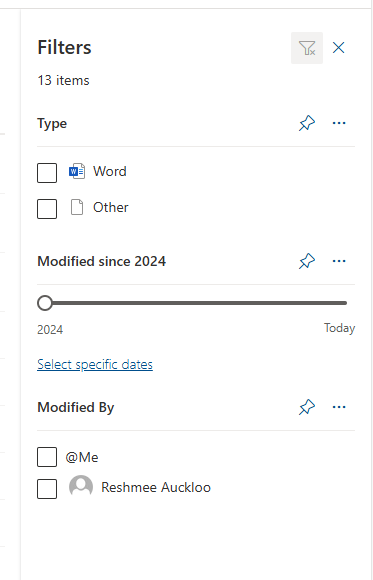

# Pinning Fields to the Filter Pane in SharePoint Libraries

## Summary

The filter pane allows users to quickly filter and find relevant data in libraries and lists. However, by default, not all fields are visible in the filter pane. To enhance usability, specific fields can be pinned to the top of the filter pane.



### Prerequisites

- The user account that runs the script must have access to the SharePoint Online site.

# [PnP PowerShell](#tab/pnpps)

```powershell
# This script updates a field within a SharePoint Online library to pin it to the top of the filters pane.

# Parameters
function Pin-FieldsInList() {
    param (
        [string]$SiteUrl,
        [string]$ListTitle,
        [string[]]$FieldNames
    )

    # Connect to SharePoint Online
    Connect-PnPOnline -Url $SiteUrl

    # Loop through each field to update its properties
    foreach ($FieldName in $FieldNames) {
        Write-Host "Updating field '$FieldName' in library '$ListTitle'..."

        # Get the field
        $Field = Get-PnPField -List $ListTitle -Identity $FieldName

        if ($Field) {
            # Update the field to show in the filters pane
            Set-PnPField -List $ListTitle -Identity $FieldName -Values @{ShowInFiltersPane = 1}
            Write-Host "Field '$FieldName' has been pinned to the filters pane."
        } else {
            Write-Host "Field '$FieldName' not found in library '$ListTitle'."
        }
    }
}

# Example how to call the function Pin-FieldsInList 
Pin-FieldsInList -SiteUrl "https://contoso.sharepoint.com/teams/TestMultipleLibraries" -ListTitle "amberlib" -FieldNames @("Modified", "Type")
```

[!INCLUDE [More about PnP PowerShell](../../docfx/includes/MORE-PNPPS.md)]

***

## Source Credit

Sample first appeared on [Pinning Fields to the Filter Pane in SharePoint Libraries Using PowerShell](https://reshmeeauckloo.com/posts/powershell-sharepoint-library-pin-field-filter-pane/)

## Contributors

| Author(s) |
|-----------|
| [Reshmee Auckloo](https://github.com/reshmee011) |


[!INCLUDE [DISCLAIMER](../../docfx/includes/DISCLAIMER.md)]

