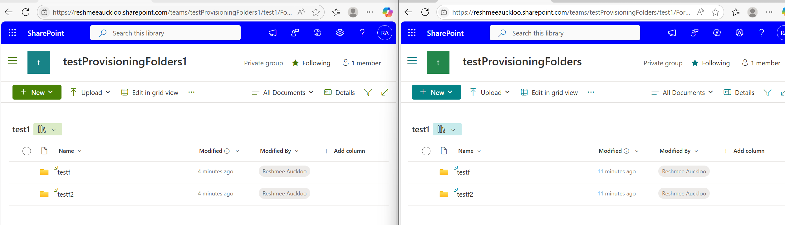

# Exporting and Migrating SharePoint Libraries with Folders

## Summary

Recently, I was asked how to export the first-level folders in document libraries using PnP PowerShell site provisioning cmdlets. While `Get-PnPSiteTemplate` allows exporting SharePoint site configurations, it doesn’t directly cater to folders. After experimenting with various options, including `Add-PnPDataRowsToSiteTemplate`, I discovered the solution: the `Add-PnPListFoldersToSiteTemplate` cmdlet.



### Prerequisites

- The user account that runs the script must have access to the SharePoint Online site.

# [PnP PowerShell](#tab/pnpps)

```powershell
param(
    [Parameter(Mandatory=$true)]
    [string]$SourceSiteUrl,
    
    [Parameter(Mandatory=$true)]
    [string]$DestinationSiteUrl,
    
    [Parameter(Mandatory=$false)]
    [string]$TemplateFileName = "SiteTemplate.xml"
)

# Display script parameters
Write-Host "========================================" -ForegroundColor Cyan
Write-Host "SITE TEMPLATE MIGRATION SCRIPT" -ForegroundColor Cyan
Write-Host "========================================" -ForegroundColor Cyan
Write-Host "Source Site URL: $SourceSiteUrl" -ForegroundColor White
Write-Host "Destination Site URL: $DestinationSiteUrl" -ForegroundColor White
Write-Host "Template File: $TemplateFileName" -ForegroundColor White
Write-Host "========================================`n" -ForegroundColor Cyan

# Connect to source site and export template
Write-Host "Connecting to source site..." -ForegroundColor Green
Connect-PnPOnline -Interactive -Url $SourceSiteUrl

Write-Host "Exporting site template..." -ForegroundColor Green
Get-PnPSiteTemplate -Out $TemplateFileName -Handlers Lists

# Get all document libraries and loop through them to add folders
Write-Host "Getting all document libraries..." -ForegroundColor Cyan
$ExcludedLists = @("Access Requests", "App Packages", "appdata", "appfiles", "Apps in Testing", "Cache Profiles", "Composed Looks", "Content and Structure Reports", "Content type publishing error log", "Converted Forms",
    "Device Channels", "Form Templates", "fpdatasources", "Get started with Apps for Office and SharePoint", "List Template Gallery", "Long Running Operation Status", "Maintenance Log Library", "Images", "site collection images"
    , "Master Docs", "Master Page Gallery", "MicroFeed", "NintexFormXml", "Quick Deploy Items", "Relationships List", "Reusable Content", "Reporting Metadata", "Reporting Templates", "Search Config List", "Site Assets", "Preservation Hold Library",
    "Site Pages", "Solution Gallery", "Style Library", "Suggested Content Browser Locations", "Theme Gallery", "TaxonomyHiddenList", "User Information List", "Web Part Gallery", "wfpub", "wfsvc", "Workflow History", "Workflow Tasks", "Pages")

$libraries = Get-PnPList | Where-Object { $_.BaseTemplate -eq 101 -and $_.Hidden -eq $false -and $_.Title -notin $ExcludedLists}

if ($libraries.Count -gt 0) {
    Write-Host "Found $($libraries.Count) document libraries:" -ForegroundColor Green
    foreach ($library in $libraries) {
        Write-Host "  - $($library.Title)" -ForegroundColor Yellow
    }
    
    Write-Host "`nAdding folder structures to site template..." -ForegroundColor Cyan
    foreach ($library in $libraries) {
        try {
            Write-Host "Processing library: $($library.Title)..." -ForegroundColor Yellow
            Add-PnPListFoldersToSiteTemplate -Path $TemplateFileName -List $library.Title
            Write-Host "✓ Successfully added folders for '$($library.Title)'" -ForegroundColor Green
        }
        catch {
            Write-Host "✗ Error processing library '$($library.Title)': $($_.Exception.Message)" -ForegroundColor Red
        }
    }
} else {
    Write-Host "No document libraries found." -ForegroundColor Yellow
}

# Connect to destination site and apply template
Write-Host "`nConnecting to destination site..." -ForegroundColor Green
Connect-PnPOnline -Interactive -Url $DestinationSiteUrl

Write-Host "Applying site template to destination..." -ForegroundColor Green
Invoke-PnPSiteTemplate -Path $TemplateFileName -Handlers Lists

Write-Host "`n========================================" -ForegroundColor Cyan
Write-Host "MIGRATION COMPLETED SUCCESSFULLY!" -ForegroundColor Green
Write-Host "Template applied from: $SourceSiteUrl" -ForegroundColor White
Write-Host "Template applied to: $DestinationSiteUrl" -ForegroundColor White
Write-Host "========================================" -ForegroundColor Cyan 
```

[!INCLUDE [More about PnP PowerShell](../../docfx/includes/MORE-PNPPS.md)]

***

## Source Credit

Sample first appeared on [Exporting and Migrating SharePoint Libraries with Folders Using PnP PowerShell](https://reshmeeauckloo.com/posts/powershell-pnp-siteprovisioning-libraries-with-folders/)

## Contributors

| Author(s) |
|-----------|
| [Reshmee Auckloo](https://github.com/reshmee011) |


[!INCLUDE [DISCLAIMER](../../docfx/includes/DISCLAIMER.md)]

