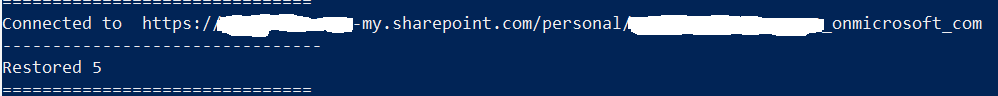
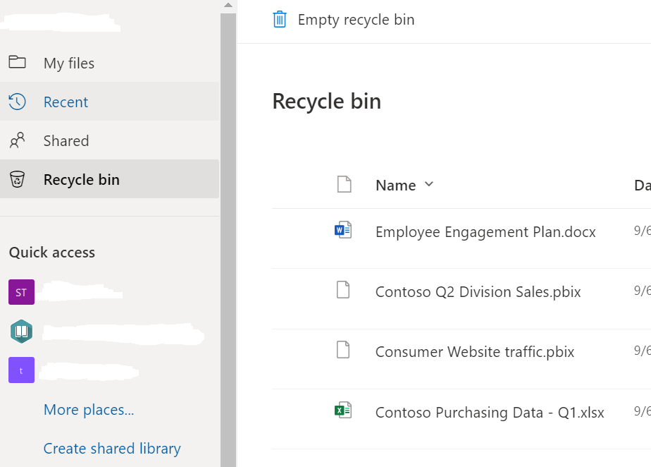
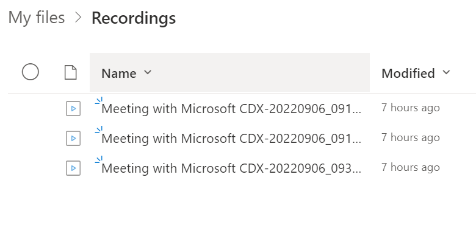
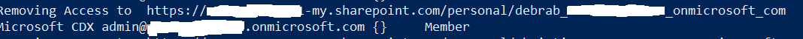
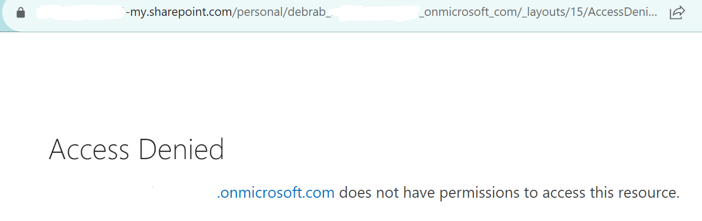

# Recover Deleted Teams Meeting Recordings

## Summary

With the new 120 day expiration policy , some customers have been caught unaware. What do you do if you need to recover across thousands of accounts.
This is supposed to be run in stages , i suggest using this as a sample to build your own script/s. I suggest you copy and paste each stage at a time.

### Recycle bin before restoration


### Grant Access to One Drive

  

### Looping Through One Drive's

  

### Restoration of files



### Recycle bin After Restores



### Recordings Folder After Restores



### Remove Access



### Testing Access



# [PnP PowerShell](#tab/pnpps)

```powershell

# 1 Variables
$SiteCollAdmin="admin@Tenant.onmicrosoft.com"
$Tenant="TenantName"

# 2 Connect to the SharePoint Admin Service consider using an App registration or a Service account.
Connect-spoService -url https://$Tenant-admin.sharepoint.com 
# 3.1 Get all the OneDrive URLS
Get-SPOSite -IncludePersonalSite $True -limit all -Filter "Url -like '-my.sharepoint.com/personal/'"|Select Url,LockState,Status,LastContentModifiedDate,Title,Owner |Export-Csv c:\temp\sites.csv -NoTypeInformation

# 3.2 Get any Deleted OneDrive's
Get-SPODeletedSite -IncludeOnlyPersonalSite |Select Url,LockState,Status,LastContentModifiedDate,Title,Owner |Export-Csv c:\temp\DeletedOnedrivesites.csv -NoTypeInformation

# 3.3 Get SPO Teams
$teams=Get-SPOSite -limit all -Template "GROUP#0" -IncludePersonalSite:$false|Select Url,LockState,Status,LastContentModifiedDate,Title,Owner |Export-Csv c:\temp\Teamssites.csv -NoTypeInformation

# 4 import CSV'sharepoint

$Sites = import-csv -path c:\temp\sites.csv
$DeletedSites = import-csv -path c:\temp\DeletedOnedrivesites.csv
$TeamsSites= import-csv -path c:\temp\Teamssites.csv

# 4.1 Restore deleted OneDrive's (Optional)
foreach ($DLsite in $DeletedSites){
	Restore-SPODeleted	-identity $DLsite.url
	}

# 5 Grant access to OneDrive & Repeat for Deleted Sites
foreach ($site in $Sites){
Set-SPOUser -Site $site.Url -LoginName $SiteCollAdmin -IsSiteCollectionAdmin $True
write-host "Granting Access to "$site.Url
}


# 5.1 Repeat for Deleted Sites
foreach ($DLsite in $DeletedSites){
Set-SPOUser -Site $site.Url -LoginName $SiteCollAdmin -IsSiteCollectionAdmin $True
write-host "Granting Access to "$site.Url
}

# 6 Main Function --- Restore-SPODeleted items Per Site.---

foreach ($site in $Sites){
Connect-pnponline -url $site.Url -interactive
Write-host "Connected to "$site.url
Write-host "--------------------------------"

#For All *.mp4 use the line below
#$Deleteditems=Get-PnPRecycleBinItem |? LeafName -like '*.mp4' |Restore-PnPRecycleBinItem -force
#Restore just Meeting recordings that haven't been renamed.

$count=Get-PnPRecycleBinItem |? LeafName -like '*Meeting Recording.mp4'
if ($count.count -le 0){
Write-host "Found Nothing , So do Nothing."}

if ( $count.count -gt 0){
$Restore=Get-PnPRecycleBinItem |? LeafName -like '*Meeting Recording.mp4' |Restore-PnPRecycleBinItem -force
Write-host "Restored" $count.count}
Write-host "==============================="
}

# 7 Removing Access to Onedrive & Repeat for Deleted Sites
foreach ($site in $Sites){
Set-SPOUser -site $Site.url -LoginName $SiteCollAdmin -IsSiteCollectionAdmin $False
write-host "Removing Access to "$site.Url
}


# 8
Disconnect-pnponline


```
[!INCLUDE [More about PnP PowerShell](../../docfx/includes/MORE-PNPPS.md)]


## Source Credit

Used various sources for pieces of the script above, thank you kindly.

[www.sharepointdiary.com](https://www.sharepointdiary.com/2017/02/sharepoint-online-remove-site-collection-administrator-using-powershell.html)

[www.sharepointdiary.com](https://www.sharepointdiary.com/2017/04/gain-admin-permission-to-onedrive-for-business-sites-using-powershell.html)

[https://techcognizance.com](https://techcognizance.com/2021/05/16/restore-items-from-onedrive-recycle-bin-using-powershell/)

[joseinazusa](https://github.com/joseinazusa/powershell-recursive-folder-restore/blob/master/recursive-recyclebin-restore.ps1)


## Contributors

| Author(s) |
|-----------|
| Jason Baxter|


[!INCLUDE [DISCLAIMER](../../docfx/includes/DISCLAIMER.md)]
