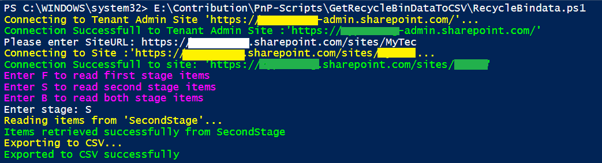

# Get SharePoint Site Recycle Bin Items And Export It To CSV

## Summary

Many times we have requirements like read recycle bin items from any site collection and get items based on recycle bin stage(like FirstStage, SecondStage or Both Stage) export it to CSV.

## Implementation

- Open Windows PowerShell ISE
- Create a new file
- Write a script as below,
- First, we will connect to Tenant admin site.
    - Then we will Read site URL from user and connect to the Site,
    - We will ask to user for enter the stage (like F For FisrtStage, S For SecondStage and B For Both Stage) and based on stage it will retrieve recycle bin items.
    - And then we will export it to CSV.
 


# [PnP PowerShell](#tab/pnpps)
```powershell

#Global Variable Declaration
$AdminURL = "https://{domain}-admin.sharepoint.com/"
$UserName = "USERID"
$Password = "PASSWORD"
$SecureStringPwd = $Password | ConvertTo-SecureString -AsPlainText -Force 
$Credentials = New-Object System.Management.Automation.PSCredential -ArgumentList $UserName, $SecureStringPwd
$DateTime = "_{0:MM_dd_yy}_{0:HH_mm_ss}" -f (Get-Date)
$BasePath = "E:\PnP-Scripts\GetRecycleBinDataToCSV\Logs\"
$CSVPath = $BasePath + "\RecycleBinItems" + $DateTime + ".csv"
$global:RecycleBinItems = @()
$global:SelectedStage = ""

#Login to Tenant Admin Site
Function LoginToAdminSite() {
    [cmdletbinding()]
    param([parameter(Mandatory = $true, ValueFromPipeline = $true)] $Credentials)
    Write-Host "Connecting to Tenant Admin Site '$($AdminURL)'..." -ForegroundColor Yellow
    Connect-PnPOnline -Url $AdminURL -Credentials $Credentials
    Write-Host "Connection Successfull to Tenant Admin Site :'$($AdminURL)'" -ForegroundColor Green
}

#Login to SharePoint Site
Function ConnectToSPSite() {
    try {
        $SiteUrl = Read-Host "Please enter SiteURL"
        if ($SiteUrl) {
            Write-Host "Connecting to Site :'$($SiteUrl)'..." -ForegroundColor Yellow  
            Connect-PnPOnline -Url $SiteUrl -Credentials $Credentials
            Write-Host "Connection Successfull to site: '$($SiteUrl)'" -ForegroundColor Green  
            
            GetRecycleBinItems($SiteUrl)
        }
        else {
            Write-Host "Site URL is empty" -ForegroundColor Red
        }
    }
    catch {
        Write-Host "Error in connecting to Site:'$($SiteUrl)'" $_.Exception.Message -ForegroundColor Red               
    } 
}

#Read recycle bin items and export to CSV
Function GetRecycleBinItems($siteUrl) {
    try {
        Write-Host "Enter F to read first stage items " -ForegroundColor Magenta
        Write-Host "Enter S to read second stage items " -ForegroundColor Magenta
        Write-Host "Enter B to read both stage items " -ForegroundColor Magenta
        $Stage = Read-Host "Enter stage"
        
        if ($Stage -eq 'F') {
            $global:SelectedStage = "FirstStage"
        }
        elseif ($Stage -eq 'S') {
            $global:SelectedStage = "SecondStage"   
        }
        if ($global:SelectedStage) { 
            Write-Host "Reading items from '$($global:SelectedStage)'..." -ForegroundColor Yellow
            $global:RecycleBinItems = Get-PnPRecycleBinItem | Select-Object Title, AuthorEmail, AuthorName, DeletedByEmail, DeletedByName, DeletedDate, ID, ItemState, ItemType, LeafName, Size | Where-Object { $_.ItemState -eq $global:SelectedStage }
            Write-Host "Items retrieved successfully from" $global:SelectedStage -ForegroundColor Green
        }
        else {
            Write-Host "Reading items form both stages..." -ForegroundColor Yellow
            $global:RecycleBinItems = Get-PnPRecycleBinItem | Select-Object Title, AuthorEmail, AuthorName, DeletedByEmail, DeletedByName, DeletedDate, ID, ItemState, ItemType, LeafName, Size
            Write-Host "Items retrieved successfully from" $global:SelectedStage -ForegroundColor Green
        }                     
    }
    catch {
        Write-Host "Error in getting recycle bin items from :'$($siteUrl)'" $_.Exception.Message -ForegroundColor Red                 
    }
    Write-Host "Exporting to CSV..." -ForegroundColor Yellow
    $global:RecycleBinItems | Export-Csv $CSVPath -NoTypeInformation -Append
    Write-Host "Exported to CSV successfully" -ForegroundColor Green
}

Function Main {
    LoginToAdminSite($Credentials);
    ConnectToSPSite
}

Main

```
[!INCLUDE [More about PnP PowerShell](../../docfx/includes/MORE-PNPPS.md)]


# [CLI for Microsoft 365](#tab/cli-m365-ps)
```powershell

#Global Variable Declaration
$DateTime = "_{0:MM_dd_yy}_{0:HH_mm_ss}" -f (Get-Date)
$BasePath = "C:\workspace\a_Local\cli_sample\"
$CSVPath = $BasePath + "RecycleBinItems" + $DateTime + ".csv"
$global:RecycleBinItems = @()

Function Login() {
    $m365Status = m365 status
    if ($m365Status -match "Logged Out") {
        m365 login
    }
}

Function ConnectToSPSite() {
    try {
        $SiteUrl = Read-Host "Please enter SiteURL"
        if ($SiteUrl) {
            
            GetRecycleBinItems($SiteUrl)
        }
        else {
            Write-Host "Site URL is empty" -ForegroundColor Red
        }
    }
    catch {
        Write-Host "Error in connecting to Site:'$($SiteUrl)'" $_.Exception.Message -ForegroundColor Red               
    } 
}

#Read recycle bin items and export to CSV
Function GetRecycleBinItems($siteUrl) {
    try {
        Write-Host "Enter F to read first stage items " -ForegroundColor Magenta
        Write-Host "Enter S to read second stage items " -ForegroundColor Magenta
        Write-Host "Enter B to read both stage items " -ForegroundColor Magenta
        $stage = Read-Host "Enter stage"
        $stage = $stage.ToLower()
        
        if ($stage -eq 'f' -or $stage -eq 'b') {
            Write-Host "Reading items from 'FirstStage'..." -ForegroundColor Yellow
            $first = m365 spo site recyclebinitem list --siteUrl $siteUrl
            $first = $first | ConvertFrom-Json
            Write-Host "Items retrieved successfully from FirstStage" -ForegroundColor Green
        }
        
        if ($stage -eq 's' -or $stage -eq 'b') {
            Write-Host "Reading items from 'SecondStage'..." -ForegroundColor Yellow
            $second = m365 spo site recyclebinitem list --siteUrl $siteUrl --secondary
            $second = $second | ConvertFrom-Json
            Write-Host "Items retrieved successfully from SecondStage" -ForegroundColor Green
        }

        if ($stage -eq 'f') {
            $global:RecycleBinItems = $first
        }
        elseif ($stage -eq 's') {
            $global:RecycleBinItems = $second
        }
        else {
            $global:RecycleBinItems = @($first + $second)
        }

    }
    catch {
        Write-Host "Error in getting recycle bin items from :'$($siteUrl)'" $_.Exception.Message -ForegroundColor Red                 
    }
    Write-Host "Exporting to CSV..." -ForegroundColor Yellow
    $global:RecycleBinItems | Export-Csv $CSVPath -NoTypeInformation -Append
    Write-Host "Exported to CSV successfully" -ForegroundColor Green
}

Function Main {
    Login
    ConnectToSPSite
}

Main

```
[!INCLUDE [More about CLI for Microsoft 365](../../docfx/includes/MORE-CLIM365.md)]

> [!note]
> CLI version of this script is in the latest CLI for Microsoft 365 release which is still considered as beta, use v4.4.0 or higher


***

## Contributors

| Author(s) |
|-----------|
| Chandani Prajapati |
| [Adam Wójcik](https://github.com/Adam-it)|

[!INCLUDE [DISCLAIMER](../../docfx/includes/DISCLAIMER.md)]

