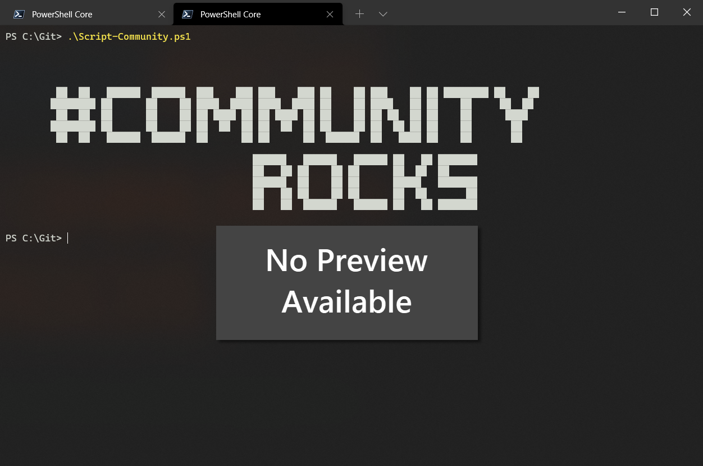

# Get and Remove Site Admins after providing Support.

## Summary

On a regular basis, admin users are granted Site Collection Administrator permissions on individual sites to provide support (e.g. tickets or access requests). Once the support case is resolved, this access is often not removed again, leaving unnecessary standing permissions in the tenant.

This sample runs in two steps to find and clean up these support-related site admins:

1. **Discover**: Loops through every site collection in the tenant and checks its site collection administrators against a list of known support/admin accounts (`$Administrators`). Only *directly assigned* site collection administrators are considered, not group/team owners or other roles. Every match is exported to `SitesSCAdmin.csv`, with an empty `Remove` column.
2. **Review**: Open `SitesSCAdmin.csv`, mark the `Remove` column with an `x` for every row where the admin access should be revoked, and save it as `SitesSCAdmin_cleanup.csv`.
3. **Cleanup**: Re-run the script. It imports `SitesSCAdmin_cleanup.csv`, filters for the rows flagged `x`, and removes the site collection administrator from the matching site.



> [!TIP]
> The sample below connects with `-Interactive` for simplicity, but since the script reconnects once per site, this would prompt for authentication constantly. For regular or unattended runs, it's recommended to authenticate with credentials stored in variables (e.g. a certificate or client secret via `Connect-PnPOnline -ClientId ... -Thumbprint ... -Tenant ...`) instead.


# [PnP PowerShell](#tab/pnpps)
```powershell
Connect-PnPOnline -Url "https://tenant-admin.sharepoint.com" -Interactive 
 
$sites = Get-PnPTenantSite
 
$Administrators = @(
    "admin1@company.com",
    "admin2@company.com"
)
 
$siteList = @()
$i = 0
Foreach ($site in $sites) {
    $i++
    Connect-PnpOnline -Url $site.Url -Interactive
    $Admins = Get-PnPSiteCollectionAdmin
    foreach ($Admin in $Admins) {
        if ($Admin.Email -in $Administrators) {
            Write-Host "Adding $($site.Title) to array ($i)"
            $siteList += [PSCustomObject]@{
                SiteName      = $site.Title
                SiteUrl       = $site.Url
                Administrator = $Admin.Email
                Remove        = ""
            }
        }
    }
}
$siteList | Export-Csv -Path .\SitesSCAdmin.csv -Force -Delimiter ";"
 
$cleanup = Import-Csv -Path .\SitesSCAdmin_cleanup.csv -Delimiter ";" | Where-Object { $_.Remove -eq "x" }
 
foreach ($site in $cleanup) {
    Connect-PnpOnline -Url $site.SiteUrl -Interactive
    try {
        Write-Host "Removing $($site.Administrator) from $($site.SiteUrl)"
        Remove-PnPSiteCollectionAdmin -Owners $site.Administrator
    }
    catch {
        Write-Host "Error Removing $($site.Administrator) from $($site.SiteUrl): $_"
    }
 
}
```

[!INCLUDE [More about PnP PowerShell](../../docfx/includes/MORE-PNPPS.md)]

***

## Contributors

| Author(s) |
|-----------|
| Fabian Hutzli |

[!INCLUDE [DISCLAIMER](../../docfx/includes/DISCLAIMER.md)]
