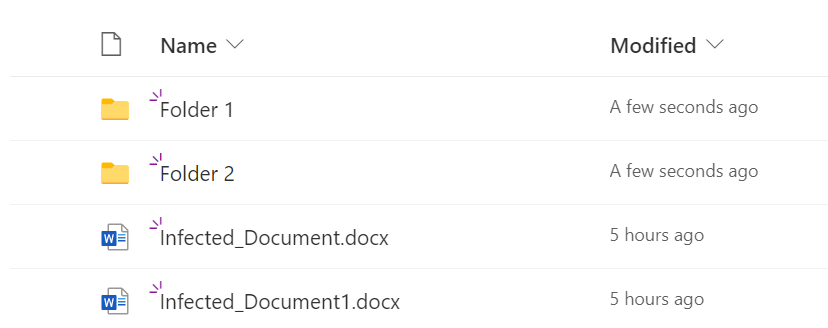
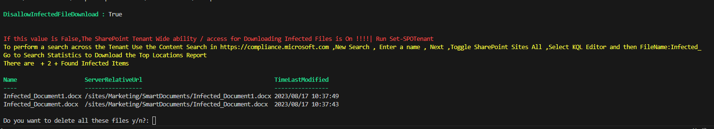
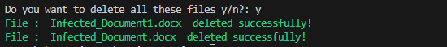
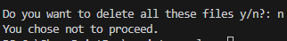
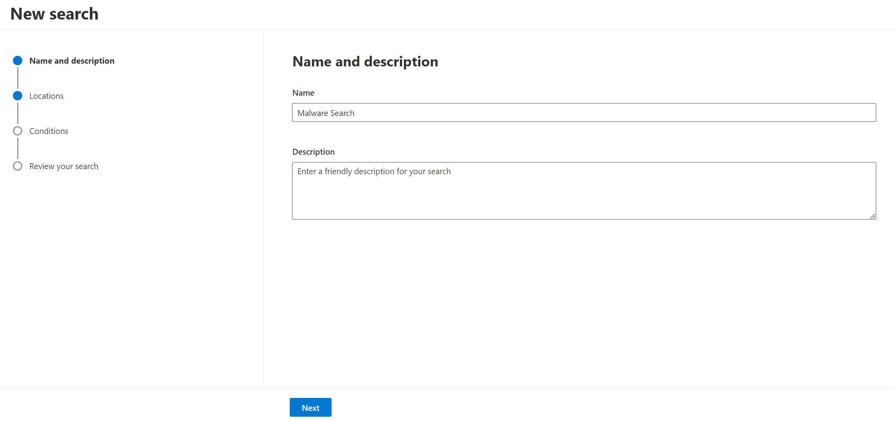
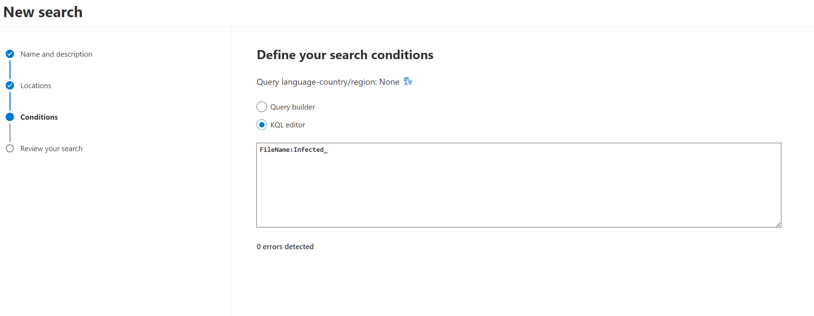
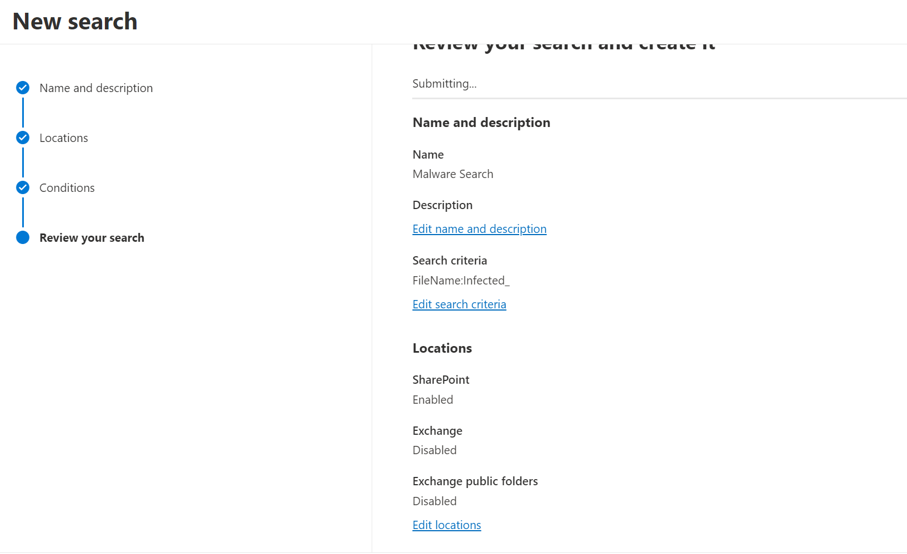
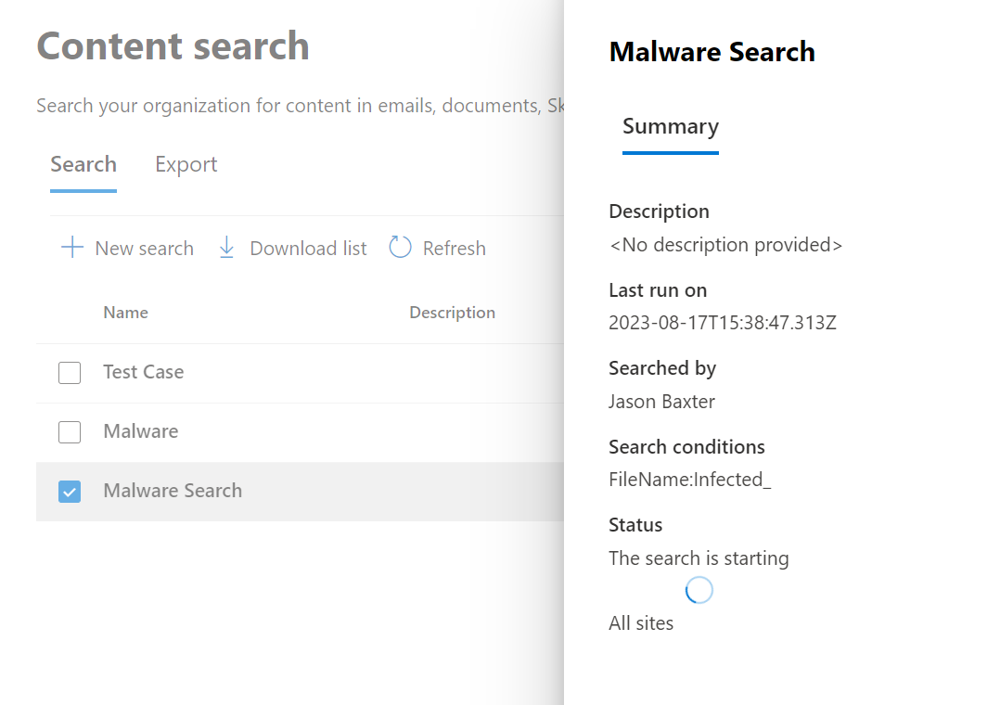
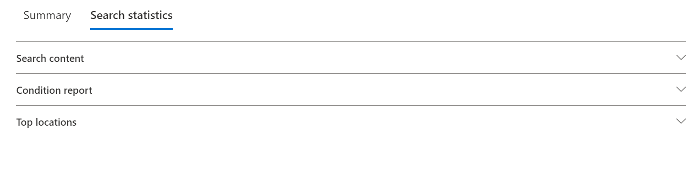
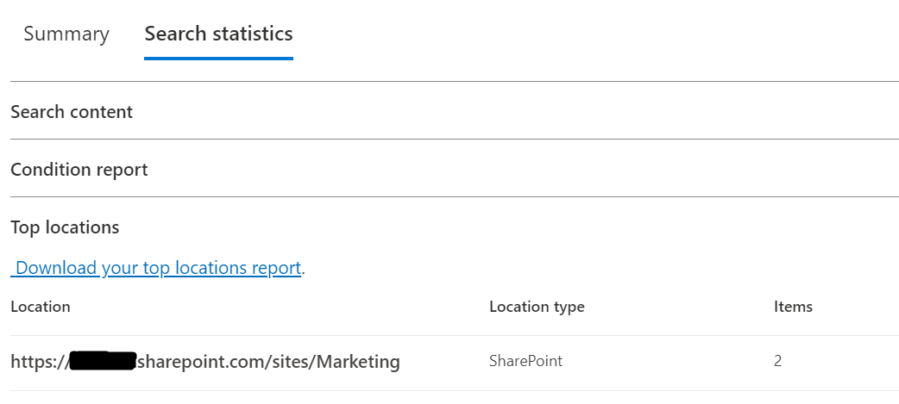

# Remove Identified Malware from Preservation Hold Library

## Summary

When Malware is identified in SharePoint Online , There are Built in Protections in SharePoint Online , OneDrive and Microsoft Teams. Which you can read about more [here](https://learn.microsoft.com/en-us/microsoft-365/security/office-365-security/anti-malware-protection-for-spo-odfb-teams-about?view=o365-worldwide). If the Tenant Setting is set to true , users are unable to download the file. **How do Admin's / Security Analysts remove these files in bulk?**

**Mock Preservation Hold Library**

Even though there is an alert and an Security Admin can quarantine the file through the M365 Defender portal, there is a possibility that a retention policy , such as a blanket policy to keep all files for 3 years, will retain malware in the preservation hold library.

**You still need to exclude the site from the retention policy and wait a min of 24hrs until you can run this script.**





If you want to do a search across the entire tenant i suggest using the Content Search Tool in [Microsoft Purview](https://compliance.microsoft.com/contentsearchv2).

Here are some screenshots to help with performing a search.
### Content Search Images








Links to more of the images

* [Link To Image 1 ](assets/ContentSearch1.png)
* [Link To Image 2 ](assets/ContentSearch2.png)
* [Link To Image 3 ](assets/ContentSearch3.png)
* [Link To Image 4 ](assets/ContentSearch4.png)
* [Link To Image 5 ](assets/ContentSearch5.png)
* [Link To Image 6 ](assets/ContentSearch6.png)
* [Link To Image 7 ](assets/ContentSearch7.png)

# [PnP PowerShell](#tab/pnpps)

```powershell
# Install and import the SharePoint PnP PowerShell module
#Install-Module PnP.PowerShell
#Import-Module PnP.PowerShell

$SiteURL = "https://<tenant>.sharepoint.com/sites/Marketing" # Put the affected Site or Onedrive URL
$ListName = "Preservation Hold Library"

Write-host -f Green "Connecting to the Onedrive / Site......."

# Connect to your SharePoint site
Connect-PnPOnline -Url $SiteURL -Interactive

# Specify the file name you want to delete
$fileNameToDelete = "RestoreLog-5bf3fe68-7dad-4e71-af30-9959b6d04303.log"

# Get the file by its name
$fileToDelete = Get-PnPListItem -List $ListName -Query "<View><Query><Where><Eq><FieldRef Name='FileLeafRef'/><Value Type='Text'>$fileNameToDelete</Value></Eq></Where></Query></View>"

Write-Host -f Yellow "Found"+ $fileToDelete.Count +"with the specified filename"

$fileInfo = @{
    "ID ="=$fileToDelete["ID"]
    "File Name"   = $fileToDelete["FileLeafRef"]
    "File Type"   = $fileToDelete["File_x0020_Type"]
    "Virus Status" = switch ($fileToDelete["_VirusStatus"]) {
        0 { "This document is reported as clean from viruses." }
        1 { "This document had a virus reported by the virus scanner plug-in." }
        2 { "This document had a virus reported by the virus scanner plug-in, which the scanner determines that it can remove." }
        3 { "This document had a virus previously reported, but the virus scanner determines that it successfully removed it." }
        4 { "This document had a virus reported, and the virus scanner attempted to clean it but failed." }
        5 { "This document had a virus reported, and the scanner requested that the document be deleted." }
        6 { "This document had a timeout from the virus scanner when it was last processed." }
        default { "Unknown virus status." }
    }
    "Virus Info"= $fileToDelete["_VirusInfo"]
    "File Size"   = $fileToDelete["File_x0020_Size"]
    "Created By"  = $fileToDelete["Author"].LookupValue
    "Created On"  = $fileToDelete["Created"]
}
$fileInfo | Format-Table -AutoSize

if ($null -ne $fileToDelete) {
    # Prompt for confirmation before deleting
    $confirmation = Read-Host "Are you sure you want to delete $($fileToDelete["FileLeafRef"])? (Y/N)"
    
    if ($confirmation -eq "Y" -or $confirmation -eq "y") {
        # Delete the file
        Remove-PnPListItem -List $ListName -Identity $fileToDelete.Id -Force
        Write-Host "$($fileToDelete["FileLeafRef"]) has been deleted."
    }
    else {
        Write-Host "Deletion cancelled."
    }
}
else {
    Write-Host "File not found: $fileNameToDelete"
}

# Disconnect from the SharePoint site
Disconnect-PnPOnline

```
## [Search a library for infected files and delete them all](#tab/pnpps)

```powershell
# Install and import the SharePoint PnP PowerShell module
#Install-Module PnP.PowerShell
#Import-Module PnP.PowerShell

# Connect to your SharePoint site
Connect-PnPOnline -Url "https://<tenant>.sharepoint.com/sites/Marketing" -Interactive

# Specify the list name and the virus status values to match
$listName = "Preservation Hold Library"
$virusStatusValues = @(1, 2)

# Get the files with matching virus status values
$matchingFiles = Get-PnPListItem -List $listName -Query "<View><Query><Where><In><FieldRef Name='_VirusStatus' /><Values><Value Type='Number'>1</Value><Value Type='Number'>2</Value></Values></In></Where></Query></View>"

if ($matchingFiles.Count -gt 0) {
    $matchingCount = $matchingFiles.Count
    Write-Host "Number of matching files: $matchingCount"
    $matchingFiles | Select-Object FileLeafRef, _VirusStatus | Format-Table -AutoSize

    # Prompt for confirmation before deleting
    $confirmation = Read-Host "Do you want to delete all these files? (Y/N)"

    if ($confirmation -eq "Y" -or $confirmation -eq "y") {
        foreach ($file in $matchingFiles) {
            #Remove-PnPListItem -List $listName -Identity $file.Id -force
            Write-Host "$($file["FileLeafRef"]) has been deleted."
        }
        Write-Host "All matching files have been deleted."
    } else {
        Write-Host "Deletion cancelled."
    }
} else {
    Write-Host "No matching files found."
}

# Disconnect from the SharePoint site
Disconnect-PnPOnline


```
[!INCLUDE [More about PnP PowerShell](../../docfx/includes/MORE-PNPPS.md)]


## Source Credit

I always leverage some of these pieces of code from Sharepointdiary , so here is the credit to those articles.

https://www.sharepointdiary.com/2017/02/sharepoint-online-delete-file-from-document-library-using-powershell.html

https://www.sharepointdiary.com/2021/10/how-to-delete-files-from-preservation-hold-library.html


## Contributors

| Author(s) |
|-----------|
| Jason Baxter|


[!INCLUDE [DISCLAIMER](../../docfx/includes/DISCLAIMER.md)]
