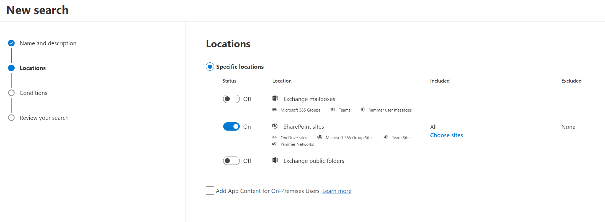

# Remove Identified Malware from Preservation Hold Library

## Summary

When Malware is identified in SharePoint Online , There are Built in Protections in SharePoint Online , OneDrive and Microsoft Teams. Which you can read about more [here](https://learn.microsoft.com/en-us/microsoft-365/security/office-365-security/anti-malware-protection-for-spo-odfb-teams-about?view=o365-worldwide). If the Tenant Setting is set to true , users are unable to download the file. **How do Admin's / Security Analysts remove these files in bulk?**

**Mock Preservation Hold Library**

Even though there is an alert and an Security Admin can quarantine the file through the M365 Defender portal, there is a possibility that a retention policy , such as a blanket policy to keep all files for 3 years, will retain malware in the preservation hold library.

**You still need to exclude the site from the retention policy and wait a min of 24hrs until you can run this script.**


If you want to do a search across the entire tenant i suggest using the Content Search Tool in [Microsoft Purview](https://compliance.microsoft.com/contentsearchv2).

Here are some screenshots to help with performing a search.
### Content Search Images




Links to more of the images

* [Link To Image 1 ](assets/ContentSearch1.png)
* [Link To Image 2 ](assets/ContentSearch2.png)
* [Link To Image 3 ](assets/ContentSearch3.png)
* [Link To Image 4 ](assets/ContentSearch4.png)
* [Link To Image 5 ](assets/ContentSearch5.png)
* [Link To Image 6 ](assets/ContentSearch6.png)
* [Link To Image 7 ](assets/ContentSearch7.png)

# [PnP PowerShell](#tab/pnpps)

```powershell

$AdminURL="https://<tenant>-admin.sharepoint.com"
$SiteURL = "https://<tenant>.sharepoint.com/sites/Marketing"
$ListName = "Preservation Hold Library"
#$ListName = "Documents"

#Checking
#Connect to PnP Online
Connect-PnPOnline -url $AdminURL -Interactive

Get-PnPTenant | Select-Object DisallowInfectedFileDownload| fl

Write-Host -f Red "If this value is False,The SharePoint Tenant Wide ability / access for downloading infected files is On !!!!| Run Set-SPOTenant"
Write-Host -f Yellow "To perform a search across the Tenant Use the Content Search in https://compliance.microsoft.com ,New Search , Enter a name , Next ,Toggle SharePoint Sites All ,Select KQL Editor and then FileName:Infected_"
Write-Host -f Yellow "Go to Search Statistics to Download the Top Locations Report"

Try {
    #Connect to PnP Online
    Connect-PnPOnline -Url $SiteURL -Interactive
    #Try to Get File

    #Only have to update this if you want to delete a specific file.
    $FileRelativeURL ="/sites/Marketing/Preservation Hold Library/Possible Deals.xlsx"   
    
    # Swap these two lines around if you want to only remove a specific file.
    $File = Get-PnPFile -Url $FileRelativeURL -ErrorAction SilentlyContinue

    #Searching for a FileName starting with Infected_
    #$File = Find-PnPFile -List $ListName -Match Infected_*
    
    # Tell the user how many files they found and some details in a table of the files.
    Write-Host -f Yellow "There are "+ $File.Count +" Found Infected Items"
    $File|Select Name , ServerRelativeUrl ,TimeLastModified |ft
    
    # Check if they want to remove these files.
    $Delete=Read-Host -Prompt "Do you want to delete all these files y/n?"

    if ($Delete -eq "y") {

                foreach ($currentItemName in $File) {
                <# $currentItemName is the current item #>

                        If ($currentItemName) {
                            #Delete the File ,comment the next line for testing how this works.
                            #Remove-PnPFile -ServerRelativeUrl $currentItemName.ServerRelativeUrl -Force
                            Remove-PnPFile -ServerRelativeUrl $FileRelativeURL  -Force
                            Write-Host -f Green "File : "$currentItemName.Name" deleted successfully!"
                        }
                        Else {
                            Write-Host -f Yellow "Could not Find File at "+$currentItemName.ServerRelativeUrl
                        }
                                                    }
                    }
    elseif ($Delete  -eq "n") {
        Write-Host -f Yellow "You chose not to proceed."
    } 
    else {
        Write-Host -f Red "Invalid input. Please enter 'yes' or 'no'."
       
    }

}
#Catch any unexpected errors and display these.
catch {
    write-host "Error: $($_.Exception.Message)" -foregroundcolor Red
}


```
[!INCLUDE [More about PnP PowerShell](../../docfx/includes/MORE-PNPPS.md)]


## Source Credit

I always leverage some of these pieces of code from Sharepointdiary , so here is the credit to those articles.

https://www.sharepointdiary.com/2017/02/sharepoint-online-delete-file-from-document-library-using-powershell.html

https://www.sharepointdiary.com/2021/10/how-to-delete-files-from-preservation-hold-library.html


## Contributors

| Author(s) |
|-----------|
| Jason Baxter|


[!INCLUDE [DISCLAIMER](../../docfx/includes/DISCLAIMER.md)]
