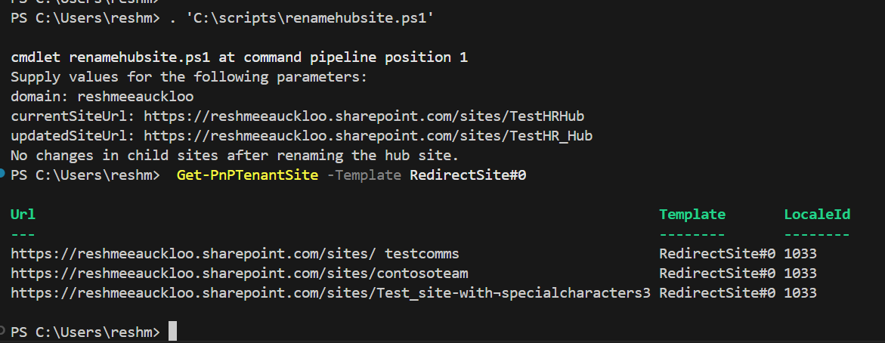

# Renaming a SharePoint Hub Site URL

## Summary

Renaming a SharePoint Hub Site URL or title is not a straightforward process. A hub site can not be renamed directly. Instead, the hub site needs to be unregistered before performing the rename, and then re-register it as a hub. This ensures the integrity of the hub structure and keeps associated sites intact.

---

## 🛠️ What This Script Does

This PowerShell script walks through:

✅ Unregistering the hub site

✏️ Renaming the site URL and title

🗑️ Deleting the redirect site automatically created after renaming

🔁 Re-registering the site as a hub

🔍 Verifying that child sites remain associated



### Prerequisites

- The user account that runs the script must have access to the SharePoint Online site.

# [PnP PowerShell](#tab/pnpps)

```powershell
param (
    [Parameter(Mandatory = $true)]
    [string]$domain = "contoso",

    [Parameter(Mandatory = $true)]
    [string]$currentSiteUrl = "https://contoso.sharepoint.com/sites/TestHR_Hub",

    [Parameter(Mandatory = $true)]
    [string]$updatedSiteUrl = "https://contoso.sharepoint.com/sites/TestHR_Hub_Updated"
)

$adminSiteURL = "https://$domain-Admin.SharePoint.com"
Connect-PnPOnline -Url $adminSiteURL

try {
    $siteId = (Get-PnPTenantSite -Identity $currentSiteUrl).SiteId
    $hubSite = Get-PnPHubSite -Identity $siteId.Guid -ErrorAction SilentlyContinue

    if (-not $hubSite) {
        Write-Host "The site is not a hub site or does not exist."
    }
    else {
        $childSites = Get-PnPHubSiteChild -Identity $siteId.Guid -ErrorAction SilentlyContinue
        Unregister-PnPHubSite -Site $siteId.Guid
    }

    Rename-PnPTenantSite -Identity $currentSiteUrl -NewSiteUrl $updatedSiteUrl -NewSiteTitle 'Test HR Hub' | Out-Null

    # Wait for the rename to complete
    $updatehubSite = Get-PnPTenantSite -Identity $updatedSiteUrl -ErrorAction SilentlyContinue
    while(-not $updatehubSite) {
        Start-Sleep -Seconds 30
        $updatehubSite = Get-PnPTenantSite -Identity $updatedSiteUrl -ErrorAction SilentlyContinue
    }

    # Remove the redirect site created by the rename
    Remove-PnPTenantSite -Url $currentSiteUrl -Force

    # Register the site as a hub site again
    Register-PnPHubSite -Site $updatedSiteUrl | Out-Null

    # Check if child sites are still associated
    $childSites1 = Get-PnPHubSiteChild -Identity $siteId.Guid -ErrorAction SilentlyContinue
    $result = Compare-Object -ReferenceObject $childSites1 -DifferenceObject $childSites
    if ($result) {
        Write-Host "Child sites have been updated after renaming the hub site."
    } else {
        Write-Host "No changes in child sites after renaming the hub site."
    }
}
catch {
    Write-Host "An error occurred while renaming the hub site: $_"
}
```

[!INCLUDE [More about PnP PowerShell](../../docfx/includes/MORE-PNPPS.md)]

***

## Source Credit

Sample first appeared on [How to Safely Rename a SharePoint Hub Site URL with PnP PowerShell](https://reshmeeauckloo.com/posts/powershell-sharepoint-rename-hubsite/)

## Contributors

| Author(s) |
|-----------|
| [Reshmee Auckloo](https://github.com/reshmee011) |


[!INCLUDE [DISCLAIMER](../../docfx/includes/DISCLAIMER.md)]

