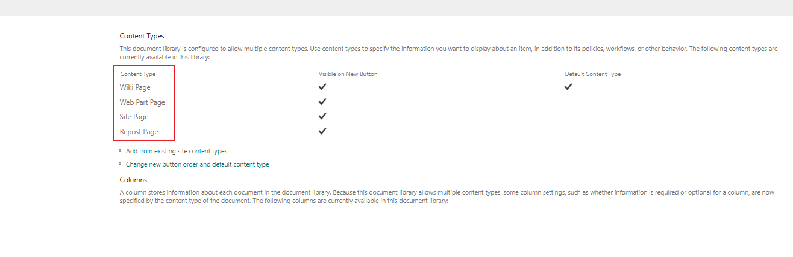

# Reorder Content Types in SharePoint List

## Summary

This guide details how to rearrange content types in a SharePoint list using PnP PowerShell.




# [PnP PowerShell](#tab/pnpps)

```powershell

# Specify the Site URL
$SiteURL = "https://contoso.sharepoint.com/"

# Connect to SharePoint online admin center
Connect-PnPOnline -Url $SiteURL -Interactive

# Note Down the Content Types order you need
$ContentTypesOrder = @("Site Page","Web Part Page","Wiki Page","Repost Page")

# Specify the List Name
$ListName = "Site Pages"

#Get the List Details
$List = Get-PnPList -Identity $ListName -Includes ContentTypes,RootFolder.UniqueContentTypeOrder

#Create a List for content types order
$ContentTypeOrder = New-Object System.Collections.Generic.List[Microsoft.SharePoint.Client.ContentTypeId]

#Arrange Content Types Order
ForEach($ContentType in $ContentTypesOrder)
{
    #Get the Content Type from List and Add to Content Type Order List
    $CType = $List.ContentTypes | Where {$_.Name -eq $ContentType}
    If($CType -ne $Null)
    {
        $ContentTypeOrder.Add($CType.Id)
    }
}

#Set Content type Order
$List.RootFolder.UniqueContentTypeOrder = $ContentTypeOrder
$List.RootFolder.Update()
Invoke-PnPQuery

# Disconnect SharePoint online connection
Disconnect-PnPOnline

```

[!INCLUDE [More about PnP PowerShell](../../docfx/includes/MORE-PNPPS.md)]

***

## Contributors

| Author |
|-----------|
| [Aman Panjwani](https://www.linkedin.com/in/aman-17-panjwani/) |

[!INCLUDE [DISCLAIMER](../../docfx/includes/DISCLAIMER.md)]

