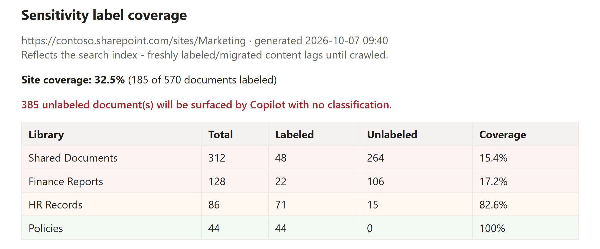

# Report sensitivity label coverage for Copilot readiness

## Summary

Before you turn Microsoft 365 Copilot loose on a site, one number matters: how much of the content has a sensitivity label, and how much does not? An unlabeled document is one Copilot can surface and summarise with no classification attached, so "how much is unlabeled, and where?" is a Copilot-readiness question, not just a compliance one.

This read-only script answers it. It uses SharePoint Search, specifically the crawled managed property `InformationProtectionLabelId`, which holds a document's sensitivity-label GUID and is empty when the document is unlabeled, to count labeled versus unlabeled documents without walking every file. That means it scales across large libraries instead of enumerating them item by item. It groups the result per library, ranks the worst-covered library first, prints a site coverage percentage and a plain Copilot-exposure line, and can optionally write a CSV of every document and a styled HTML report. It sets an exit code (`0` fully covered, `2` gaps found) so a pipeline can gate on label coverage.

It complements Microsoft Purview rather than reinventing it. Purview owns *applying* labels (manual labeling, default library labels, and, on the premium tiers, automatic labeling); this script does not change anything, it just finds where labels are missing so you can target them. That makes it useful even on tenants that do not have the premium auto-labeling licences, where you still want to see the gap and label by hand or with a default label.



> [!Note]
> This report reflects the **search index**, not the live state of the site. Freshly uploaded, migrated, or just-labeled documents will not show the correct status until they have been crawled (minutes to a few hours on a fresh site). If a site returns no documents, the content most likely has not been crawled yet.

> [!Note]
> Reading the site via search requires access to it. Register an app for interactive sign-in once with `Register-PnPEntraIDAppForInteractiveLogin` and pass its client id with `-ClientId`.

# [PnP PowerShell](#tab/pnpps)

```powershell
<#
.SYNOPSIS
    Reports sensitivity-label coverage for a SharePoint site - how many documents
    are UNLABELED (what Microsoft 365 Copilot would surface with no classification)
    and where the gaps are.

.DESCRIPTION
    Read-only. Uses SharePoint Search (the crawled managed property
    InformationProtectionLabelId) to find labeled vs unlabeled documents, so it
    scales without walking every file. Groups results by library, ranks the
    worst-covered first, and frames the gap in Copilot terms.

    It complements Microsoft Purview auto-labeling - it does NOT apply labels, it
    tells you WHERE labels are missing so you can target auto-labeling / default
    labels. Nothing is changed.

    IMPORTANT - it reflects the SEARCH INDEX, not real time. Freshly uploaded,
    migrated or just-labeled documents will not show correct status until they
    have been crawled (minutes to hours on a fresh site).

.PARAMETER SiteUrl
    The site to assess, e.g. https://contoso.sharepoint.com/sites/Marketing

.PARAMETER ClientId
    Entra app registration client id for the interactive PnP connection.

.PARAMETER CsvPath
    Optional. Writes the per-document rows to this CSV.

.PARAMETER HtmlPath
    Optional. Writes a styled HTML coverage report to this path.

.PARAMETER MinUnlabeled
    Optional. Only show libraries with at least this many unlabeled docs (hides noise).

.EXAMPLE
    .\Get-LabelCoverage.ps1 -SiteUrl "https://contoso.sharepoint.com/sites/Marketing" -ClientId "00000000-0000-0000-0000-000000000000"

.EXAMPLE
    .\Get-LabelCoverage.ps1 -SiteUrl "https://contoso.sharepoint.com/sites/Marketing" -ClientId "00000000-0000-0000-0000-000000000000" -CsvPath .\coverage.csv -HtmlPath .\coverage.html

.NOTES
    Exit codes: 0 = all documents labeled, 2 = unlabeled documents found, 1 = error.
#>
[CmdletBinding()]
param(
    [Parameter(Mandatory)] [string] $SiteUrl,
    [Parameter(Mandatory)] [string] $ClientId,
    [string] $CsvPath,
    [string] $HtmlPath,
    [int]    $MinUnlabeled = 0
)

$ErrorActionPreference = 'Stop'

function Write-Stage { param([string]$t) Write-Host "`n=== $t ===" -ForegroundColor Yellow }

try {
    # --- connect (read-only) ------------------------------------------------
    Write-Stage "Connecting"
    Connect-PnPOnline -Url $SiteUrl -ClientId $ClientId -Interactive
    Write-Host "  Connected to $SiteUrl" -ForegroundColor Green

    # --- pull documents + their label id via search -------------------------
    Write-Stage "Scanning documents (via search index)"

    # IsDocument:1 limits to files. Path scopes to this site collection.
    # InformationProtectionLabelId holds the sensitivity-label GUID; empty = unlabeled.
    $query = "IsDocument:1 Path:$($SiteUrl.TrimEnd('/'))/*"
    $props = 'Path','Title','FileType','InformationProtectionLabelId','SiteTitle','SPSiteURL'

    $rows = New-Object System.Collections.Generic.List[object]
    $pageSize = 500
    $start = 0
    do {
        $res = Submit-PnPSearchQuery -Query $query -SelectProperties $props -StartRow $start -MaxResults $pageSize -TrimDuplicates:$false
        $batch = @($res.ResultRows)
        foreach ($r in $batch) {
            $path = [string]$r['Path']
            if (-not $path) { continue }
            $label = [string]$r['InformationProtectionLabelId']
            # library = first path segment after the site collection url
            $rel = $path.Substring($SiteUrl.TrimEnd('/').Length).TrimStart('/')
            $lib = ($rel -split '/')[0]
            $rows.Add([pscustomobject]@{
                Library  = $lib
                Title    = [string]$r['Title']
                FileType = [string]$r['FileType']
                Path     = $path
                Labeled  = [bool]($label)        # non-empty label id => labeled
                LabelId  = $label
            })
        }
        $start += $pageSize
    } while ($batch.Count -eq $pageSize -and $start -lt 10000)   # search relevance trim ~10k

    $all = [object[]]$rows.ToArray()
    if ($all.Count -eq 0) {
        Write-Warning "No documents returned by search. Either the site has no files, or (more likely on a fresh/just-migrated site) the content has not been crawled yet. Wait for the index and re-run."
        exit 0
    }

    # --- aggregate per library ----------------------------------------------
    Write-Stage "Coverage"

    $byLib = $all | Group-Object Library | ForEach-Object {
        $tot = $_.Count
        $lab = @($_.Group | Where-Object Labeled).Count
        $unl = $tot - $lab
        [pscustomobject]@{
            Library   = $_.Name
            Total     = $tot
            Labeled   = $lab
            Unlabeled = $unl
            Coverage  = if ($tot) { [math]::Round(100.0 * $lab / $tot, 1) } else { 0 }
        }
    } | Where-Object { $_.Unlabeled -ge $MinUnlabeled } |
        Sort-Object Coverage, @{Expression='Unlabeled';Descending=$true}   # worst coverage first

    $totalDocs = $all.Count
    $totalUnl  = @($all | Where-Object { -not $_.Labeled }).Count
    $siteCov   = if ($totalDocs) { [math]::Round(100.0 * ($totalDocs - $totalUnl) / $totalDocs, 1) } else { 0 }

    $byLib | Format-Table Library, Total, Labeled, Unlabeled, @{N='Coverage %';E={$_.Coverage}} -AutoSize

    Write-Host ""
    Write-Host ("  SITE COVERAGE : {0}%  ({1} of {2} documents labeled)" -f $siteCov, ($totalDocs-$totalUnl), $totalDocs) -ForegroundColor Cyan
    if ($totalUnl -gt 0) {
        Write-Host ("  COPILOT EXPOSURE : {0} unlabeled document(s) will be surfaced by Copilot with no classification." -f $totalUnl) -ForegroundColor Red
    } else {
        Write-Host "  No unlabeled documents found." -ForegroundColor Green
    }

    # --- optional CSV -------------------------------------------------------
    if ($CsvPath) {
        $all | Select-Object Library, Title, FileType, Labeled, LabelId, Path |
            Export-Csv -Path $CsvPath -NoTypeInformation -Encoding UTF8
        Write-Host "  CSV written: $CsvPath" -ForegroundColor Green
    }

    # --- optional HTML ------------------------------------------------------
    if ($HtmlPath) {
        Add-Type -AssemblyName System.Web
        $rowsHtml = ($byLib | ForEach-Object {
            $cls = if ($_.Coverage -lt 50) { 'bad' } elseif ($_.Coverage -lt 90) { 'warn' } else { 'ok' }
            "<tr class='$cls'><td>$([System.Web.HttpUtility]::HtmlEncode($_.Library))</td><td>$($_.Total)</td><td>$($_.Labeled)</td><td>$($_.Unlabeled)</td><td>$($_.Coverage)%</td></tr>"
        }) -join "`n"
        $html = @"
<!doctype html><html><head><meta charset="utf-8"><title>Sensitivity label coverage</title>
<style>body{font-family:Segoe UI,Arial,sans-serif;margin:2rem;color:#201f1e}
h1{font-size:1.3rem}.sub{color:#605e5c}
table{border-collapse:collapse;margin-top:1rem;width:100%}
th,td{border:1px solid #edebe9;padding:.4rem .6rem;text-align:left}
th{background:#f3f2f1}
tr.bad td{background:#fdf3f2}tr.warn td{background:#fff8f0}tr.ok td{background:#f3faf3}
.exposure{color:#a4262c;font-weight:600;margin-top:1rem}</style></head><body>
<h1>Sensitivity label coverage</h1>
<div class="sub">$([System.Web.HttpUtility]::HtmlEncode($SiteUrl)) &middot; generated $(Get-Date -Format 'yyyy-MM-dd HH:mm')</div>
<div class="sub">Reflects the search index - freshly labeled/migrated content lags until crawled.</div>
<p><strong>Site coverage: $siteCov%</strong> ($($totalDocs-$totalUnl) of $totalDocs documents labeled)</p>
$(if($totalUnl -gt 0){"<p class='exposure'>$totalUnl unlabeled document(s) will be surfaced by Copilot with no classification.</p>"})
<table><tr><th>Library</th><th>Total</th><th>Labeled</th><th>Unlabeled</th><th>Coverage</th></tr>
$rowsHtml
</table></body></html>
"@
        Set-Content -Path $HtmlPath -Value $html -Encoding UTF8
        Write-Host "  HTML written: $HtmlPath" -ForegroundColor Green
    }

    if ($totalUnl -gt 0) { exit 2 } else { exit 0 }
}
catch {
    Write-Host "ERROR: $($_.Exception.Message)" -ForegroundColor Red
    exit 1
}
```

[!INCLUDE [More about PnP PowerShell](../../docfx/includes/MORE-PNPPS.md)]

***

## Source Credit

Sample first appeared on [https://www.fivenumber.com](https://www.fivenumber.com)

## Contributors

| Author(s) |
| --------- |
| Vijay Kumar G |

[!INCLUDE [DISCLAIMER](../../docfx/includes/DISCLAIMER.md)]

