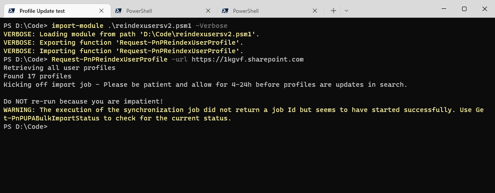

# Request Reindex of SharePoint User Profile Properties

## Summary

This function, Request-PnPReindexUserProfile, triggers a full crawl of each user's profile properties. The index should run in the next couple of hours.



## Implementation
Save this script to a PSM1 module file, like reindexusers.psm1. Then import the module file with Import-Module:
```powershell

Import-Module reindexusers.psm1 -Verbose

```
The -Verbose switch lists the functions that are imported.

Once the module is imported the function Request-PnPReindexUserProfile will be loaded and ready to use.

# [PnP PowerShell](#tab/pnpps)

```powershell

<# Script to trigger the Re-index of SPO user profiles
Original Author: Mikael Svenson - @mikaelsvenson
Blog: http://techmikael.com
Original code: https://github.com/wobba/SPO-Trigger-Reindex 
Modified by Todd Klindt - @toddklindt
v1.0 - 7/25/2022
Blog: https://www.toddklindt.com

#>
function Request-PnPReindexUserProfile {
<#
.SYNOPSIS
Script to trigger re-indexing of all user profiles

.Description
If you perform search schema mappings after profiles exist you have to update the last modified time on a profile for it to be re-indexed.
This script ensures all profiles are updated with a new time stamp. Once the import job completes allow 4-24h for profiles to be updated in search.

If used in automation replace Connect-PnPOnline with something which works for you. 

A temp file will be created on the file system where you execute the command. That temp file will also be uploaded to the "Shared Documents" library in the site you pass in the -url parameter. The account you connect with must have write permission to the -url site and have the SharePoint Admin role in the tenant. 

.Parameter url
The site you will use to host the import file. Can be any site you have write access to. DO NOT use the admin site.

.PARAMETER DocumentLibrary
If you don't want the temporary file uploaded to the Shared Documents library of your site, specific a different library here. Use Get-PnPList after connecting to get a list of the available document libraries. 

.Example 
Request-PnPReindexUserProfile -url https://contoso.sharepoint.com

.Example 
Request-PnPReindexUserProfile -url https://contoso.sharepoint.com/sites/IT -DocumentLibrary Foo


#>    
    [CmdletBinding()]
    param (
        # URL of the site to store the job definition file and any log files. In the form of https://contoso.sharepoint.com
        [Parameter(Mandatory = $true, ValueFromPipeline = $true)][string]$url,
        # Optional - Name of the Document Library in the site to store the job definition and log files. Should look like "Shared Documents" If no value is passed the oldest document library in the site will be used. That's usually "Shared Documents"
        [string]$DocumentLibrary
    )
    
    begin {
        
    }
    
    process {
        # In case they didn't heed our warning and tried to use the Admin site
        $url = $url.Replace("-admin.",".")

        # Need the current location so we know where to save the temp file
        $tempPath = Get-Location

        # Make sure they have the PnP.PowerShell module installed
        $hasPnP = (Get-Module PnP.PowerShell -ListAvailable).Length
        if ($hasPnP -eq 0) {
            Write-Output "This script requires PnP PowerShell, please install it"
            Write-Output "Install-Module PnP.PowerShell"
            return
        }

        # Replace connection method as needed
        try {
            Connect-PnPOnline -Url $url -Interactive
        }
        catch {
            Write-Error "Could not connect to $url"
            Write-Error $_
            return
        }
        
        Write-Output "Retrieving all user profiles"
        try {
            $ProfileList = Submit-PnPSearchQuery -Query '-AccountName:spofrm -AccountName:spoapp -AccountName:app@sharepoint -AccountName:spocrawler -AccountName:spocrwl -PreferredName:"Foreign Principal"' -SourceId "b09a7990-05ea-4af9-81ef-edfab16c4e31" -SelectProperties "aadobjectid", "department", "write" -All -TrimDuplicates:$false -RelevantResults -ErrorAction Stop
        }
        catch {
            Write-Error "Error with Submit-PnPSearchQuery"
            Write-Error "Please check connection and permissions to $url and try again"
            Write-Error $_
            return
        }

        # Put the template file together
        $fragmentTemplate = "{{""IdName"": ""{0}"",""Department"": ""{1}""}}";
        $accountFragments = @();
        
        foreach ($Profile in $ProfileList) {
            $aadId =  $Profile.aadobjectid + ""
            $dept = $Profile.department + ""
            if(-not [string]::IsNullOrWhiteSpace($aadId) -and $aadId -ne "00000000-0000-0000-0000-000000000000") {
                $accountFragments += [string]::Format($fragmentTemplate,$aadId,$dept)
            }
        }

        Write-Output "Found $($accountFragments.Count) profiles"
        $json = "{""value"":[" + ($accountFragments -join ',') + "]}"
        
        $propertyMap = @{}
        $propertyMap.Add("Department", "Department")
        
        $filename = "upa-batch-trigger";

        Set-Content -Path "$tempPath\$filename.txt" -value $json

        Write-Output "Kicking off import job - Please be patient and allow for 4-24h before profiles are updates in search.`n`nDo NOT re-run because you are impatient!"

        if([string]::IsNullOrWhiteSpace($DocumentLibrary)) {
            # Find default doclib to store the job file and logs in since one was not passed
            $DocumentLibraryObj = (Get-PnPList -Includes IsSystemList | Where-Object -Property IsSystemList -EQ -Value $false | Where-Object -Property BaseType -EQ -Value "DocumentLibrary“ | Sort-Object -Property Created)[0]
            $Ignore = Get-PnPProperty -ClientObject $DocumentLibraryObj -Property RootFolder
            $DocumentLibraryName = $DocumentLibraryObj.RootFolder.Name
        } else {
            $DocumentLibraryName = $DocumentLibrary
        }

        Write-Verbose "Using $DocumentLibraryName"
        try {
            $job = New-PnPUPABulkImportJob -UserProfilePropertyMapping $propertyMap -IdType CloudId -IdProperty "IdName" -Folder $DocumentLibraryName -Path "$tempPath\$filename.txt"
        }
        catch {
            Write-Error "Could not upload $tempPath\$($filename.txt) to $url"
            Write-Error $_
            return
        }
        
        Remove-Item -Path "$tempPath\$filename.txt"
        
        if(-not [string]::IsNullOrWhiteSpace($job)) {
            Write-Output "You can check the status of your job with: Get-PnPUPABulkImportStatus -JobId $($job.JobId)"
            $job
        }
                
    }
    
    end {
        
    }
}

```
[!INCLUDE [More about PnP PowerShell](../../docfx/includes/MORE-PNPPS.md)]
***


## Source Credit

Sample first appeared on [https://github.com/wobba/SPO-Trigger-Reindex](https://github.com/wobba/SPO-Trigger-Reindex). Copied and modified with Mikael's blessing.

## Contributors

| Author(s) |
|-----------|
| Mikael Svenson |
| [Todd Klindt](https://www.toddklindt.com)|


[!INCLUDE [DISCLAIMER](../../docfx/includes/DISCLAIMER.md)]
