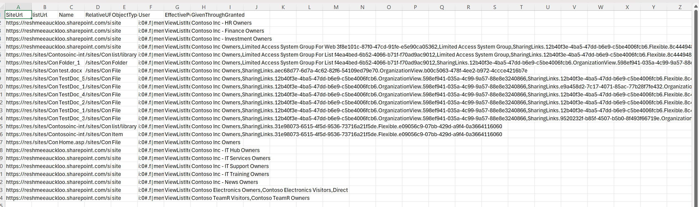

# Retrieve Effective Permissions of End Users Across Sites

## Summary

Managing permissions in SharePoint can be challenging, especially when users are granted access through various means such as direct permissions, shared links, SharePoint groups, or M365 groups. To simplify this process, you can use the effectivepermissions endpoint to retrieve and analyze permissions assigned to users at the site, list/library, and item/file/folder levels.



### Prerequisites

- The user account that runs the script must have SharePoint Online tenant administrator access.

- Enter the values as prompted by the script and modify the filter `$m365Sites = Get-PnPTenantSite| Where-Object {  $_.Url -like '*/sites/*' -and $_.Template -ne 'RedirectSite#0' }`  to target only sites you are interested in. 


# [PnP PowerShell](#tab/pnpps)

```powershell
#Parameters
$tenantUrl = Read-Host -Prompt "Enter tenant URL";
$dateTime = (Get-Date).toString("dd-MM-yyyy-hh-ss")
$invocation = (Get-Variable MyInvocation).Value
$directorypath = Split-Path $invocation.MyCommand.Path
$fileName = "EffectivePermissionsReport-" + $dateTime + ".csv"
$ReportOutput = $directorypath + "\Logs\"+ $fileName
$userName =  Read-Host -Prompt "Enter User Name";
#Connect to PnP Online
Connect-PnPOnline -Url $tenantUrl 

$global:Results = @();
Function Extract-Guid ($inputString) {
    $splitString = $inputString -split '\|'
    return $splitString[2].TrimEnd('_o')
  }
Function QueryUniquePermissionsByObject($_web,$_object,$_LoginName)
{
  $roleAssignments = Get-PnPProperty -ClientObject $_object -Property RoleAssignments
 $permissions =@(); 
  foreach($roleAssign in $roleAssignments){
    Get-PnPProperty -ClientObject $roleAssign -Property RoleDefinitionBindings,Member;
    $PermissionLevels = $roleAssign.RoleDefinitionBindings | Select -ExpandProperty Name;
    #Get all permission levels assigned (Excluding:Limited Access)  
    if($excludeLimitedAccess -eq $true){
       $PermissionLevels = ($PermissionLevels | Where { $_ -ne "Limited Access"}) -join ","  
    }
    $Users = Get-PnPProperty -ClientObject ($roleAssign.Member) -Property Users -ErrorAction SilentlyContinue
    #Get Access type
    $AccessType = $roleAssign.RoleDefinitionBindings.Name
    $MemberType = $roleAssign.Member.GetType().Name; 
    #Get the Principal Type: User, SP Group, AD Group  
    $PermissionType = $roleAssign.Member.PrincipalType  
    If($PermissionLevels.Length -gt 0) {
      $MemberType = $roleAssign.Member.GetType().Name; 
       #Sharing link is in the format SharingLinks.03012675-2057-4d1d-91e0-8e3b176edd94.OrganizationView.20d346d3-d359-453b-900c-633c1551ccaa

      # c:0-.f|rolemanager|spo-grid-all-users/
        If ($roleAssign.Member.Title -like "SharingLinks*")
        {
            If ($Users.count -gt 0)
            {
                $Users  | where-object {$_.LoginName -eq $_LoginName -or $_.Title -match 'Everyone except external users|Everyone|All Users'} | foreach-object{
             
                $permissions +=  New-Object PSObject -property $([ordered]@{
                    PermissionLevels = $AccessType
                    Type = $roleAssign.Member.Title
                 });
                }
            }
            else {
             
                $permissions +=  New-Object PSObject -property $([ordered]@{
                  PermissionLevels = $AccessType
                  Type = $roleAssign.Member.Title
               });
           # }
            }      
            
        }
      ElseIf($MemberType -eq "User")
      { 
        $MemberName = $roleAssign.Member.Title; 
        $MemberLoginName = $roleAssign.Member.LoginName;    
        if($MemberType -eq "User"  -and  ($roleAssign.Member.LoginName -eq $_LoginName -or $_.Title -eq 'Everyone except external users'))
        {
          $ParentGroup = "Direct";
        
        # (PermissionObject $_object $_Type $_RelativeUrl $_siteUrl $_siteTitle $_listTitle $MemberType $ParentGroup $MemberName $MemberLoginName $PermissionLevels); 
        $permissions +=  New-Object PSObject -property $([ordered]@{
            PermissionLevels =  $PermissionLevels -Join ","
            Type= "Direct"
        });
       }
      }
      elseif($MemberType -eq "Group")
      {}

      if( $MemberType -eq "Group")
      {
        If($PermissionType -eq "SharePointGroup")  {  
          #Get Group Members  
          $groupUsers = Get-PnPGroupMember -Identity $roleAssign.Member.LoginName                  
          $groupUsers|foreach-object{ 
            if ($_.LoginName.StartsWith("c:0o.c|federateddirectoryclaimprovider|") -and $_.LoginName.EndsWith("_0")) {
              $guid = Extract-Guid $_.LoginName
              
              Get-PnPMicrosoft365GroupOwners -Identity $guid |where-object {$_.LoginName -eq $_LoginName}  |ForEach-Object {
                $user = $_ 
                $permissions +=  New-Object PSObject -property $([ordered]@{
                    PermissionLevels =  $PermissionLevels -Join ","
                    Type= $roleAssign.Member.LoginName
                 });  
            }
            }
            elseif ($_.LoginName.StartsWith("c:0o.c|federateddirectoryclaimprovider|")) {
              $guid = Extract-Guid $_.LoginName
              
              Get-PnPMicrosoft365GroupMembers -Identity $guid | where-object {$_.LoginName -eq $_LoginName} |ForEach-Object {
                $user = $_
                $permissions +=  New-Object PSObject -property $([ordered]@{
                    PermissionLevels =  $PermissionLevels -Join ","
                    Type= $roleAssign.Member.LoginName
                 });  
              }
            }
            if ($_.LoginName -eq $_LoginName -or $_.Title -match 'Everyone except external users|Everyone|All Users'){  
                $permissions +=  New-Object PSObject -property $([ordered]@{
                    PermissionLevels = $PermissionLevels -Join ","
                    Type= $roleAssign.Member.LoginName
                 });   
            }


          }
        }
      } 
    }      
  }
return $permissions;
}

function GetUserEffectivePermissions($_ctx,$_object,$_userName,$_type,$_siteUrl,$_listUrl)
{
    $user = get-pnpuser -Identity $_userName

     # Retrieve the user permissions on the site
     if($user){
     $permissions = $_object.GetUserEffectivePermissions($user.LoginName)
     $_ctx.ExecuteQuery()
     #get all base permissions granted to the user
     $PermissionKindObj= New-Object Microsoft.SharePoint.Client.PermissionKind 
     $PermissionKindType=$PermissionKindObj.getType()
     $permissionsToExport = @()
     ForEach ($PermissionKind in [System.Enum]::GetValues($PermissionKindType))
     {
         $hasPermisssion = $permissions.Value.Has($PermissionKind)
         if ($hasPermisssion -and $permissionKind.ToString() -ne 'EmptyMask')
         {
             $permissionsToExport +=$permissionKind.ToString()                   
         }
     }
     
     if($permissionsToExport){
       $permissions= QueryUniquePermissionsByObject $_ctx.web $_object $user.LoginName
     
     
     if($_type -eq "File")
        {
            $ObjectType = $item.FileSystemObjectType; 
            $Name  = $Item.FieldValues["FileLeafRef"]           
            $RelativeURL = $Item.FieldValues["FileRef"]
        }
        else
        {
            $ObjectType = $_type;
            $Name = "";
            $RelativeURL = $_listUrl ?? 
            $SiteUrl;
        }

        #find out how permissions have been granted - direct, group , sharing links

        $result = New-Object PSObject -property $([ordered]@{
            SiteUrl = $_siteURL
            listUrl = $_listUrl
            Name  = $Name           
            RelativeURL = $RelativeURL
            ObjectType = $ObjectType
            User = $User.LoginName
            EffectivePermissions =  ($permissionsToExport -join ",")
            GivenThroughGranted =  ($permissions | foreach-object{ $_.type}) -join ','
        }) 
        $global:Results +=$result;
    }
  }
}

#Exclude certain libraries
$ExcludedLists = @("Form Templates", "Preservation Hold Library", "Site Assets", "Images", "Pages", "Settings", "Videos","Timesheet"
    "Site Collection Documents", "Site Collection Images", "Style Library", "AppPages", "Apps for SharePoint", "Apps for Office")

$m365Sites = Get-PnPTenantSite| Where-Object {  $_.Url -like '*/sites/*' -and $_.Template -ne 'RedirectSite#0' } 
#$m365Sites = Get-PnPTenantSite -Detailed | Where-Object {($_.Url -like '*Comm*') -and $_.Template -ne 'RedirectSite#0' }
$m365Sites | ForEach-Object {
$siteUrl = $_.Url;     
Connect-PnPOnline -Url $siteUrl 
$ctx = Get-PnPContext
$web= Get-PnPWeb

Write-Host "Processing site $siteUrl"  -Foregroundcolor "Red"; 

GetUserEffectivePermissions $ctx $web $userName "site" $siteUrl "";
$ll = Get-PnPList -Includes BaseType, Hidden, Title,HasUniqueRoleAssignments,RootFolder | Where-Object {$_.Hidden -eq $False -and $_.Title -notin $ExcludedLists } #$_.BaseType -eq "DocumentLibrary" 
  Write-Host "Number of lists $($ll.Count)";

  foreach($list in $ll)
  {
    $listUrl = $list.RootFolder.ServerRelativeUrl;       

    #Get all list items in batches
    $ListItems = Get-PnPListItem -List $list -PageSize 2000 
    if($list.HasUniqueRoleAssignments)
    {
      GetUserEffectivePermissions $ctx $list $userName "list/library" $siteUrl $listUrl;
    }
        #Iterate through each list item
        ForEach($item in $ListItems)
        {
            $ItemCount = $ListItems.Count
            #Check if the Item has unique permissions
            $HasUniquePermissions = Get-PnPProperty -ClientObject $Item -Property "HasUniqueRoleAssignments"
            If($HasUniquePermissions)
            {       
                #Get Shared Links
                if($list.BaseType -eq "DocumentLibrary")
                {
                    $type= "File";
                }
                else
                {
                    $type= "Item";
                }
                GetUserEffectivePermissions $ctx $item $userName $type $siteUrl $listUrl;
            }
        }
    }
 }
  $global:Results | Export-CSV $ReportOutput -NoTypeInformation
Write-host -f Green "Effective Permissions for user generated Successfully!"
```

> [!Note]
> SharePoint admin rights are required to run the script

[!INCLUDE [More about PnP PowerShell](../../docfx/includes/MORE-PNPPS.md)]

***

## Source Credit

Sample first appeared on [Retrieve Effective Permissions of an user within SharePoint Sites Using PowerShell](https://reshmeeauckloo.com/posts/powershell-get-effectivepermissions-for-site-list-item/)

## Contributors

| Author(s) |
|-----------|
| [Reshmee Auckloo](https://github.com/reshmee011) |


[!INCLUDE [DISCLAIMER](../../docfx/includes/DISCLAIMER.md)]

