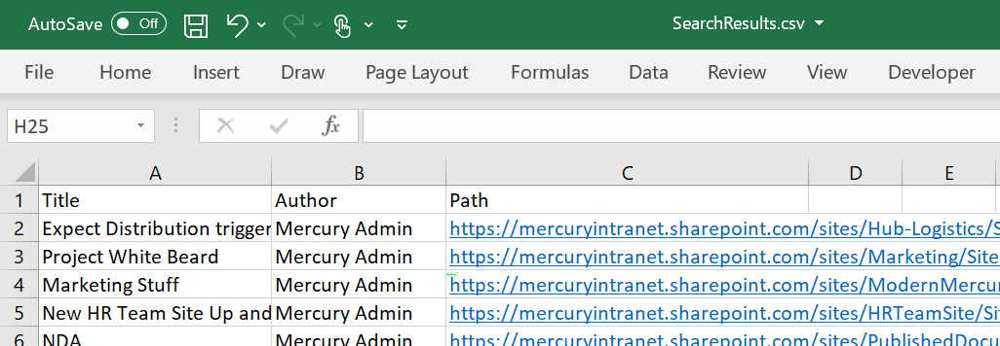

# Run A Search Query And Export To CSV

## Summary

Perform a search query (such as "Show me all News Posts in this tenant") and export the results to CSV.

This script is designed as a starter for you to expand by modifying the query used, and adding whichever managed properties you want to appear in the CSV file, in the order you want.

Any content you can retrieve through search you can use in this script, so as long as you can build the query for it.

The key to this script is the `Submit-PnPSearchQuery` cmdlet, which you can also modify in this script, for example to set the Result Source. See more information on the usage of this cmdlet [here](https://docs.microsoft.com/en-us/powershell/module/sharepoint-pnp/submit-pnpsearchquery?view=sharepoint-ps).



## Instructions

- Open your favourite text/script editor and copy/paste the script template below 
- Modify the search query to your requirements, add the desired Managed Properties to the Select Properties list
- Also update the `PSCustomObject` with the properties that you require in the resulting CSV file
- Open a PowerShell terminal
- Connect to your SharePoint tenancy using PnP PowerShell
- Run the script
- Retrieve the generated CSV file

# [PnP PowerShell](#tab/pnpps)

``` powershell
$itemsToSave = @()

$query = "PromotedState:2"
$properties = "Title,Path,Author"

$search = Submit-PnPSearchQuery -Query $query -SelectProperties $properties -All

foreach ($row in $search.ResultRows) {


  $data = [PSCustomObject]@{
    "Title"      = $row["Title"]
    "Author"     = $row["Author"]
    "Path"       = $row["Path"]
  }

  $itemsToSave += $data
}

$itemsToSave | Export-Csv -Path "SearchResults.csv" -NoTypeInformation
```
[!INCLUDE [More about PnP PowerShell](../../docfx/includes/MORE-PNPPS.md)]


# [CLI for Microsoft 365](#tab/cli-m365-ps)
```powershell
#Log in to Microsoft 365
Write-Host "Connecting to Tenant" -f Yellow 

$m365Status = m365 status
if ($m365Status -match "Logged Out") {
    m365 login
}

$query = "PromotedState:2"
$properties = "Title,Path,Author"

m365 spo search --queryText $query --selectProperties $properties --allResults --output csv | Out-File -FilePath "SearchResults.csv"
```
[!INCLUDE [More about CLI for Microsoft 365](../../docfx/includes/MORE-CLIM365.md)]
***


## Contributors

| Author(s) |
|-----------|
| James Love |
| Smita Nachan |

[!INCLUDE [DISCLAIMER](../../docfx/includes/DISCLAIMER.md)]

