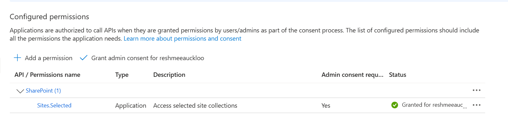

# Audit Service Principal Access to SharePoint Sites with Sites.Selected Permissions 

## Summary

Ensuring the security and compliance of your SharePoint environment is crucial, especially when dealing with service principals. These entities often have elevated permissions that, if mismanaged, can lead to unauthorized access and potential data breaches. Regularly auditing these permissions is a best practice for maintaining a secure and compliant SharePoint environment.

The Sites.Selected API permission needs to be granted to the service principal. 



The Service Principal is granted access to the SharePoint site(s) using the cmdlet:

```PowerShell
grant-PnPAzureADAppSitePermission -AppId 27f0f80f-4c32-4e49-a3ce-377fff559532 -DisplayName  p-m365  -Permissions FullControl
```

The script will scan any permissions granted to service principals across the tenant.

# [PnP PowerShell](#tab/pnpps)

```powershell
param (
    [Parameter(Mandatory = $true)]
    [string] $domain
)

$adminSiteURL = "https://$domain-Admin.SharePoint.com"
$TenantURL = "https://$domain.sharepoint.com"
$dateTime = "_{0:MM_dd_yy}_{0:HH_mm_ss}" -f (Get-Date)
$invocation = (Get-Variable MyInvocation).Value

$directorypath = Split-Path $invocation.MyCommand.Path
$fileName = "entraid_site_permissions" + $dateTime + ".csv"
$outputPath = $directorypath + "\"+ $fileName

if (-not (Test-Path $outputPath)) {
    New-Item -ItemType File -Path $outputPath
}
     Connect-PnPOnline -Url $adminSiteURL -Interactive -WarningAction SilentlyContinue
        Write-Host "Getting entra id permissions..." -ForegroundColor Yellow
        $report = Get-PnPTenantSite -Filter "Url -like '$TenantURL'"| Where-Object { $_.Template -ne 'RedirectSite#0' }  | foreach-object {
        $siteUrl = $_.Url
        connect-PnPOnline -Url $siteUrl -interactive -WarningAction SilentlyContinue
        Get-PnPAzureADAppSitePermission | ForEach-Object {
        [PSCustomObject]@{
            ##add the properties from the $sharingsetting object
            Id = $_.Id
            Url = $siteUrl
            Roles = $_.Roles -join ","
            Apps = $_.Apps -join ","
        }
    }
}

$report |select *  |Export-Csv $outputPath -NoTypeInformation -Append
```

[!INCLUDE [More about PnP PowerShell](../../docfx/includes/MORE-PNPPS.md)]

***

## Source Credit

The script first appeared  ["Audit Service Principal Access to SharePoint Sites with Sites.Selected Permissions"](https://reshmeeauckloo.com/posts/powershell-sharepoint-get-entraid-permissions/).


## Contributors

| Author(s) |
|-----------|
| [Reshmee Auckloo](https://github.com/reshmee011)|


[!INCLUDE [DISCLAIMER](../../docfx/includes/DISCLAIMER.md)]

