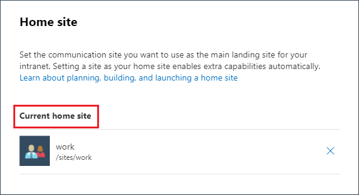

# Set Home site for SharePoint tenant

## Summary

This sample script shows how to set a communication site as a home site for SharePoint online tenant.

Scenario inspired from this blog post: [Set up a home site in SharePoint Online](https://ganeshsanapblogs.wordpress.com/2021/03/17/set-up-a-home-site-in-sharepoint-online)



# [PnP PowerShell](#tab/pnpps)

```powershell

# SharePoint tenant admin site collection url
$adminSiteUrl = "https://<tenant>-admin.sharepoint.com"

# Communication site collection url
$commSiteUrl = "https://<tenant>.sharepoint.com/communicationsite"

# Connect to SharePoint Online site  
Connect-PnPOnline -Url $adminSiteUrl -Interactive

# Set communication site as the home site
Set-PnPHomeSite -HomeSiteUrl $commSiteUrl

```
[!INCLUDE [More about PnP PowerShell](../../docfx/includes/MORE-PNPPS.md)]

# [CLI for Microsoft 365 with PowerShell](#tab/cli-m365-ps)
```powershell

# Usage example:
# .\Set-HomeSiteForSharePointTenant.ps1 -WebUrl "https://contoso.sharepoint.com/sites/Intranet"

[CmdletBinding()]
param (
    [Parameter(Mandatory = $true, HelpMessage = "Please enter Site URL, e.g. https://contoso.sharepoint.com/sites/Intranet")]
    [string]$WebUrl
    )
begin {
    #Log in to Microsoft 365
    Write-Host "Connecting to Tenant" -f Yellow

    $m365Status = m365 status
    if ($m365Status -match "Logged Out") {
        m365 login
    }

    Write-Host "Connection Successful!" -f Green 
}
process {
    # Set the specified site as the Home Site
    m365 spo homesite set --siteUrl $WebUrl
}
end { 
    Write-Host "Finished"
}
```
[!INCLUDE [More about CLI for Microsoft 365](../../docfx/includes/MORE-CLIM365.md)]

***

## Contributors

| Author(s) |
|-----------|
| [Ganesh Sanap](https://twitter.com/GaneshSanap20) |
| [Smita Nachan](https://github.com/SmitaNachan) |


[!INCLUDE [DISCLAIMER](../../docfx/includes/DISCLAIMER.md)]

