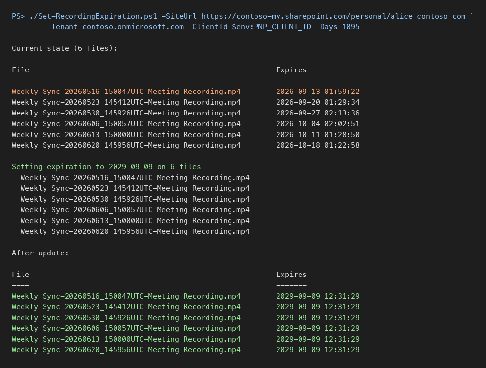

# Set or extend the expiration date on existing Teams meeting recordings

## Summary

Teams meeting recordings saved to OneDrive or SharePoint carry an expiration date stamped at creation time from the Teams meeting policy. Changing the policy only affects new recordings, and Microsoft's documentation says existing ones must be edited one at a time in the OneDrive details pane.

The date is stored in the hidden library column `_ExpirationDate`, which is read-only to every list item write: `Set-PnPListItem`, `SystemUpdate()` and `ValidateUpdateListItem` all fail with "The field you are trying to update may be read only." The working path is the CSOM method `File.SetExpirationDate(DateTime)` on the file object, which is what the OneDrive UI itself calls.

This script lists every recording in a folder with its current expiration date, then sets each one to a new date a given number of days from today. Run it with `-ListOnly` first to see what it will touch.



Notes:

- A OneDrive that holds more than 5000 items trips the list view threshold when queried with `Get-PnPListItem -FolderServerRelativeUrl`. The script enumerates the folder with `Get-PnPFolderItem` and fetches each file with `Get-PnPFile -AsListItem` instead.
- `Connect-PnPOnline` infers the tenant from a `-my.sharepoint.com` host incorrectly, so `-Tenant` is passed explicitly.
- Recordings that have already expired sit in the recycle bin for 93 days. Restore them first, then run this script, or the next sweep deletes them again.

# [PnP PowerShell](#tab/pnpps)

```powershell
<#
.SYNOPSIS
    Lists and sets the expiration date on Teams meeting recordings in a OneDrive or SharePoint folder.
.EXAMPLE
    ./Set-RecordingExpiration.ps1 -SiteUrl https://contoso-my.sharepoint.com/personal/alice_contoso_com -Tenant contoso.onmicrosoft.com -ClientId <app id> -ListOnly
.EXAMPLE
    ./Set-RecordingExpiration.ps1 -SiteUrl https://contoso-my.sharepoint.com/personal/alice_contoso_com -Tenant contoso.onmicrosoft.com -ClientId <app id> -Days 1095
#>
param(
    [Parameter(Mandatory)] [string]$SiteUrl,
    [Parameter(Mandatory)] [string]$Tenant,
    [Parameter(Mandatory)] [string]$ClientId,
    [string]$FolderSiteRelativeUrl = "Documents/Recordings",
    [string]$NameFilter = "*.mp4",
    [int]$Days = 1095,
    [switch]$ListOnly
)

Connect-PnPOnline -Url $SiteUrl -ClientId $ClientId -Tenant $Tenant -Interactive

function Get-Recordings {
    Get-PnPFolderItem -FolderSiteRelativeUrl $FolderSiteRelativeUrl -ItemType File |
        Where-Object { $_.Name -like $NameFilter } |
        ForEach-Object { Get-PnPFile -Url $_.ServerRelativeUrl -AsListItem }
}

function Show-Recordings($items) {
    $items | Select-Object @{ n = "File"; e = { $_["FileLeafRef"] } },
                           @{ n = "Expires"; e = { $_["_ExpirationDate"] } } |
        Format-Table -AutoSize
}

$items = @(Get-Recordings)
Write-Host "Current state ($($items.Count) files):"
Show-Recordings $items

if ($ListOnly) { return }

$newDate = (Get-Date).AddDays($Days).ToUniversalTime()
Write-Host "Setting expiration to $($newDate.ToString('yyyy-MM-dd')) on $($items.Count) files"

foreach ($item in $items) {
    $item.File.SetExpirationDate($newDate)
    Invoke-PnPQuery
    Write-Host "  $($item['FileLeafRef'])"
}

Write-Host "After update:"
Show-Recordings @(Get-Recordings)
```
[!INCLUDE [More about PnP PowerShell](../../docfx/includes/MORE-PNPPS.md)]

***

## Contributors

| Author(s) |
|-----------|
| George Brooks |

[!INCLUDE [DISCLAIMER](../../docfx/includes/DISCLAIMER.md)]

