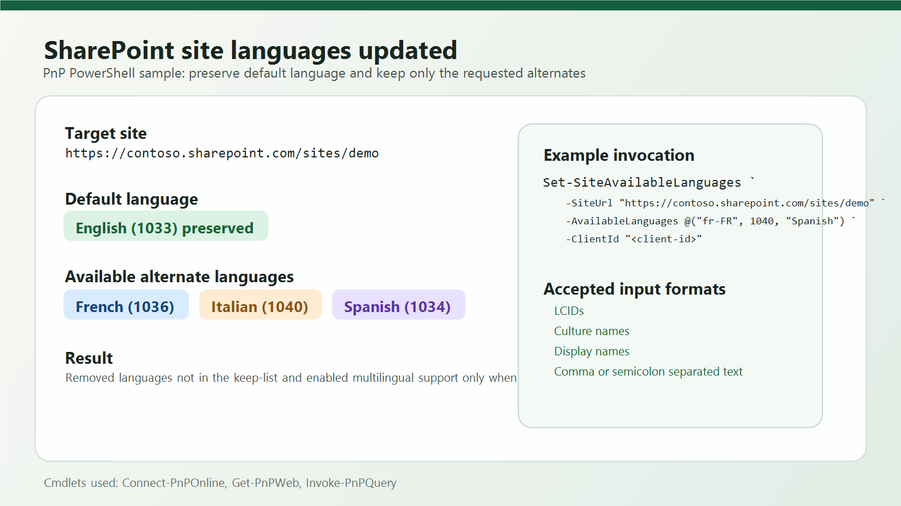

# Set available languages for a SharePoint site

## Summary

Do you need to standardize the available languages on a SharePoint site? This script updates the multilingual settings so only the languages you specify remain enabled as available site languages.



The script accepts languages as LCIDs, culture names such as `en-US`, display names such as `French`, or a semicolon/comma-separated list. It preserves the site's default language automatically, removes languages that are no longer wanted, adds missing ones, and disables multilingual support when no alternate languages are kept.

Before running the script, register an Entra ID app for `Connect-PnPOnline` and provide its client ID.

> [!Note]
> SharePoint keeps the site's default language separate from the available alternate languages. This script therefore preserves the default language and only changes the alternate language set.

# [PnP PowerShell](#tab/pnpps)

```powershell

<#
.SYNOPSIS
Sets the available site languages for a SharePoint site.

.DESCRIPTION
Updates the multilingual settings for a SharePoint site so only the languages specified in
AvailableLanguages remain enabled as available site languages. List items may be LCIDs,
culture names such as en-US, or display names such as French.

The site's default language is preserved automatically because it is not part of the
available-language list in SharePoint. Passing an empty keep-list disables multilingual
support and removes all available languages.

.PARAMETER SiteUrl
The SharePoint site URL to update.

.PARAMETER AvailableLanguages
The languages that should remain available on the site. Values can be LCIDs, culture names,
display names, or a semicolon/comma-separated string.

.PARAMETER ClientId
The Microsoft Entra ID app registration client ID used with Connect-PnPOnline.

.EXAMPLE
Set-SiteAvailableLanguages -SiteUrl "https://contoso.sharepoint.com/sites/demo" -AvailableLanguages @("fr-FR", 1040) -ClientId $clientId

#>

function ConvertTo-LanguageIdentifierList {
	param(
		[Parameter(Mandatory = $false)]
		$Value
	)

	$items = @()

	if ($null -eq $Value) {
		return ,@()
	}

	if ($Value -is [string]) {
		$trimmedValue = $Value.Trim()
		if ([string]::IsNullOrWhiteSpace($trimmedValue)) {
			return ,@()
		}

		if ($trimmedValue.StartsWith("[") -or $trimmedValue.StartsWith("{")) {
			try {
				$parsedValue = $trimmedValue | ConvertFrom-Json -ErrorAction Stop
				return ConvertTo-LanguageIdentifierList -Value $parsedValue
			}
			catch {
				throw "AvailableLanguages must be a valid JSON array, a semicolon-separated list, or an array value."
			}
		}

		$items = $trimmedValue -split "[;,]"
	}
	elseif ($Value -is [System.Collections.IDictionary]) {
		foreach ($entry in $Value.GetEnumerator()) {
			$items += $entry.Value
		}
	}
	elseif ($Value -is [System.Collections.IEnumerable] -and -not ($Value -is [string])) {
		foreach ($item in $Value) {
			$items += $item
		}
	}
	else {
		$items = @($Value)
	}

	$languageIds = New-Object System.Collections.Generic.List[int]
	foreach ($item in $items) {
		if ($null -eq $item) {
			continue
		}

		$candidate = [string]$item
		if ([string]::IsNullOrWhiteSpace($candidate)) {
			continue
		}

		$candidate = $candidate.Trim()
		$languageId = 0
		if ([int]::TryParse($candidate, [ref]$languageId)) {
			if (-not $languageIds.Contains($languageId)) {
				$languageIds.Add($languageId)
			}

			continue
		}

		try {
			$culture = [System.Globalization.CultureInfo]::GetCultureInfo($candidate)
			if (-not $languageIds.Contains($culture.LCID)) {
				$languageIds.Add($culture.LCID)
			}

			continue
		}
		catch {
		}

		$matchingCulture = [System.Globalization.CultureInfo]::GetCultures([System.Globalization.CultureTypes]::AllCultures) |
			Where-Object {
				$_.DisplayName -eq $candidate -or
				$_.EnglishName -eq $candidate -or
				$_.NativeName -eq $candidate -or
				$_.Name -eq $candidate -or
				$_.TwoLetterISOLanguageName -eq $candidate
			} |
			Select-Object -First 1

		if ($null -eq $matchingCulture) {
			throw "The language value '$candidate' could not be resolved to a valid LCID."
		}

		if (-not $languageIds.Contains($matchingCulture.LCID)) {
			$languageIds.Add($matchingCulture.LCID)
		}
	}

	return ,$languageIds.ToArray()
}

function Set-SiteAvailableLanguages 
{
	param(
		[Parameter(Mandatory = $true)]
		[string]$SiteUrl,

		[Parameter(Mandatory = $true)]
		$AvailableLanguages,

		[Parameter(Mandatory = $true)]
		[string]$ClientId
	)

	$availableLanguageIds = ConvertTo-LanguageIdentifierList -Value $AvailableLanguages

	$siteConnection = Connect-PnPOnline -Url $SiteUrl -Interactive -ClientId $ClientId -ReturnConnection
	$web = Get-PnPWeb -Includes Language, IsMultilingual, SupportedUILanguageIds -Connection $siteConnection

	$defaultLanguageId = [int]$web.Language
	$targetLanguageIds = @($availableLanguageIds | Where-Object { $_ -ne $defaultLanguageId } | Select-Object -Unique)
	$currentLanguageIds = @($web.SupportedUILanguageIds)

	foreach ($languageId in $currentLanguageIds) {
		if ($targetLanguageIds -notcontains $languageId) {
			$web.RemoveSupportedUILanguage([int]$languageId)
			Write-Host "Removed language LCID $languageId"
		}
	}

	foreach ($languageId in $targetLanguageIds) {
		if ($currentLanguageIds -notcontains $languageId) {
			$web.AddSupportedUILanguage([int]$languageId)
			Write-Host "Added language LCID $languageId"
		}
	}

	$web.IsMultilingual = ($targetLanguageIds.Count -gt 0)
	$web.Update()
	Invoke-PnPQuery -Connection $siteConnection

	$keptLanguageText = if ($targetLanguageIds.Count -gt 0) { $targetLanguageIds -join ", " } else { "none" }
	Write-Host "Default language LCID $defaultLanguageId was preserved."
	Write-Host "Available languages are now set to: $keptLanguageText"
}

# Set-SiteAvailableLanguages -SiteUrl "https://contoso.sharepoint.com/sites/demo" -AvailableLanguages @("fr-FR", 1040) -ClientId "<client-id>"

```
[!INCLUDE [More about PnP PowerShell](../../docfx/includes/MORE-PNPPS.md)]
***


## Contributors

| Author(s) |
|-----------|
| Kasper Larsen |

[!INCLUDE [DISCLAIMER](../../docfx/includes/DISCLAIMER.md)]

