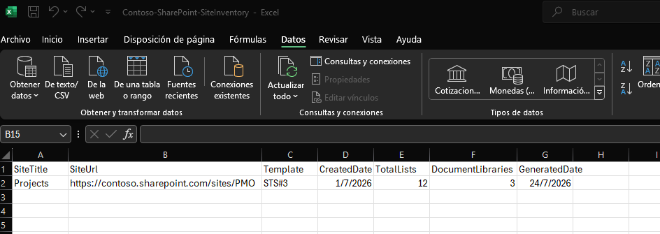

# Generate SharePoint Site Inventory Report

## Summary

This script generates a SharePoint Online site inventory report using PnP PowerShell.

The report collects key information from a SharePoint site, including:

- Site title
- Site URL
- Site template/type
- Creation date
- Number of lists
- Number of document libraries

The output is exported to a CSV file that can be used for documentation, governance reviews, or SharePoint environment assessments.



## Prerequisites

Before running the script:

- Install the latest version of PnP PowerShell:

```powershell
Install-Module PnP.PowerShell -Scope CurrentUser
```

- Access permissions to the SharePoint Online site.

## Usage

Run the script providing the target SharePoint site URL:

```powershell
.\Generate-SPSiteInventory.ps1 `
    -SiteUrl "https://contoso.sharepoint.com/sites/PMO"
```

The script generates the following output file:

```
SharePointSiteInventory.csv
```

## Contributors

| Author(s) |
|-----------|
| [Antonio Villarruel](https://github.com/a-villarruel) |

[!INCLUDE [DISCLAIMER](../../docfx/includes/DISCLAIMER.md)]

# Generate SharePoint Site Inventory Report

## Summary

This script generates a SharePoint Online site inventory report using PnP PowerShell.

The report collects key information from a SharePoint site, including:

- Site title
- Site URL
- Site template/type
- Creation date
- Number of lists
- Number of document libraries

The output is exported to a CSV file that can be used for documentation, governance reviews, or SharePoint environment assessments.


## Prerequisites

Before running the script:

- Install the latest version of PnP PowerShell:

```powershell
Install-Module PnP.PowerShell -Scope CurrentUser
```

- Access permissions to the SharePoint Online site.

## Usage

Run the script providing the target SharePoint site URL:

```powershell
.\Generate-SPSiteInventory.ps1 `
    -SiteUrl "https://contoso.sharepoint.com/sites/PMO"
```

The script generates the following output file:

```
SharePointSiteInventory.csv
```

## Contributors

| Author(s) |
|-----------|
| [Antonio Villarruel](https://github.com/a-villarruel) |

[!INCLUDE [DISCLAIMER](../../docfx/includes/DISCLAIMER.md)]

